<section class="cover">

AUST CSE Carnival 8.0 · UI/UX Design Sprint · 11 September 2026

# GreenCommute

## A worker commuter app for GreenTex Apparel, Gazipur

<strong>Mohammed Tayeb</strong> · Team Lonewolf · REG-ZZ4-631 · Dept. of CSE, AUST

<table class="links">
<tr><th>Figma design file</th><td><a href="https://www.figma.com/design/aWSZZboavo5bIt92qFQnsz/Carnival-8.0-%E2%80%94-UI-UX-Sprint">figma.com/design/aWSZZboavo5bIt92qFQnsz</a></td></tr>
<tr><th>Prototype · boarding flow</th><td><a href="https://www.figma.com/proto/aWSZZboavo5bIt92qFQnsz?page-id=5%3A4&node-id=30-642&starting-point-node-id=30%3A642&scaling=scale-down">Play from Language → Sign-in → Home → Door code → Ticket → In transit</a></td></tr>
<tr><th>Prototype · SOS trigger</th><td><a href="https://www.figma.com/proto/aWSZZboavo5bIt92qFQnsz?page-id=5%3A4&node-id=29-646&starting-point-node-id=29%3A646&scaling=scale-down">Play from In transit → SOS → countdown → delivered</a></td></tr>
<tr><th>Screens page (all frames)</th><td><a href="https://www.figma.com/design/aWSZZboavo5bIt92qFQnsz/Carnival-8.0-%E2%80%94-UI-UX-Sprint?node-id=5-4">03 Screens</a></td></tr>
<tr><th>Process repository</th><td><a href="https://github.com/Tayebbb/ui-ux-carnival">github.com/Tayebbb/ui-ux-carnival</a> — full phase documents, decision log, exports</td></tr>
</table>

Figma pages: <a href="https://www.figma.com/design/aWSZZboavo5bIt92qFQnsz/Carnival-8.0-%E2%80%94-UI-UX-Sprint?node-id=0-1">00 Cover</a> · <a href="https://www.figma.com/design/aWSZZboavo5bIt92qFQnsz/Carnival-8.0-%E2%80%94-UI-UX-Sprint?node-id=5-2">01 Flow &amp; Sitemap</a> · <a href="https://www.figma.com/design/aWSZZboavo5bIt92qFQnsz/Carnival-8.0-%E2%80%94-UI-UX-Sprint?node-id=5-3">02 Wireframes</a> · <a href="https://www.figma.com/design/aWSZZboavo5bIt92qFQnsz/Carnival-8.0-%E2%80%94-UI-UX-Sprint?node-id=5-4">03 Screens</a> · <a href="https://www.figma.com/design/aWSZZboavo5bIt92qFQnsz/Carnival-8.0-%E2%80%94-UI-UX-Sprint?node-id=5-5">04 Design System</a> · <a href="https://www.figma.com/design/aWSZZboavo5bIt92qFQnsz/Carnival-8.0-%E2%80%94-UI-UX-Sprint?node-id=5-6">05 Accessibility</a> · <a href="https://www.figma.com/design/aWSZZboavo5bIt92qFQnsz/Carnival-8.0-%E2%80%94-UI-UX-Sprint?node-id=5-7">06 Prototype</a> · <a href="https://www.figma.com/design/aWSZZboavo5bIt92qFQnsz/Carnival-8.0-%E2%80%94-UI-UX-Sprint?node-id=5-8">07 Redlines &amp; Handoff</a> · <a href="https://www.figma.com/design/aWSZZboavo5bIt92qFQnsz/Carnival-8.0-%E2%80%94-UI-UX-Sprint?node-id=18-2">Archive</a>

Evidence tags used throughout: <strong>[E·01]</strong> Anisur's email · <strong>[E·02]</strong> kick-off notes · <strong>[E·03]</strong> Monira Khatun (HR) voice note · <strong>[E·04]</strong> SMS · <strong>[I]</strong> inference · <strong>[A]</strong> assumption, unverified · <strong>[D]</strong> design decision. Nothing in this document is invented research; where the pack is silent it is marked [A].

### Contents

1. Requirements &amp; discovery — 15
2. Research &amp; validation — 15
3. Information architecture &amp; low-fi — 15
4. High-fidelity UI — 25
5. Figma ecosystem &amp; design file — 15
6. Handoff — 15
7. Tools, AI use &amp; credits

</section>

<section class="phase">

# 1 · Requirements &amp; discovery

Phase 1 · 17:00–17:40 · Full document: <a href="https://github.com/Tayebbb/ui-ux-carnival/blob/main/01-understand/brief.md">01-understand/brief.md</a>

## Problem statement

About 15,000 garment workers — mostly women, many who cannot read well [E·01] — wait at roadside stops in Gazipur for GreenTex staff buses with no idea when their bus will come or whether it will have room. They wait for hours in rain and dark, arrive late, and production stops [E·01]. Boarding is at 6:30 AM in the dark [E·02], in a pushing crowd [E·03], on cheap Android phones with cracked, dim screens and scratched cameras [E·01, E·02], with expensive data and no Wi-Fi at the stop 3 km from the factory [E·01, E·02]. A new cashless 10 Tk fare adds a payment step at the door [E·01].

**Product goal.** Every worker knows — without needing to read — when to leave home and whether her bus is coming, so she waits minutes, not hours. Supporting goals: board and pay in seconds without a camera; a deliberate, discreet SOS that reaches factory security; works on the real phones; presentable to buyers in English without changing the worker experience.

**Who it is for**

| Tier | User | Source |
|---|---|---|
| Primary | Staff-bus worker — mostly women, limited reading, cheap Android, dawn commute | [E·01–03] |
| Secondary | Factory security-gate officer — receives the SOS with bus number | [E·03] |
| Tertiary | Bus driver — boards workers; subject of "bus full" and speeding | [E·03, E·04] |
| Stakeholders | Anisur (operations, buyer demo), Monira (HR), transport managers (future dashboard) | [E·01, E·03] |

## Functional requirements

| ID | Requirement | Source | Priority |
|---|---|---|---|
| FR-1 | Personalised home: her route, stop and the next bus for her today — nothing to search | [E·01, E·03] | Must |
| FR-2 | Status as number + words: **minutes away** · **Full — take the next one** · **Arrived** · **Delayed / no update since hh:mm**; never show a cached ETA as live | [E·03] | Must |
| FR-3 | Alerts: leave-home cue, bus full, delay — push; SMS fallback proposed [A] | [E·01, E·03] | Must |
| FR-4 | Board and pay: type the daily 4-digit door code (≤ 2 taps + 4 digits), optional QR scan with torch; offline → **Pending**, **Paid 10 Tk** only after server confirmation; one transaction ID across retries | [E·01, E·03, E·02] | Must |
| FR-5 | Balance: last-confirmed Tk, pending separate, low-balance warning, recent payments | [E·01] | Must |
| FR-6 | SOS: large one-handed control on waiting and in-transit screens; 5-second countdown with Cancel; states **Sending / Not sent / Delivered / Acknowledged**; payload = bus, worker, time, location | [E·01, E·03] | Must |
| FR-7 | Optional Map / Stops one tap from Home: bus and stop on an attributed OpenStreetMap basemap; last-known position when offline | [E·02, E·03] | Must exist, optional use |
| FR-8 | Language: English pre-selected; immediate, prominent **বাংলা** switch on first launch and every core screen | [E·01] | Must |
| FR-9 | In-transit state: current bus, next stop, ETA to factory, SOS | Rubric | Must |
| FR-11 | Sign-in with company-issued worker ID + password before personalised Home; help and sign-out; no password at each boarding | [D] DL-22 | Should |
| FR-12 | Speeding detection: vehicle telemetry + manager review — documented, deferred | [E·04] | Deferred |
| OUT | Transport-manager dashboard, in-ride groceries | [E·01] "not now" | Out |

## Non-functional requirements

| ID | Requirement | Source |
|---|---|---|
| NFR-1 | Legibility on dim, cracked screens: primary status contrast ≥ 7:1, hero digits ≥ 64 px, body ≥ 15–18 px, no thin weights | [E·02] |
| NFR-2 | One-handed in a crowd: primary actions in the bottom thumb zone, targets ≥ 56 px with ≥ 12 px gaps, tap-only — no swipes | [E·02, E·03] |
| NFR-3 | Wet-screen tolerance: forgiving taps, clear code feedback, explicit SOS cancel | [E·02] |
| NFR-4 | Connectivity: cache shell/route/identity; small live payloads; every cached status is dated | [E·01, E·02] |
| NFR-5 | Low-end Android: fast cold start; animation only for state change; 360 × 800 base reflowing 320–430 px | [E·01, E·02] |
| NFR-6 | Low-literacy comprehension: ≤ 3 words per state label; number + icon + text + colour; identical layout every day; Bangla-capable typeface | [E·01, E·03] |
| NFR-7 | Safety and trust: SOS reachable at zero balance or offline; a cancelled request is logged, not deleted | [E·01, E·03] |
| NFR-8 | Data cost well under 1 MB/day [A target] | [E·01] |
| NFR-9 | Presentable in English for the buyer demo with one language switch | [E·01] |

## Contradictions in the client pack — named and resolved

| # | Client said | But | Resolution [D] |
|---|---|---|---|
| C1 | Live map "exactly like Uber", "absolute must" [E·01, E·02] | Workers "do not understand live maps… just want big text" [E·03] | **Status first.** Home is a departure board; Map/Stops is one tap away for those who want it |
| C2 | Pay by scanning a complex QR on the door [E·01] | Half the cameras are scratched; 6:30, dark, pushing crowd [E·02, E·03] | **Typed 4-digit door code first**, QR kept as optional input to the same payment |
| C3 | SOS emails the local police [E·01] | Police "never check it"; alert the factory gate with the bus number [E·03] | **SOS goes to factory security** with bus, worker, time, location; delivery and acknowledgement shown separately |
| C4 | English default for the buyer demo [E·01] | Many cannot read properly [E·01] | **English stays pre-selected**; unmissable বাংলা toggle on every core screen; language-light UI (numbers + icons) |
| C5 | Load the app on factory Wi-Fi [E·01] | The stop is 3 km away; Wi-Fi does not reach; data is expensive [E·01, E·02] | **Offline-first dated cache**; small updates; SMS fallback proposed [A] |
| C6 | "Premium, smooth animations" [E·01] | Cheap, dim, wet, cracked phones [E·02] | **Premium = clarity**: one high-contrast light theme, big type, motion only for state change |
| C7 | Dashboard, groceries, speeding [E·01, E·04] | Six-hour sprint; worker app | **Parked** with IA room; speeding proposed manager-side, no worker UI |
| C8 | 15,000 workers / 40 buses [E·01, E·02] | "Bus is full, take the next one" [E·03] | **Full is a first-class state** because HR names it — not because of fleet arithmetic |
| C9 | Each worker has an "assigned bus" [E·01] | "Take the next one" [E·03] | **Route/stop-based assignment**: show the next eligible bus on her route |
| C10 | No cash, pay from balance [E·01] | Lateness is "the main thing"; no top-up policy in the pack | **Warn before shortfall**; grace admission is a client decision, flagged as open |

## User stories and acceptance criteria

| # | Story | Done when |
|---|---|---|
| US-1 | As a worker, I want to see in one glance how many minutes until my bus, so that I leave home at the right time and do not wait in the rain. | Home shows minutes ≥ 64 px with route and stop; status readable at 7:1 contrast; freshness time visible. |
| US-2 | As a worker, I want to know when my bus is full, so that I wait for the next one instead of pushing. | "Full — next bus in N min" state exists with amber, icon and words; next-bus ETA shown only when known. |
| US-3 | As a worker, I want to board and pay 10 Tk by typing four digits, so that I do not need a working camera in a crowd. | Code entry ≤ 2 taps + 4 digits; wrong code gives retry and help; ticket shows Paid or Pending honestly. |
| US-4 | As a worker travelling at dawn, I want to alert factory security with one hand, so that someone who can act knows my bus number. | SOS ≥ 56 px on Home, ticket and transit; 5 s countdown with Cancel; states Sending → Delivered → Acknowledged. |
| US-5 | As a security officer, I want each SOS to carry bus number, worker, time and location, so that I can respond without calling back first. | Delivered screen lists all four fields and an alert ID; cancellation is timestamped, not erased. |

## Rough user profiles (Phase 1 hypotheses — checked in Phase 2)

- **Profile W · the worker** [I]: woman on a sewing line, boards ~6:30 in the dark, cheap Android with a cracked screen, limited reading, one hand free in a crowd, pays 10 Tk from a balance she cannot top up in cash.
- **Profile S · the security-gate officer** [I from E·03]: on duty during boarding, needs bus number and location to act; staffing at 6:30 assumed [A].

</section>

<section class="phase">

# 2 · Research &amp; validation

Phase 2 · 17:40–18:20 · Full document: <a href="https://github.com/Tayebbb/ui-ux-carnival/blob/main/02-research/research.md">02-research/research.md</a>

**Method.** The client pack (four items) is the only user evidence available in a timed contest. Every fact below is tagged to its source; all testimony is *about* workers, not from them. No interviews, statistics or quotes were invented.

## What the scenario taught us

| # | Reported fact | Source | What it means for design |
|---|---|---|---|
| F2 | Workers "stand in the rain for hours… get late, production stops" | [E·01] | The pain is uncertainty while exposed; the fix is *when to leave*, not *where the bus is* |
| F5 | Cheap Android, broken screens, dim brightness | [E·01, E·02] | Contrast, size and forgiving targets outrank visual polish |
| F6 | Data expensive; Wi-Fi does not reach the stop | [E·01, E·02] | Design for interrupted data; date every cached status |
| F7 | "Many cannot read properly, mostly female workers" | [E·01] | Numbers, icons and ≤ 3-word labels carry meaning; Bangla one tap away |
| F8 | "They just want… 'Bus is 10 minutes away' or 'Bus is full, take the next one'" | [E·03] | HR names the two core states almost verbatim → Home is a status board |
| F9 | QR "in a pushing crowd won't work"; half the cameras scratched | [E·03, E·02] | Typed code first; camera optional |
| F11 | HR proposes a 4-digit PIN to confirm boarding | [E·03] | Four digits is plausible; it is a service code, not proof of presence |
| F12 | Police email "useless"; alert the gate "with the specific bus number" | [E·03] | Recipient and payload defined by the person closest to workers |
| F13 | "If they feel unsafe" at dawn → big red SOS | [E·01] | Sponsor acknowledges a safety risk; SOS must be discreet and cancellable |
| F14 | 10 Tk daily, no cash, from a balance | [E·01] | Top-up, zero balance and return trips are unspecified → open questions, not invented rules |

## Main problems (ranked)

| Rank | Problem | Severity | Where it lives | Priority |
|---|---|---|---|---|
| 1 | Uncertainty while exposed — no arrival / full information in rain and dark [E·01, E·03] | High | Waiting state | P0 |
| 2 | Boarding/payment friction — QR in a crowd on damaged cameras; refusal worsens lateness [E·02, E·03] | High | Core boarding flow | P0 |
| 3 | Comprehension barrier — limited reading, English default, maps [E·01, E·03] | High | Cross-cutting | P0 |
| 4 | Safety escalation risk — police email rejected; gate recipient proposed [E·01, E·03] | Very high | SOS state | P0 |
| 5 | Connectivity at the moment of need — no Wi-Fi, costly data [E·01, E·02] | High | Enabler for 1, 2, 4 | P0 |

Frequency is unmeasured for all five; the pack gives no incident rates [A].

## Personas — updated from Phase 1

**Shahida · sewing-line worker (primary) · illustrative name [A]**

| Field | Phase 1 guess | Scenario evidence | Phase 2 | Status |
|---|---|---|---|---|
| Goal | Reach the factory before 8:00 | "stand in the rain for hours… get late" [E·01] | Narrower daily decision: *when to leave, wait or take the next bus* | Sharpened |
| Main need | Know when to leave without reading a paragraph | "big text… 'Bus is 10 minutes away'" [E·03] | Confirmed almost verbatim | Confirmed |
| Behaviour | Reads Bangla, uses apps | Limited reading [E·01]; PIN suggestion [E·03] | Four digits plausible; script and habits unknown | Corrected / assumed |
| Constraint | Cheap Android, wet hands | [E·01, E·02] | Confirmed; zero-balance policy added as unknown | Supported + added |
| Emotion | — | "if they feel unsafe" [E·01] | Fear at dawn acknowledged by the sponsor | Added |
| Language | — | English default vs literacy [E·01] | Immediate বাংলা switch becomes a design target | Added |

**Kamal · factory security-gate officer (secondary) · illustrative name [A]**

| Field | Phase 1 guess | Scenario evidence | Phase 2 | Status |
|---|---|---|---|---|
| Role | Security at the gate during boarding | "alert our factory security gate" [E·03] | Confirmed as intended SOS receiver; 6:30 staffing assumed | Confirmed / assumed |
| Need | Respond fast | "with the specific bus number" [E·03] | Bus + worker + time + location + alert ID; acknowledgement separate from delivery | Added detail |
| Constraint | — | [I] | Needs a receiving channel; not a worker-app screen this sprint | Design scope |

Tertiary, noted not personified: the bus driver [E·03, E·04] — no automatic driver alert, no silent tracking.

## Journey map — rainy morning, bus 15 minutes late (Shahida, Route 3)

Illustrative simulation [A]; only 6:30 boarding and 8:00 shift come from the pack [E·02].

| Time | Stage | What happens | Feeling [I] | Without the app | With GreenCommute [D] |
|---|---|---|---|---|---|
| 05:40 | Wake, decide | Rain on the roof; does she leave now? | Anxious | Leaves early "to be safe", waits in rain | Home: **Bus 12 · 24 min · updated 05:39** → she waits indoors 10 more minutes |
| 06:05 | Walk to stop | 15-min walk, umbrella, phone in one hand | Hurried | No information | Push alert: **Delayed — 15 min late · no update since 06:02**; status turns slate-blue |
| 06:20 | Wait | Crowd grows; first bus rumoured full | Worried, cold | Pushes toward any bus | Home: **Full — next bus 12 min**; she steps back |
| 06:38 | Board | Bus 14 arrives; driver shows door code 7319 | Rushed | QR scan fails on a scratched, wet camera | Types **7 3 1 9** → blue Thursday ticket, **Paid 10 Tk** (or Pending if offline) |
| 06:40 | Ride | Seated, still dark | Relieved | — | In transit: next stop, ETA 07:25, SOS in thumb reach |
| 06:52 | Feels unsafe | Man behind her at the back | Afraid | Nothing to do quietly | Taps SOS → 5 s countdown → **Delivered to security · Bus 14** — no sound |
| 07:30 | Arrive | Factory gate | Calm | Late, wet | On time; security acknowledged at 06:53 |

**Assumptions stated as assumptions [A]:** walking distance to the stop; that she owns the phone; that mobile data or SMS exists at the stop; that security is staffed at 06:30; how balance is topped up; whether one 10 Tk fee covers the return trip.

</section>

<section class="phase">

# 3 · Information architecture &amp; low-fi

Phase 3 · 18:20–19:10 · Full document: <a href="https://github.com/Tayebbb/ui-ux-carnival/blob/main/03-structure/structure.md">03-structure/structure.md</a> · Figma: <a href="https://www.figma.com/design/aWSZZboavo5bIt92qFQnsz/Carnival-8.0-%E2%80%94-UI-UX-Sprint?node-id=5-2">01 Flow &amp; Sitemap</a>, <a href="https://www.figma.com/design/aWSZZboavo5bIt92qFQnsz/Carnival-8.0-%E2%80%94-UI-UX-Sprint?node-id=5-3">02 Wireframes</a>

**Design-system research** (adapted, not copied): Material 3 for touch-target and state rules, GOV.UK for plain-language patterns, Uber Base for transit status hierarchy, BBC GEL for legibility. Point of view for the product: *a bus-stop departure board in her hand.*

## Sitemap — hub and spoke (DL-14)

Home is the only hub; every spoke is one tap deep and returns to Home. No tab bar, no hamburger.

<figure class="wide">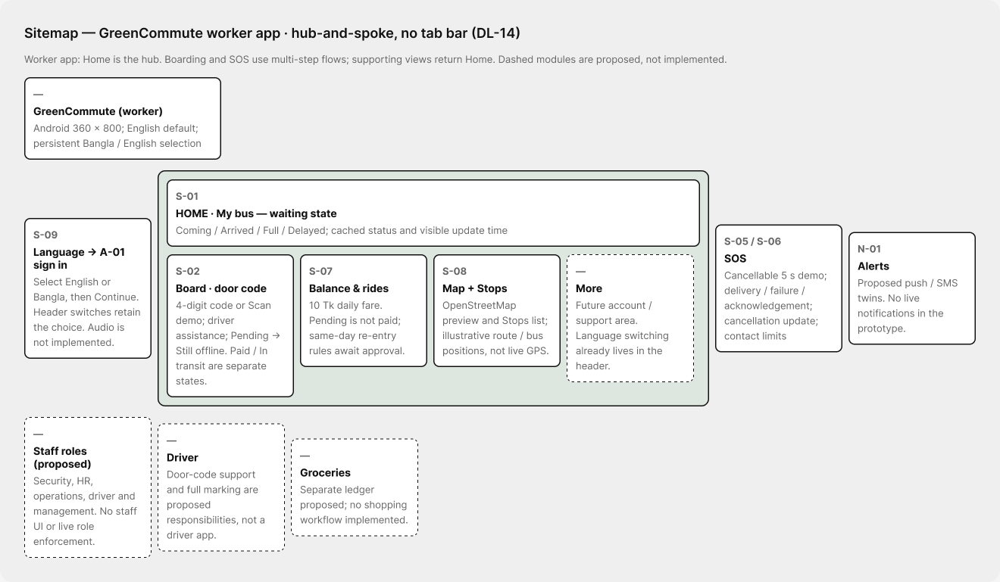<figcaption>Sitemap · Figma page 01</figcaption></figure>

| Screen | Purpose | User story | Primary action |
|---|---|---|---|
| S-09 Language | First launch: English pre-selected, বাংলা one tap | US-1 (C4) | Continue |
| A-01…A-05 Sign-in | Worker ID + password, help, demo credentials, checking, sign-out | FR-11 | Sign in |
| S-01 Home | Status board: minutes / Full / Arrived / Delayed / Offline; SOS | US-1, US-2 | Board · View map · SOS |
| S-02 Door code | Type 4 digits, or Scan instead (S-02b torch scanner); wrong-code retry; driver help (S-02c) | US-3 | Pay 10 Tk |
| S-03 Ticket | Day-colour ticket: Paid / Pending (still offline S-03b) | US-3 | Show driver · SOS |
| S-04 In transit | Bus, next stop, ETA to factory, SOS | FR-9, US-4 | SOS |
| S-05 SOS countdown | 5 s countdown, Cancel | US-4 | Cancel |
| S-06 SOS states | Sending · Delivered · Not sent · Acknowledged · Confirm cancellation · Cancellation logged · No contact | US-4, US-5 | Call security · Return |
| S-07 Balance | Confirmed Tk, pending, recent payments, sign-out | FR-5 | Back |
| S-08 Map / Stops | Optional geographic map + stop list | FR-7 (C1) | Home |

## Core flow — boarding and payment

<figure class="wide">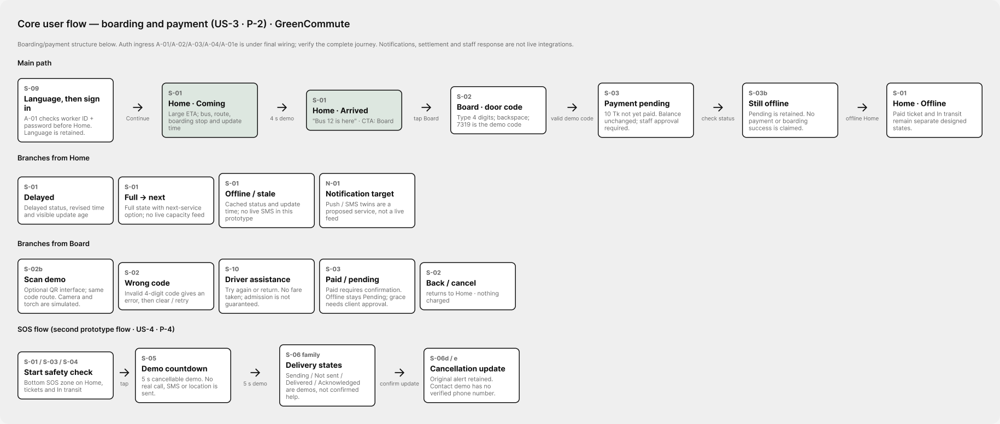<figcaption>Core flow: boarding + payment with wrong-code, offline and help branches · Figma page 01</figcaption></figure>

<figure class="wide half">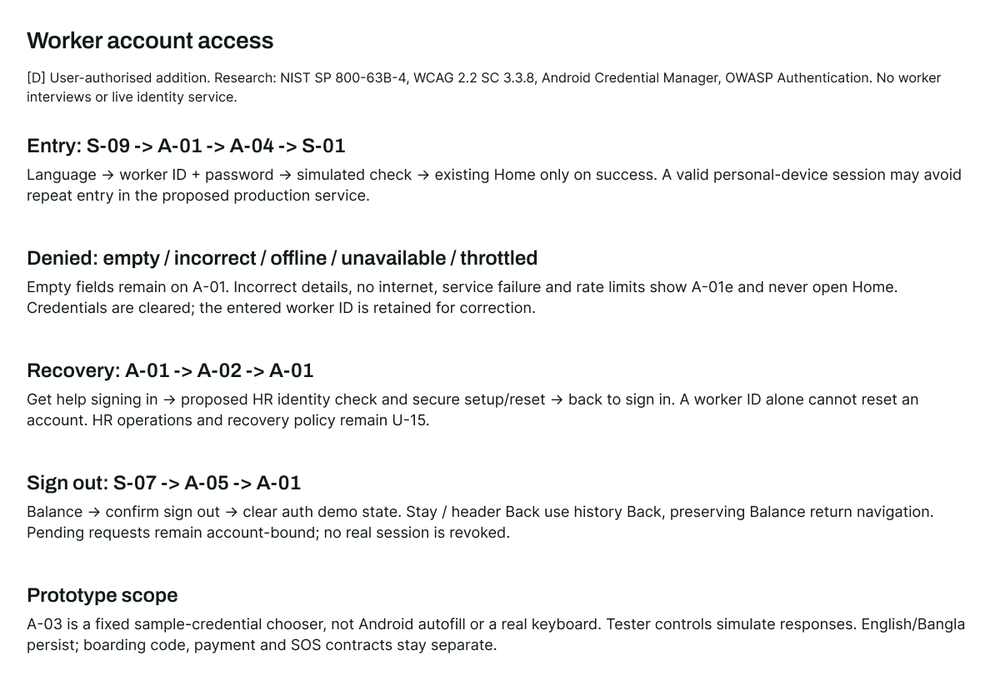<figcaption>Entry flow: language and sign-in</figcaption></figure>

## Wireframes

Hand sketch first, then the Figma low-fi frames for every committed screen.

<figure class="sketch">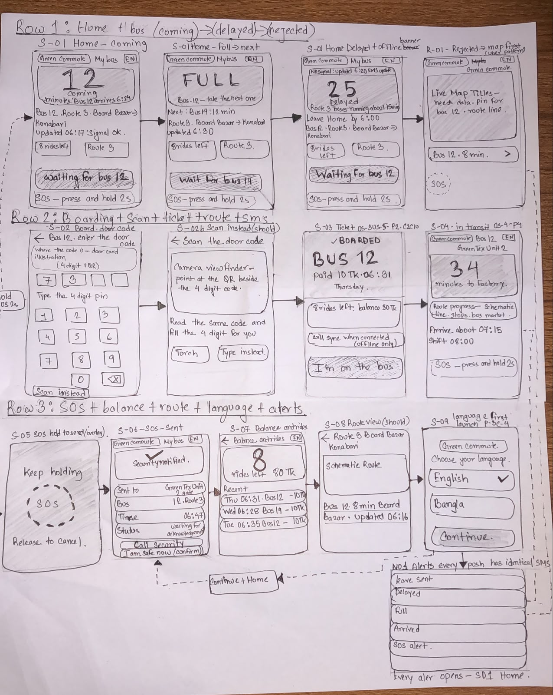<figcaption>Hand sketch · Mohammed Tayeb · 11 Sep 2026, Phase 3</figcaption></figure>

<figure class="wide">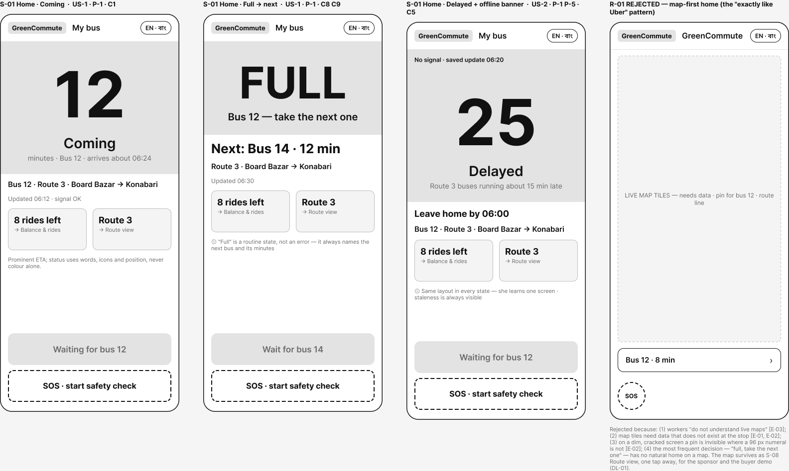<figcaption>A · Home states + <strong>R-01, the rejected home alternative</strong> (right)</figcaption></figure>

**Why R-01 was rejected.** R-01 put the live map on top with the ETA as a caption — the client's Uber request [E·01]. It fails Monira's evidence [E·03] (workers do not read maps), spends the top 60 % of a dim screen on tiles that cost data [E·01, E·02], and pushes the SOS below the thumb zone. The chosen S-01 puts minutes at 128 px, status colour behind them, and SOS in the bottom band; the map is one tap away.

<figure class="wide">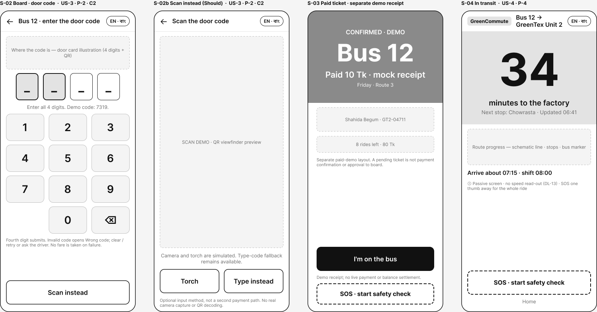<figcaption>B · Door code, scanner, ticket, in transit</figcaption></figure>
<figure class="wide">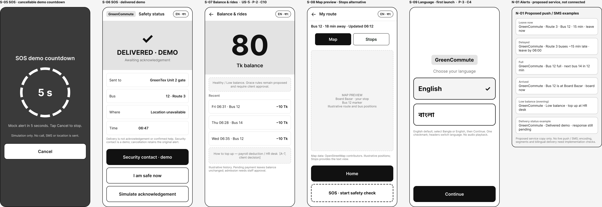<figcaption>C · SOS, balance, route, language, alerts</figcaption></figure>
<figure class="wide">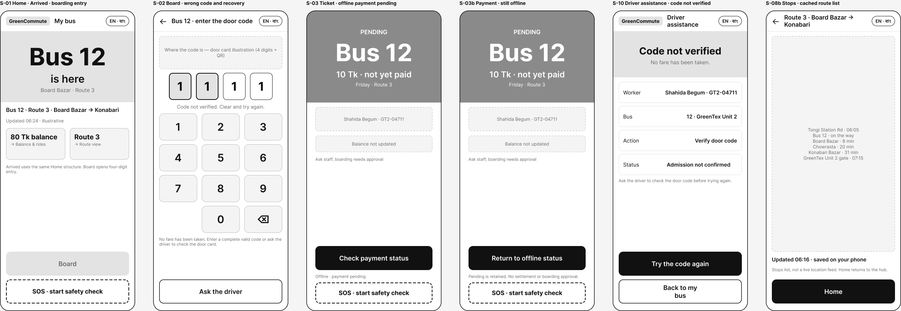<figcaption>D · Recovery states and stops</figcaption></figure>
<figure class="wide">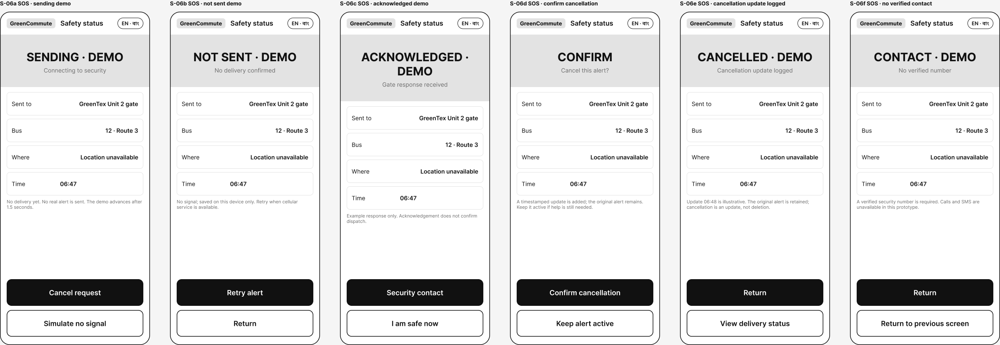<figcaption>E · SOS recovery states</figcaption></figure>
<figure class="wide half">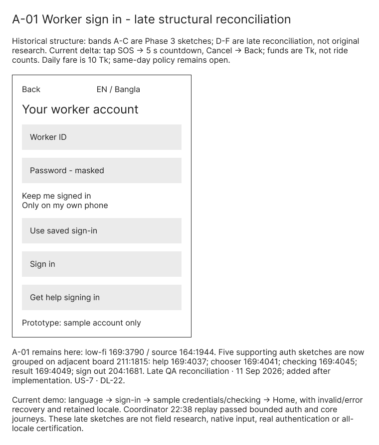<figcaption>F · Sign-in states</figcaption></figure>

</section>

<section class="phase">

# 4 · High-fidelity UI

Phase 4 · 19:10–20:40 · Notes: <a href="https://github.com/Tayebbb/ui-ux-carnival/blob/main/04-screens/screen-notes.md">04-screens/screen-notes.md</a> · Figma: <a href="https://www.figma.com/design/aWSZZboavo5bIt92qFQnsz/Carnival-8.0-%E2%80%94-UI-UX-Sprint?node-id=5-4">03 Screens</a>

**Designed for dim screens and one hand.** One light, high-contrast theme (every primary text pair ≥ 7:1, measured in §5); hero digits 128 px; all primary controls ≥ 56 px in the bottom thumb band; tap-only; red reserved for SOS; identical layout every day so she learns it once. Android 360 × 800 base; auto-layout reflows 320–430 px.

## Waiting state — S-01 Home

<figure>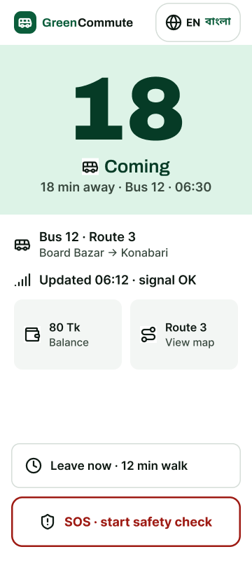<figcaption><strong>Coming</strong> · US-1, F8 · minutes at 128 px, updated time, Board + View map, SOS in thumb band</figcaption></figure>
<figure>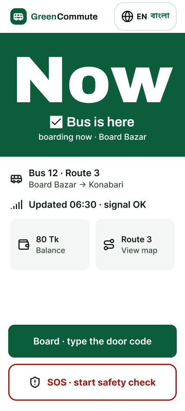<figcaption><strong>Arrived</strong> · US-1 · green fill, "Board now" becomes the single big action</figcaption></figure>
<figure>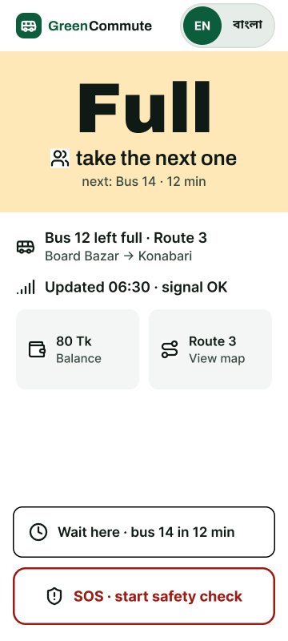<figcaption><strong>Full</strong> · US-2, C8 · amber, icon + words, next-bus ETA only when known</figcaption></figure>
<figure>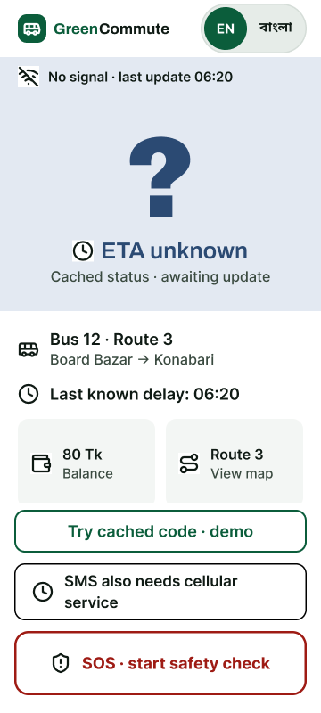<figcaption><strong>Offline</strong> · C5, Problem 5 · cached status dated, never shown as live; SOS still present</figcaption></figure>

## Boarding and payment — S-02 → S-03

<figure>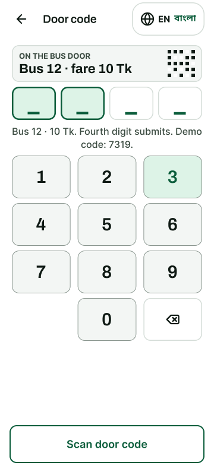<figcaption><strong>Door code</strong> · US-3, C2 · 4 slots, 56 px keys, camera optional</figcaption></figure>
<figure>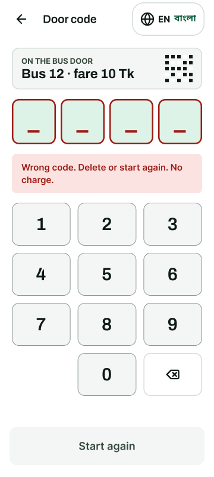<figcaption><strong>Wrong code</strong> · Problem 2 · plain words, retry, help after 3 failures</figcaption></figure>
<figure>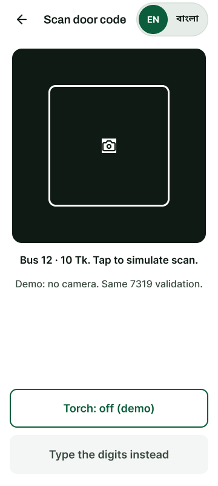<figcaption><strong>Scan instead</strong> · C2 · torch for 6:30 dark; fills the same four digits</figcaption></figure>
<figure>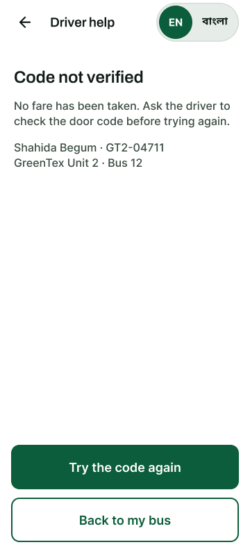<figcaption><strong>Driver help</strong> · US-3 · what to show the driver; no admission promise</figcaption></figure>

<figure>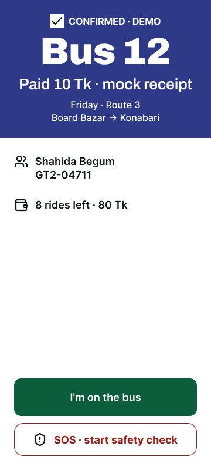<figcaption><strong>Ticket · Paid</strong> · US-3 · day colour + big bus number the driver reads at arm's length</figcaption></figure>
<figure>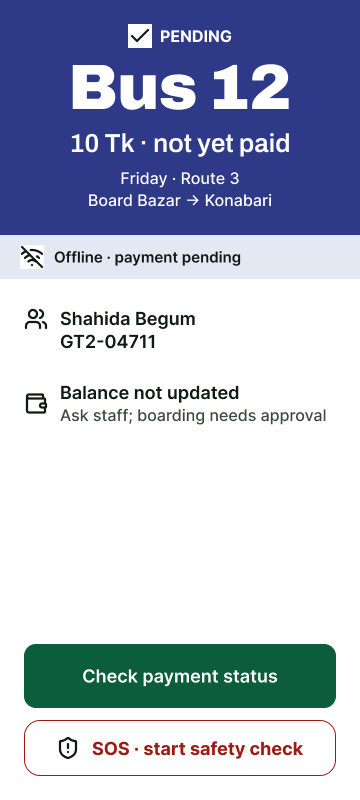<figcaption><strong>Ticket · Pending</strong> · C5, C10 · honest: paid only after server confirms</figcaption></figure>
<figure><figcaption><strong>Still offline</strong> · Problem 5 · pending stays pending; no invented success</figcaption></figure>
<figure>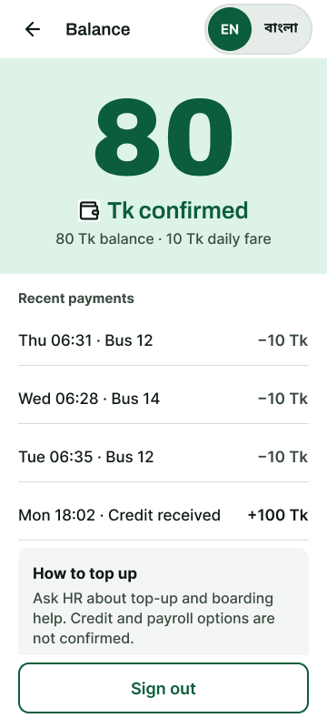<figcaption><strong>Balance</strong> · FR-5 · confirmed vs pending Tk, recent payments, sign-out</figcaption></figure>

## In-transit state — S-04, S-08

<figure>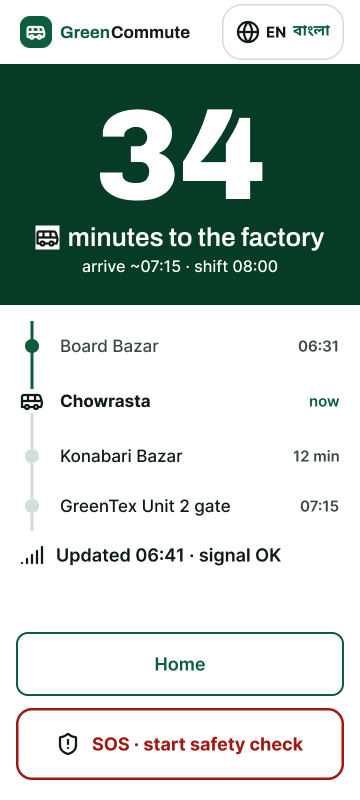<figcaption><strong>In transit</strong> · FR-9, US-4 · next stop, ETA to factory, SOS in thumb reach</figcaption></figure>
<figure>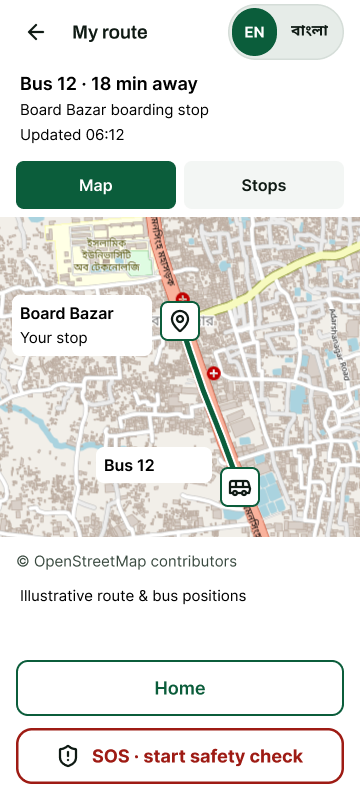<figcaption><strong>Map</strong> · C1, FR-7 · optional; attributed OSM tiles; position timestamp</figcaption></figure>
<figure>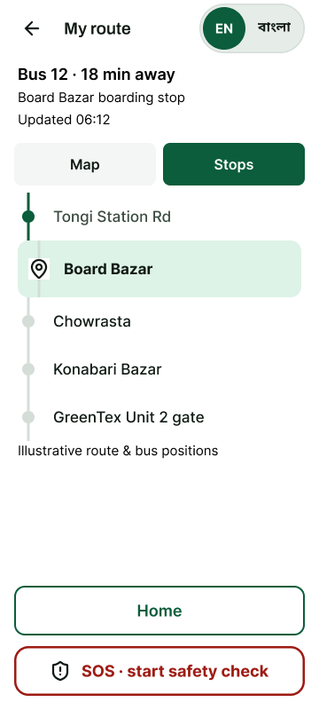<figcaption><strong>Stops</strong> · C1 · schematic alternative for map-averse users</figcaption></figure>
<figure>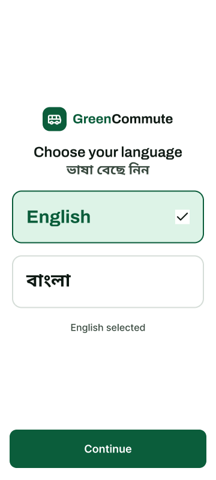<figcaption><strong>Language</strong> · C4 · English pre-selected, বাংলা one tap; whole app switches</figcaption></figure>

## Panic / SOS state — S-05, S-06

<figure>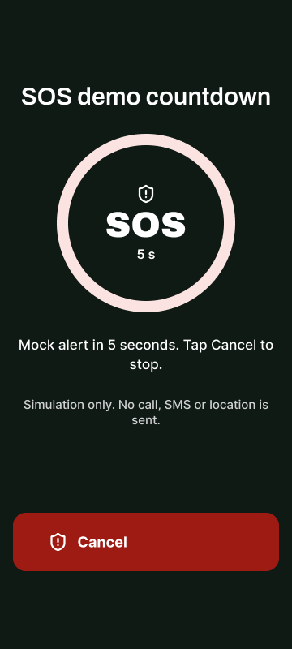<figcaption><strong>Countdown</strong> · US-4, C3 · 5 s to cancel an accidental press; no sound</figcaption></figure>
<figure>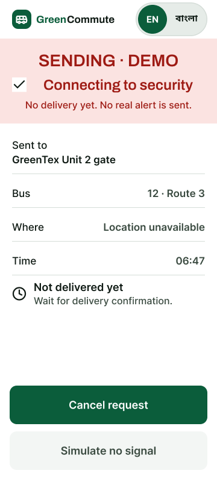<figcaption><strong>Sending</strong> · NFR-7 · attempt under way, Cancel still available</figcaption></figure>
<figure>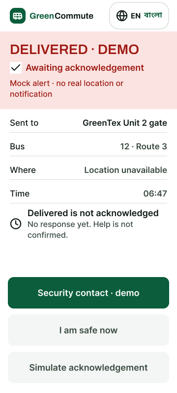<figcaption><strong>Delivered</strong> · US-5 · bus 14, worker, time, location, alert ID; Call security</figcaption></figure>
<figure>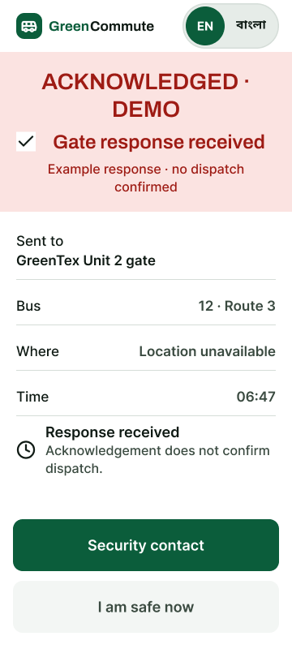<figcaption><strong>Acknowledged</strong> · US-5 · someone is acting — distinct from delivered</figcaption></figure>

<figure>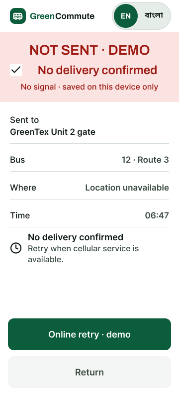<figcaption><strong>Not sent</strong> · C5 · no channel → say so, retry, call</figcaption></figure>
<figure>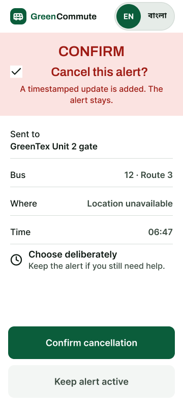<figcaption><strong>Confirm cancel</strong> · NFR-7 · cancel after delivery needs confirmation</figcaption></figure>
<figure>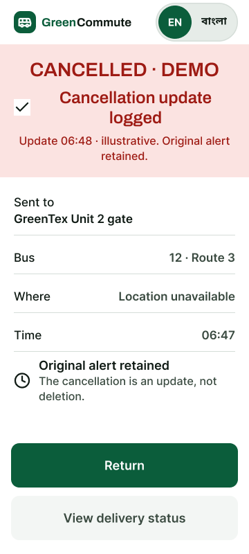<figcaption><strong>Cancellation logged</strong> · US-5 · timestamped, not erased</figcaption></figure>
<figure>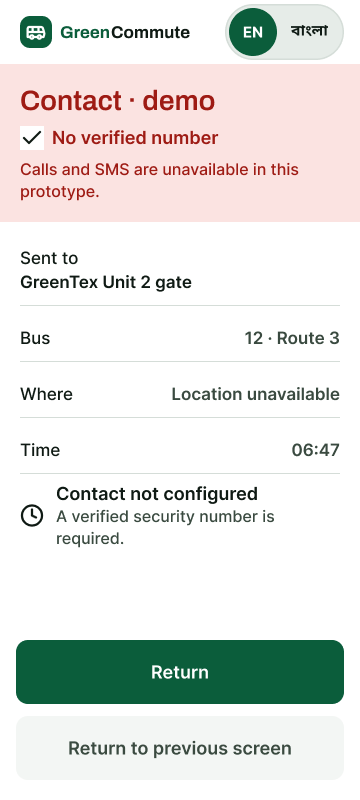<figcaption><strong>No contact</strong> · [A] U-7 · number unknown; no fabricated phone number</figcaption></figure>

## Entry — sign-in (A-01…A-05, DL-22)

<figure>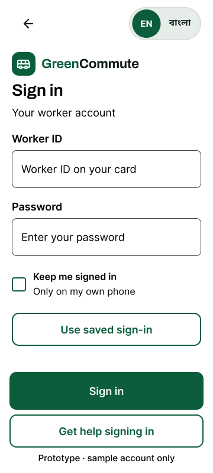<figcaption>Sign-in</figcaption></figure>
<figure>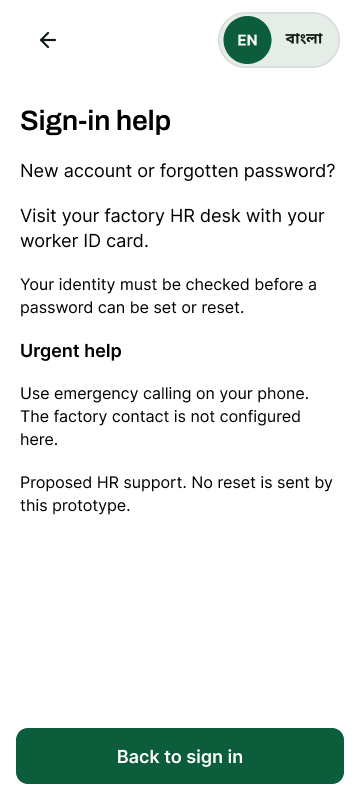<figcaption>Help</figcaption></figure>
<figure>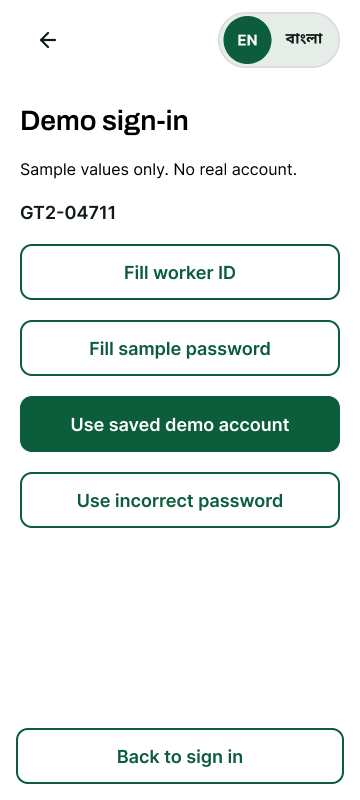<figcaption>Demo credentials</figcaption></figure>
<figure>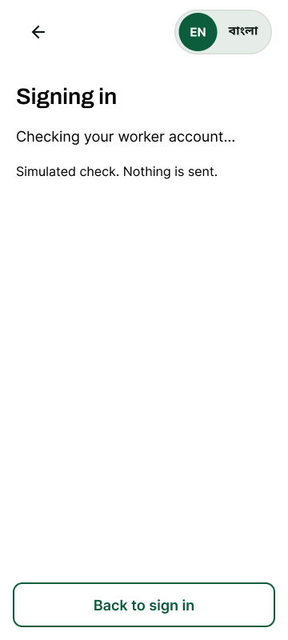<figcaption>Checking</figcaption></figure>
<figure>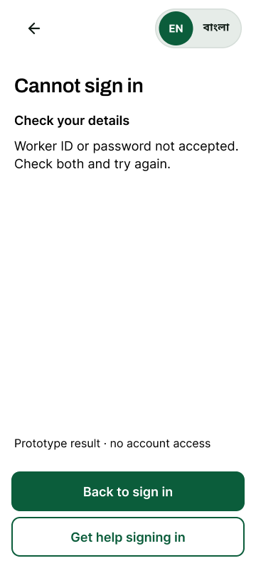<figcaption>Result</figcaption></figure>
<figure>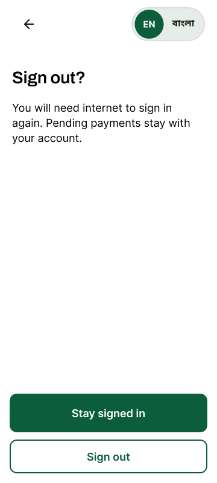<figcaption>Sign-out</figcaption></figure>

Company-issued worker ID + password once per device, never at each boarding (NFR-3). Sample credentials are labelled as demo; failures use generic wording; help does not reset by ID alone.

</section>

<section class="phase">

# 5 · Figma ecosystem &amp; design file

Phase 5 · 20:40–21:50 · Full document: <a href="https://github.com/Tayebbb/ui-ux-carnival/blob/main/05-design-file/design-system-and-accessibility.md">05-design-file/design-system-and-accessibility.md</a> · Figma: <a href="https://www.figma.com/design/aWSZZboavo5bIt92qFQnsz/Carnival-8.0-%E2%80%94-UI-UX-Sprint?node-id=5-5">04 Design System</a>, <a href="https://www.figma.com/design/aWSZZboavo5bIt92qFQnsz/Carnival-8.0-%E2%80%94-UI-UX-Sprint?node-id=5-6">05 Accessibility</a>

## Named variables

Collection **GreenCommute tokens** — semantic colour variables aliased to primitives; collection **GreenCommute language** — `locale` mode (English / Bangla) binding 153 copy variables plus font family/style so every screen switches language and typeface from one toggle.

| Group | Variables | Value | Why |
|---|---|---|---|
| Surface | `surface/page` · `surface/alt` · `surface/border` | `#FFFFFF` · `#F3F6F4` · `#D5DDD8` | One light theme: readable outdoors through droplets and cracks (DL-11) |
| Text | `text/primary` · `text/secondary` · `text/brand` · `text/on-color` | `#0F1A14` · `#3A4A40` · `#0B5D3B` · `#FFFFFF` | Near-black, never grey, on dim LCDs |
| Brand | `brand/primary` · `brand/tint` · `brand/deep` | `#0B5D3B` · `#DDF3E7` · `#063B26` | Green from "GreenCommute" / GreenTex; deep enough to carry white text |
| Status | `status/coming` · `status/full` · `status/delayed` (bg + fg each) | green `#DDF3E7`/`#063B26` · amber `#FFE8B8`/`#5E3D00` · slate `#E3E9F2`/`#2B4A73` | Three states HR named; each has icon + words, never colour alone |
| Danger | `danger/bg` · `danger/tint` · `danger/fg` · `danger/text` | `#9E1B14` · `#FBE3E1` · `#FFFFFF` · `#9E1B14` | Red reserved for SOS so it stays meaningful |
| Ticket | `ticket/thursday` | `#2E3A87` | Day colour of the boarding ticket (rotates daily, DL-02) |
| Language | `toggle/en|bn/bg|fg` | aliases | Segmented EN / বাংলা control follows the `locale` mode |

## Font set

| Font | Roles | Why |
|---|---|---|
| **Archivo** Black / SemiBold / Bold | `display/*` 36–128 px (hero minutes, bus numbers, balance) · `heading/*` 17–30 px | Wide, heavy grotesk reads like a departure board at arm's length; tabular-feeling digits |
| **Inter** Regular–Bold | `body/*` 15–18 px · `label/*` 13–18 px · `caption` 15 px | Tall x-height for small dim displays |
| **Noto Sans Bengali** Regular–Black | `bangla/*`, bound to the same roles in Bangla mode | Correct conjunct shaping; keeps English size and weight when switching |

All three are Google Fonts under the SIL Open Font License.

## Components with variants · auto layout

- **Button** set: Kind (Primary / Secondary / Muted / Danger) × State (Default / Pressed / Disabled / Focus) = 16 variants, 56–72 px tall.
- **Status hero** (Coming / Full / Arrived / Delayed / Offline), **Key** (digit / delete / confirm), **Banner** (info / warning), **Language chip** (segmented EN / বাংলা, 116 × 56), **SOS bar**, **Top bar**, **Detail row**, **Ticket card**.
- Every screen frame is auto layout with Fill/Hug sizing; verified at 320 / 360 / 412 / 430 px widths and 640 / 800 heights in both languages with zero text overflow. Layers are named by role (e.g. `Status hero`, `Primary button`, `SOS bar`).
- **Real text everywhere** — no lorem ipsum; sample names, codes and times are marked illustrative. **Theme logo:** the pack supplies only a name, so an original GreenCommute wordmark (Archivo Black, brand green, leaf-bus mark) is used on Language, Sign-in and Home.

## Clickable prototype

Two flow starts on page 03 Screens: **Boarding** (Language → Sign-in → Home → Door code → Ticket → In transit, with wrong-code, scan, offline and help branches) and **SOS trigger** (In transit → SOS → 5 s countdown → Sending → Delivered → Acknowledged / Cancel). Every visible control is wired; Back uses navigation history; timers use `After delay`. Links on the cover.

## Accessibility notes — written down, not just claimed

| Text | On | Ratio | WCAG |
|---|---|---|---|
| `text/primary` `#0F1A14` | `surface/page` `#FFFFFF` | **17.8 : 1** | AAA |
| `text/secondary` `#3A4A40` | `surface/page` | **9.4 : 1** | AAA |
| `text/brand` `#0B5D3B` | `surface/page` | **7.95 : 1** | AAA |
| `text/on-color` `#FFFFFF` | `brand/primary` `#0B5D3B` (buttons, Arrived) | **7.95 : 1** | AAA |
| `status/coming/fg` `#063B26` | `status/coming/bg` `#DDF3E7` (128 px hero) | **10.9 : 1** | AAA |
| `status/full/fg` `#5E3D00` | `status/full/bg` `#FFE8B8` | **8.1 : 1** | AAA — deepened from 4.9:1 in audit |
| `status/delayed/fg` `#2B4A73` | `status/delayed/bg` `#E3E9F2` | **7.4 : 1** | AAA |
| `danger/fg` `#FFFFFF` | `danger/bg` `#9E1B14` (SOS bar) | **8.0 : 1** | AAA |
| `danger/text` `#9E1B14` | `danger/tint` `#FBE3E1` | 6.55 : 1 | AA (below our internal 7:1 — noted) |
| `icon/muted` `#8A968F` | `surface/page` | 3.1 : 1 | AA non-text — decorative only |

- **Alt text:** every image and icon in this document carries alt text; in Figma each screen frame has a description and icons are named by meaning (`icon/bus`, `icon/warning`) for developer-side content descriptions.
- **Not colour alone:** every status has icon + ≤ 3 words + colour; ticket day-colour is backed by the day name.
- **Touch and motion:** targets ≥ 56 px with ≥ 12 px gaps; tap-only; animation only on state change; SOS is silent and cancellable for 5 s.
- **Language:** whole-app Bangla with Noto Sans Bengali; numbers stay large and Western-digit for driver recognition [A — to test].
- **Focus:** Button Focus variant with 3 px `brand/deep` ring for keyboard/switch access.
- **Not verified:** real-device TalkBack, worker comprehension tests, Bangla translation review — listed as open questions, not claimed.

</section>

<section class="phase">

# 6 · Handoff

Phase 6 · 21:50–22:40 · Full note: <a href="https://github.com/Tayebbb/ui-ux-carnival/blob/main/06-handoff/handoff.md">06-handoff/handoff.md</a> · Figma: <a href="https://www.figma.com/design/aWSZZboavo5bIt92qFQnsz/Carnival-8.0-%E2%80%94-UI-UX-Sprint?node-id=5-7">06 Prototype</a>, <a href="https://www.figma.com/design/aWSZZboavo5bIt92qFQnsz/Carnival-8.0-%E2%80%94-UI-UX-Sprint?node-id=5-8">07 Redlines &amp; Handoff</a>

## Redlines — home screen (S-01)

<figure class="redline">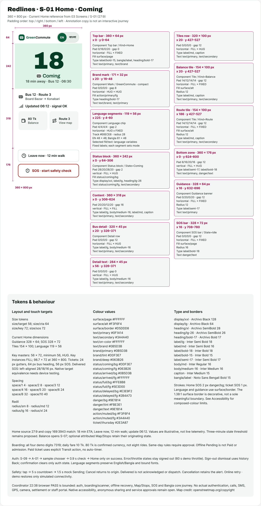<figcaption>Home redlines · spacing, sizes, tokens and text styles for every element · Figma page 07</figcaption></figure>

</section>

<section class="phase handoff">

# Developer handoff note

One page · GreenCommute · Mohammed Tayeb · 11 Sep 2026 · <a href="https://www.figma.com/design/aWSZZboavo5bIt92qFQnsz">Design file</a> · <a href="https://www.figma.com/proto/aWSZZboavo5bIt92qFQnsz?page-id=5%3A4&node-id=30-642&starting-point-node-id=30%3A642&scaling=scale-down">Prototype</a> · Redlines: page 07

**Purpose.** Android app for Gazipur garment workers: bus arrival status, camera-free 10 Tk boarding, discreet SOS to factory security. Constraints: low-end Android, dawn/rain, limited reading. English default, Bangla one tap.

**Main flows**

- **Entry:** Language → Sign-in (worker ID + password) → Checking → Home. Failure → Result with generic message; Help does not reset by ID.
- **Board:** Home → Door code (type 4 digits or Scan) → Ticket → In transit. Wrong code: retry; after 3 failures offer Driver help — never admission. Offline: ticket **Pending**; **Paid** only on server confirmation.
- **SOS:** Home / Ticket / In transit → 5 s countdown (Cancel) → Sending → Delivered → Acknowledged. Not sent when no channel. Cancel after delivery needs confirmation and is logged with time, not deleted.
- **Other:** Home → Balance / Map · Stops → back. Balance → Sign-out confirmation.

**Build with**

- Tokens: `GreenCommute tokens` (colour) and `GreenCommute language` (locale mode, copy, fonts). Fonts: Archivo, Inter, Noto Sans Bengali (OFL).
- Components: Button (Kind × State), Key, Status hero, Banner, Language chip, SOS bar, Top bar, Detail row, Ticket card. Base 360 × 800; test 320 / 412 / 430 reflow, Back, keyboard, focus, ≥ 56 px targets.
- **Status:** show bus, stop, ETA and source time; cache is dated, never presented as live. Proposed stale threshold 3 min.
- **Payment:** door code identifies the service, not presence or payment. Verify service, date and fare server-side. Typed, QR and retries share one transaction ID — no duplicate debits.
- **SOS:** one alert ID reused across retries; payload = worker, bus, time, location + accuracy + age. Delivered ≠ acknowledged. Never block on GPS. Figma sends nothing.
- **Auth:** company-issued ID; masked password with Show/Hide; paste/autofill allowed; generic errors; server rate limits; TLS; finite revocable sessions; no offline first-login.

**Open questions for the client**

1. Does one 10 Tk fee cover the return trip? Service-day cutoff? (FARE-1–5)
2. Top-up method and zero-balance policy — grace admission needs approval (C10).
3. Who marks a bus full and how fresh is that signal? (U-4)
4. Security-gate staffing at 06:30, receiving channel and call-back number (U-7).
5. Mobile data / SMS coverage at the stops; SMS fallback cost (U-7).
6. Speeding: telemetry source, thresholds, manager review — deferred by us (FR-12).
7. Bangla translation review and audio prompts; worker comprehension test on real phones.

**Not in this prototype:** live backend, real payment, GPS, SMS, audio playback, staff dashboard, groceries.

</section>

<section class="phase">

# 7 · Tools, AI use &amp; credits

## Tools and AI use (Rulebook §08)

| Phase | Tool | How it was used |
|---|---|---|
| 1–3 | GitHub Copilot (VS Code) | Structured the client pack into requirements, contradictions, personas, IA; challenged weak decisions; drafted the phase documents from my inputs |
| 3 | Pen and paper | Hand-sketched wireframes (page 8) before Figma low-fi |
| 4 | Figma + Copilot with Figma MCP | Hi-fi screens built from my wireframes and design brief; AI executed layout and variable wiring under review |
| 5 | Figma + Copilot with Figma MCP | Variables, variants, auto-layout audit, contrast measurement, text-overflow checks at five widths |
| 6 | Figma prototyping; Copilot | Prototype wiring, redlines, handoff note, this PDF |
| QA | Copilot subagents as independent "judges" | Rubric scoring, first-time-user walkthroughs, file QA — findings fixed in a loop |

This eight-prompt pack was the **main workflow**: [chatgpt.com/s/t_6aa430b886508191ac12f16790ebc536](https://chatgpt.com/s/t_6aa430b886508191ac12f16790ebc536). Many additional prompts, audits and research passes were run during the sprint — independent judge simulations, Figma structure and prototype QA, accessibility contrast checks, design-system research (Material 3, GOV.UK, Uber Base, BBC GEL). AI acted as an assistant; every design decision was made by me and is traceable, with evidence and alternatives, in the decision log: [DECISIONS.md](https://github.com/Tayebbb/ui-ux-carnival/blob/main/DECISIONS.md) (DL-01…DL-23) and [design_decision.md](https://github.com/Tayebbb/ui-ux-carnival/blob/main/design_decision.md). No user interviews, statistics or quotes were fabricated; illustrative values are marked [A].

## Credits (Rule 04)

- **Fonts:** Archivo, Inter, Noto Sans Bengali — Google Fonts, SIL Open Font License 1.1.
- **Icons:** Lucide — ISC License.
- **Map tiles:** © OpenStreetMap contributors, ODbL — attributed on the Map screen; positions illustrative.
- **Logo:** original GreenCommute wordmark and mark, created during the sprint (the pack supplied only the name).
- **Everything else** — copy, screens, components, diagrams, sketch — original work by Mohammed Tayeb, 11 September 2026, 17:00–23:00.

</section>
