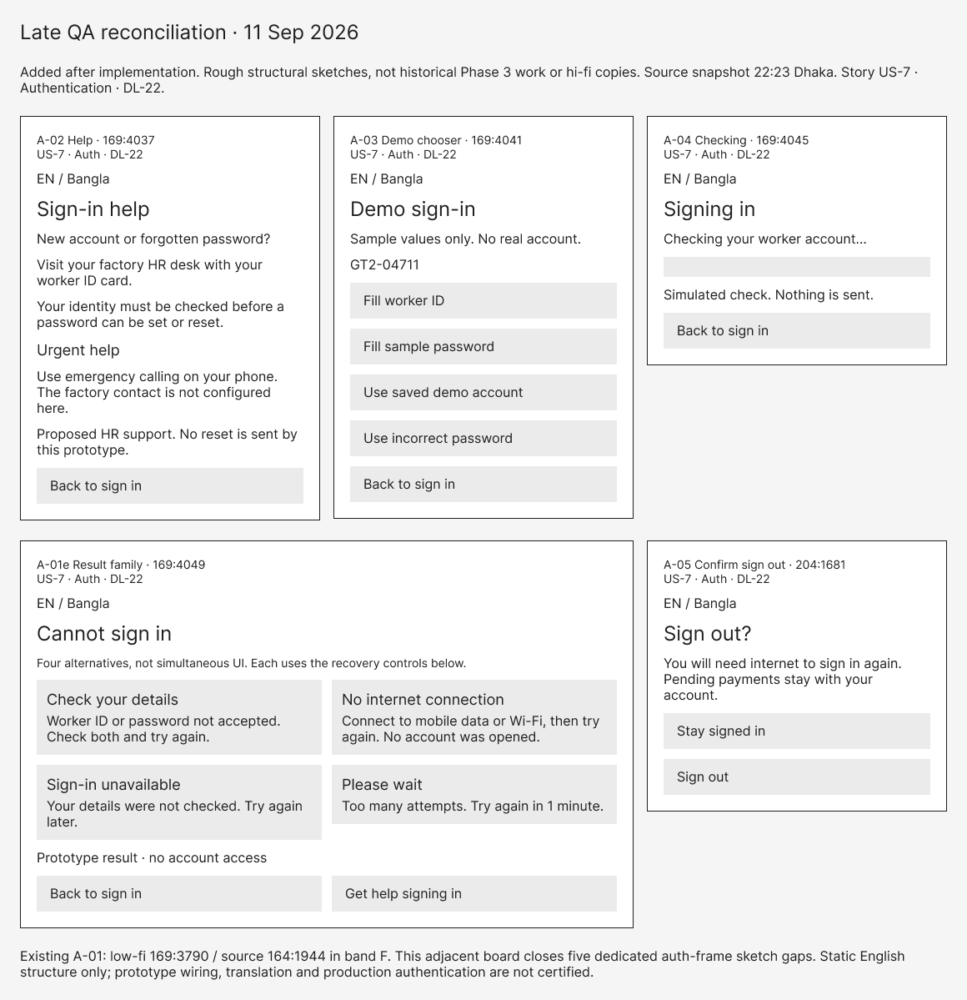

<section class="cover">

# GreenCommute
## Staff-bus companion for GreenTex Apparel's garment workers

**AUST CSE Carnival 8.0 — UI/UX Design Sprint · 11 September 2026**

**Entrant:** Mohammed Tayeb · Department of CSE, AUST

**Figma file (view access):** https://www.figma.com/design/aWSZZboavo5bIt92qFQnsz/Carnival-8.0-%E2%80%94-UI-UX-Sprint

**Clickable prototype:** https://www.figma.com/proto/aWSZZboavo5bIt92qFQnsz/Carnival-8.0-%E2%80%94-UI-UX-Sprint?page-id=5%3A4&node-id=30-642&starting-point-node-id=30%3A642&scaling=scale-down — Flow 1 · Boarding & payment starts at S-09 Language; Flow 2 · SOS starts at S-04 In transit (choose from the flow list in Present).

**Contents:** Phase 1 Requirements & discovery · Phase 2 Research & validation · Phase 3 Information architecture & low-fi · Phase 4 High-fidelity UI · Phase 5 Figma ecosystem & accessibility · Phase 6 Handoff (redlines + developer note) · decision log DL-01–DL-22 and consolidated design rationale. Final package inclusion requires a successful stable rebuild.

**Evidence base:** the client pack released at 17:00 (Item 01 Anisur Rahman's email · 02 junior's kick-off notes · 03 Monira Khatun, HR Supervisor, voice note · 04 SMS). The documents distinguish `[E·nn]` evidence, `[I]` inference, `[A]` assumption and `[D]` design decision/target. Worker names, IDs, stop assignments, bus numbers, codes, balances and most displayed times are illustrative. Exceptions include the supplied daily 10 Tk fee, 6:30 boarding and 8:00 shift. The fee does not establish a ride count or return entitlement.

**AI use:** GitHub Copilot assisted with drafting, Figma construction through its API, and technical auditing. Design decisions and responsibility for the submission remain with the entrant; AI assistance is not independent user research.

**Prototype boundary:** Language leads to the sign-in demonstration before personalised Home. Payments and emergency states are simulations. SOS uses a five-second countdown with explicit Cancel, not a working hold/release gesture; no real charge, call, SMS or location transmission occurs.

**Entrant confirmation required:** registered team name/ID, final member details and submission contact information must be checked by the entrant; none are invented here. Official form: https://forms.gle/XYuDchjGrAy3BNnN9. Asset credits, including recorded OpenStreetMap attribution and remaining map-provider provenance, appear in Phase 5.

---


**FINAL EXPORT**

Generated 2026-09-11T16:38:47.700Z. 37,417 source words; 26 PNG exports found.

Mandatory export categories are present by filename and image geometry. Content and prototype operation require separate review.

</section>

<section id="guide" class="phase">

# Reading guide

Each of the six phases appears once below, with its complete source document unchanged. These sections also serve as the full evidence record (formerly Appendices A-F). Appendix G preserves the complete decision log, including earlier hypotheses and later qualifications; this build does not reconcile or rewrite them. Wide prose tables are printed as labelled records. Appendix H includes every PNG once, with full pixel coverage in readable tiles for large sheets. Appendix I preserves the design decisions and rationale in full.

| Phase | Full phase document | Evidence link |
|---|---|---|
| 1 | [Requirements and discovery](#core-1) | [Full source evidence](#evidence-1) |
| 2 | [Research and validation](#core-2) | [Full source evidence](#evidence-2) |
| 3 | [Structure and low-fidelity design](#core-3) | [Full source evidence](#evidence-3) |
| 4 | [High-fidelity screens](#core-4) | [Full source evidence](#evidence-4) |
| 5 | [Design system and accessibility](#core-5) | [Full source evidence](#evidence-5) |
| 6 | [Developer handoff and redlines](#core-6) | [Full source evidence](#evidence-6) |

[Appendix G: full decision log](#decisions) | [Appendix H: complete export gallery](#exports) | [Appendix I: design decisions and rationale](#design-decisions)

## Mandatory image check

| Required export | Found at build time |
|---|---|
| Waiting (S-01) | 04-screens/S-01-home-arrived.png; 04-screens/S-01-home-coming.png |
| In transit (S-04) | 04-screens/S-04-in-transit.png |
| SOS (S-05 or S-06) | 04-screens/S-05-sos-countdown.png; 04-screens/S-06-sos-delivered.png |
| Home redlines | 06-handoff/redlines-home.png |

This is a packaging check, not an audit of Figma, claims, visual states or prototype interactions. The standalone developer handoff is also supplied as a separate one-page A4 PDF.

</section>

<section id="core-1" class="phase appendix">

# Phase 1 / Requirements and discovery

<div id="evidence-1"></div>

Source: 01-understand/brief.md. Full text, unchanged. [Reading guide](#guide).

# GreenCommute — Phase 1 · Requirements & Discovery

Mohammed Tayeb (solo) · AUST CSE Carnival 8.0 — UI/UX Design Sprint · 11 Sep 2026 · Theme released 17:00 · Phase 1 window 17:00–17:40

Client: GreenTex Apparel [I, from the sender's domain] · Product name: **GreenCommute** [E·04]

**How to read the tags.** `[E·01]` evidence from Item 01 (Anisur's email) · `[E·02]` Item 02 (junior's kick-off notes) · `[E·03]` Item 03 (Monira Khatun's voice note) · `[E·04]` Item 04 (SMS) · `[I]` inference from the pack · `[A]` assumption not supported by the pack · `[D]` design implication. Phase 2 rechecks hypotheses against the pack; this is not worker research and does not validate every `[A]`. Quoted source fragments are recorded excerpts; illustrative UI copy is [D]. Requirements and acceptance criteria below are targets, not delivered or tested claims. Current qualifications are recorded in DECISIONS DL-18–20.

## Discovery summary [D] — requirements at a glance

**Audience and need.** Primary: staff-bus workers at four Gazipur factories, mostly women, with reported reading/device constraints [E·01–03]. They need useful arrival/full-bus information, cashless payment and a way to request help at dawn. Security-gate staff are the intended SOS recipients [E·03]; operations and foreign buyers are stakeholders, not the primary mobile audience.

**Functional requirements [D].** Assigned-service status and freshness; leave-home/delay/full alerts; typed four-digit boarding input plus retained optional QR; one logical payment identity across input changes, navigation and retries; separate Pending/confirmed payment and balance; SOS with evidence-based delivery/acknowledgement; secondary route schematic; English default with immediate Bangla switch and retained Bangla audio. Current user-authorised addition (DL-22): company-provisioned worker ID + password before personalised Home, with sign-in help; not a password check at each boarding. See §4.1 and proposed fare gates in §4.3.

**Non-functional requirements [D, targets].** Dim-screen legibility (primary contrast ≥ 7:1), ≥ 56 px primary targets, wet/one-handed tolerance, low-end Android responsiveness, low data use, dated offline cache, redundant non-colour cues and discreet SOS feedback. Comprehension, performance and field usability remain untested; see §4.2.

| Contradiction | Proposed resolution [D] | Reason / qualification |
|---|---|---|
| Mandatory map [E·02] vs HR's status preference [E·03] | Status first; retained secondary schematic | Exposes the immediate decision; sponsor acceptance remains open (C1). |
| QR payment [E·01] vs damaged cameras/crowding [E·02–03] | Keypad first, optional QR for the same request | Removes required camera use, not fraud or presence risk (C2). |
| Police email [E·01] vs security-gate request [E·03] | Route SOS toward security; distinguish delivery from acknowledgement | Recipient is supported; staffing and response are not (C3). |
| English default vs reading difficulty [E·01] | Keep default; immediate Bangla/audio access | Preserves the explicit default without assuming Bangla/numeral comprehension (C4). |
| Live information vs no stop Wi-Fi [E·01–02] | Dated cache; fresh updates only with a working channel | No Wi-Fi proves neither absent mobile data nor usable SMS (C5). |

**Boundaries.** Worker morning journey is the current design scope [D]; return scope is unconfirmed. Dashboard/groceries were deferred by the client [E·01]; speeding implementation was deferred by us, not approved as unnecessary [D]. No new staff app, guaranteed admission/help, live backend or silent worker tracking is established.

**Unresolved policy [A].** Daily 10 Tk [E·01] establishes neither return-trip entitlement nor service cutoff. Client approval must define fare coverage, renewal and balance units (§4.3). Top-up, grace/manual admission, bus substitution, code distribution, SMS, gate staffing/escalation and location handling also remain open (§10). These are acceptance dependencies, not approved operations.

## 0. Source map — what the client pack actually contains

| Item | From | Reliability | Facts extracted |
|---|---|---|---|
| 01 | Anisur Rahman, `anisur.ops@greentex-apparel.com` — operations, project sponsor [I] | First-hand on business goals; second-hand on workers. Refers to a phone call we do not have. | ~15,000 workers · 4 garment factories · Gazipur · workers stand in rain for hours waiting for staff buses, get late, production stops — "the main thing" · wants an app "exactly like Uber", premium, smooth animations · assigned bus on a live map "so they know exactly when to leave home" · transport heavily subsidised · 10 Tk daily boarding fee · no cash anymore · pay by scanning a "complex QR code pasted on the bus door" from a balance · cheap Android sets · data expensive · load the app on factory Wi-Fi, but the stop is 3 km away — "maybe figure that out" · many cannot read properly, mostly female workers · English default because of a foreign-buyer presentation next month · big red SOS at dawn → automatic email to local police, "you decide the placement" · later: transport-manager dashboard, discounted groceries in-app — "Not now. But design keeping in mind." |
| 02 | Kick-off call notes by a junior | Terse, second-hand. Lines ending in "?" are questions raised, not decisions. Quantities approximate. | 15,000 workers · 40 buses · 8 routes · "Map view is an absolute must" — Anisur · shift 8:00 AM, boarding 6:30 AM in the dark · phones mostly have broken screens, dim brightness · QR payment questioned: half the workers have scratched cameras · rain and sweat make touchscreens hard to use in monsoon · factory Wi-Fi does not reach the stops; "offline mode needed?" |
| 03 | Monira Khatun, HR Supervisor (header calls her "field officer" — pack inconsistency), 3:42 voice note, transcribed | HR testimony *about* workers, not worker interviews. Transcript completeness is not established. | Workers on the floor — in her words, "the girls on the floor do not understand live maps" · they want "a notification or a big text that says 'Bus is 10 minutes away' or 'Bus is full, take the next one'" · QR scanning at 6:30 in a pushing crowd won't work · proposes a 4-digit PIN to confirm boarding · emailing police is useless, never checked · SOS must instantly alert the factory security gate with the specific bus number |
| 04 | SMS, sender unnamed (Anisur [I]) | Afterthought | App name "GreenCommute" · "can it track if the driver is speeding?" |
| — | **Absent from the pack** | | No logo or brand asset — only a name · no evening/return commute · no top-up method for the balance · no home-to-stop distance (3 km is stop-to-factory) · no device specs · no description of how workers learn bus times today · who marks a bus "full" |

**Details hidden in the pack that shape the product**

- Fleet totals: ~15,000 workers, 40 buses and 8 routes [E·01, E·02]. These totals do not establish ridership, seating capacity, trips, equal route allocation or how often buses fill. **Full / next bus** merits a first-class state because Monira explicitly names it [E·03], not because of fleet arithmetic.
- The client already knows two of his own contradictions: he flags Wi-Fi vs the 3 km stop and overrides literacy for a business reason (the buyer demo). The demo is a legitimate stakeholder goal that must be met *without* harming daily use.
- Boarding is at 6:30 AM and the shift starts at 8:00 [E·02]. Other journey times are illustrative [A]; one-handed use is a design inference from rain and crowding [I].
- "Know exactly when to leave home" is the need; the live map is one proposed means of meeting it.
- A precise leave-home cue is a **safety** feature for women travelling at dawn — less time waiting alone in the dark — not only a convenience [I].
- A payment record alone establishes neither physical boarding nor occupancy [I]. The source and freshness of a full-bus signal remain unknown (U-4).
- Staff buses are in the pack [E·01]; authority to distribute codes, driver devices and telemetry availability are unverified (U-6, U-12).

## 1. Problem statement

**Who.** Garment workers — the majority women, many who cannot read well [E·01] — at GreenTex Apparel's four factories in Gazipur, about 15,000 people [E·01].

**What.** They wait at roadside stops for company buses with no information about when their assigned bus will come, or whether it will have room [E·01, E·03]. They wait for hours, arrive late, and production stops [E·01]. A new cash-free 10 Tk fare adds a payment step at the bus door [E·01].

**Context.** Boarding at 6:30 AM in the dark [E·02], in monsoon rain [E·02], in a pushing crowd [E·03], on cheap Android phones [E·01] with cracked, dim screens and scratched cameras [E·02], with expensive data and no factory Wi-Fi at the stop [E·01, E·02]. Monira rejects the proposed police-email escalation [E·03]; existing emergency channels and mobile coverage are not established.

**Why it matters.** For workers: hours lost, exposure to rain and dark, lateness and its consequences. For the company: reported production stoppages, a proposed cashless fare for subsidised transport, and a welfare programme it must present to buyers next month [E·01].

**Outcome to improve.** Minutes waited at the stop per worker per day (↓) · late arrivals attributed to transport (↓) · seconds to board and pay (↓) · share of workers who can use the app without help (↑) · time from SOS press to security alert (↓).

## 2. Target users

| Tier | Who | What the pack says |
|---|---|---|
| **Primary** | The worker who rides the staff bus — mostly women, limited reading, cheap Android, dawn commute | [E·01, E·02, E·03] |
| Secondary | Factory security gate staff — receive the SOS with bus number; persona in Phase 2 | [E·03] |
| Tertiary | Bus driver — boards workers; subject of "bus full" and speeding; may display or validate the boarding code [I]; noted, not personified | [E·03, E·04] |
| Stakeholder | Anisur Rahman (operations) — production continuity, fare collection, buyer presentation | [E·01] |
| Stakeholder | Monira Khatun (HR) — worker adoption; voice of the floor | [E·03] |
| Stakeholder | Transport managers — future dashboard | [E·01] |
| Audience | Foreign buyers — see the English mode once | [E·01] |
| Removed | Local police — explicitly out of the direct loop | [E·03] |

The worker is the only primary user of this mobile prototype. Other roles support transport or SOS operations; they do not each require an app. Proposed permissions and receiving/telemetry workflows are documented in the DL-21 service appendix, not delivered as staff screens.

## 3. Product goal

**Primary outcome.** Every worker knows — without needing to read — when to leave home and whether her bus is coming, so she waits at the stop for minutes, not hours. *Measure:* median minutes at the stop; share of "leave now" alerts that arrive before the bus.

Supporting goals:

- **G2 Board and pay in seconds [D, target].** Submit a 10 Tk request with ≤ 2 taps + a 4-digit code; camera optional, no cash. Offline requests stay Pending until server-confirmed. *Measure:* input steps, completion without help and reconciliation outcomes; not measured here.
- **G3 Help in one hold [D, target].** Send an SOS toward factory security with bus number, available location and time. *Measure:* local feedback, delivery and gate acknowledgement separately; no three-second delivery guarantee.
- **G4 Works on the real phones [D, target].** Dim, cracked, wet, low-end Android with costly or interrupted data. *Measure:* primary status contrast ≥ 7:1; targets ≥ 56 px; cached content visibly dated. SMS is a candidate fallback [A], not established infrastructure.
- **G5 Presentable to buyers** in English without changing the worker experience. *Measure:* same screens, one language switch.

## 4. Requirements

### 4.1 Functional requirements

| ID | Requirement | Source | Priority |
|---|---|---|---|
| FR-1 | Personalised home: the worker's route and stop, and the next bus coming for her today — nothing to search for (see C9) | [E·01] "their assigned bus"; [E·03] | Must |
| FR-2 | Status as number + words: **minutes to arrival** · **Full — take the next one** (next bus and ETA only when supplied) · **Arrived / boarding now** · **Delayed / no update since hh:mm**; never present a cached ETA as current | [E·03]; [E·01]; [D] freshness handling | Must |
| FR-3 | Alerts: leave-home cue ("Bus 12 · 15 min away"), bus full, delay or cancellation via push; **SMS fallback proposed [A]**, conditional on coverage, cost and service integration (U-7) | [E·03]; [E·01] "know exactly when to leave home"; [E·02] no Wi-Fi at stops; [D] delivery proposal | Must (alerts) · SMS unconfirmed |
| FR-4 | Board and pay: type the proposed daily 4-digit **boarding code** on the door card, or scan it; target **≤ 2 taps + 4 digits**, no required camera. Cache/code distribution is unverified [A]. Create one unique transaction ID per payment request and reuse it on retries [D]. Offline: **Pending**, with pending amount separate from last-confirmed balance. Only server confirmation permits **Paid 10 Tk** and a settled balance. Ticket colour is a recognition cue, not payment or presence proof | [E·01] 10 Tk, no cash; [E·03] PIN suggestion; [E·02] cameras; [D] C2, DL-18 | Must |
| FR-4b | "Scan instead": target camera view with a torch toggle reads the door QR and auto-fills the same four digits; failure returns to the keypad in one tap; same transaction and retry ID as typed entry | [E·01] QR; [D] C2; user-approved optional input | Retain approved QR option |
| FR-5 | Balance: last-confirmed **Tk**, pending amounts separate, proposed low-balance warning and recent payments. Do not derive a promised ride count until the client approves daily-fare entitlement and renewal rules (FARE-1–5). Historical −3-ride grace and manual admission require **client approval**; top-up method remains unknown | [E·01] "from their balance"; [D] C10; [A] U-5 | Must (view) · policy unconfirmed |
| FR-6 | SOS: large one-handed control on waiting and in-transit screens; hold-to-trigger; discreet local feedback, no sound. Use one unique alert ID across retries/channels [D]. **Sending** = attempt underway; **Not sent** = no successful transmission; **Delivered** requires delivery confirmation; **Acknowledged** requires gate response. Payload: bus number, worker identity, time and available location with age. Call/cancel targets and push/SMS integration require operational confirmation; no delivery or help-arrival guarantee | [E·01] big red SOS; [E·03] security gate + bus number; [D] C3, DL-18; [A] U-7, U-9 | Must |
| FR-7 | Optional-use Map/Stops, one tap from the status-first Home: geographic basemap, selected bus and boarding stop, ETA only when available, and position timestamp; retained stop schematic as the alternative. Offline shows last-known position, not a live marker. Same-state return and SOS remain available. Figma route/positions are illustrative, not live telemetry | [E·02] map demand; [E·03] status preference; [D] later user-approved extension, DL-23 | Must be available; use is optional |
| FR-8 | Language: **English pre-selected**; immediate prominent **বাংলা** and Bangla audio switch on first launch and core screens, as user-approved [D]. HR-assisted set-up is only a proposal [A]. Number + icon + text + colour support comprehension; reading, numeral and audio comprehension need testing | [E·01] explicit English default; [E·01, E·03] literacy; [D] DL-04 | Must |
| FR-9 | In-transit state: current bus, next stop and ETA to the factory, SOS. No speed read-out for workers (C7); "report a problem with this bus" is a Could, not designed this sprint | Rubric Phase 4; [E·04] | Must (state) · Could (report) |
| FR-10 | Bangla audio option retained; spoken alert wording and comprehension are targets, not a verified translation or tested recording | [E·01] literacy; [D] user approval; [A] language validation | Retain approved audio option |
| FR-11 | Proposed HR-assisted enrolment: issue worker ID against approved employment records; assignment, language and initial balance remain operational dependencies. Worker sets the final password privately; HR cannot retrieve it. Identity-verified recovery uses a strong, short-lived, single-use setup/reset grant limited to setting a password, never worker ID alone | [D] DL-22; [A] U-15 staffing, issuance and identity checks | Should, subject to client confirmation |
| FR-12 | Requested speeding detection: proposed vehicle telemetry, validated threshold checks and a transport-manager review channel; role boundaries and acceptance gates in DL-21. No current detection service, speed screen or worker-phone tracking | [E·04] request; [D/A] proposed solution, U-12 | Requested; implementation deferred by us, pending client review |
| FR-13 | Sign-in target: S-09 language -> A-01 worker ID + masked password with Show/Hide -> successful simulated check -> S-01. Empty input, generic invalid credentials, offline first/new-device access, throttling and service failures do not grant access. A-02 help returns to A-01 without claiming a reset; no signup, role selector or staff dashboard. Logout on existing Balance and unauthenticated emergency-contact guidance are targets pending parent verification; no contact number is established | [D] user-authorised addition, DL-22; external desk research in Phase 2 §11, not pack evidence | Must for login addition; Figma simulation only |
| OUT | Transport-manager dashboard and in-ride groceries explicitly postponed by the client; no new More destination | [E·01] "not now"; DL-08, DL-21 | Out of current IA and sprint |

### 4.2 Non-functional requirements

| ID | Requirement | Source |
|---|---|---|
| NFR-1 | **Legibility on dim, cracked screens:** primary status ≥ 7:1 contrast, hero digits ≥ 64 px, body ≥ 18 px *(revised in Phase 5 to ≥ 15 px for secondary detail lines and ≥ 17 px for anything she acts on — DL-17)*, no thin weights; critical controls away from corners and edges where cracks and dead zones concentrate | [E·02] |
| NFR-2 | **One-handed, in a crowd:** primary actions in the bottom thumb zone; targets ≥ 56 × 56 px with ≥ 12 px spacing; tap-only — no swipe-only or multi-touch gestures | Rubric Phase 4; [E·02, E·03] |
| NFR-3 | **Wet-screen tolerance [D]:** forgiving taps; hold-to-send SOS; clear code-validation feedback; cancellation status explicit. Four-digit-only entry applies to boarding, not initial sign-in: worker ID/password adds typing burden requiring validation; authentication must not become required at each boarding | [E·02]; [D] DL-22 |
| NFR-4 | **Connectivity [D]:** cache shell, route and identity when connected; small live payloads; timestamp cached status and mark unavailable updates. First/new-device sign-in needs connectivity; previously authorised cached access requires a bounded, approved policy, not offline password acceptance. SMS for alerts/SOS is conditional [A, U-7]. No factory Wi-Fi does not establish no mobile data | [E·01, E·02]; [D] DL-22 |
| NFR-5 | **Low-end Android, responsive target [D]:** fast cold start; animation only for state change; approved 360 × 800 base with auto-layout reflow targeted at 320–430 px. Resize, device and performance checks belong to parent visual QA; not verified by this brief. Older Android versions unknown [A] | [E·01, E·02] |
| NFR-6 | **Low-literacy comprehension:** ≤ 3 words per state label; numbers and icons carry the meaning; colour never the only cue; identical layout every day; Bangla-capable typeface | [E·01, E·03] |
| NFR-7 | **Safety and trust [D]:** SOS control remains accessible at low balance or offline; transmission still needs a working channel and shows Not sent when unavailable. A cancellation request is not a recalled delivered alert. SOS location permission, freshness and handling need approval; no silent trip/speed tracking | [E·01, E·03]; [A] U-7, U-9, U-12 |
| NFR-8 | **Data cost:** well under 1 MB per day of live use [A target] | [E·01] |
| NFR-9 | **Presentability:** consistent visual system; English mode for the buyer presentation next month | [E·01] |
| NFR-10 | **Scope [D]:** document future dashboard/grocery questions without changing the approved current navigation or adding More | [E·01] future request; DL-08 |
| NFR-11 | **Timeliness:** leave-home lead time configurable per worker or stop — walking time is unknown (U-3) | [E·01] |
| NFR-12 | **Authentication [D, production targets]:** allow paste, autofill and optional OS-managed saved credentials; masked password with Show/Hide; English default with immediate Bangla. Single-factor passwords: minimum 15 characters, permit 64+, spaces/Unicode; block common/breached values, no mixed-character rules or routine expiry. Generic wrong/nonexistent/disabled-account failures and server rate limits prevent enumeration. Keep signed in unchecked, personal phones only; finite/revocable sessions, protected storage and logout. Preserve pending payment ownership across account changes without exposing or submitting another worker's queue. No default shared password, bus PIN login or HR-visible final password; service scope and policy remain U-15. Figma implements no server auth, secure storage or native autofill | [D] DL-22; Phase 2 §11 external sources, not compliance evidence |

### 4.3 Proposed daily-fare decision and acceptance requirements [D]

**Evidence boundary.** The pack specifies a **10 Tk daily boarding fee** [E·01], not whether it covers one boarding, both directions or another entitlement. It supplies neither return-trip coverage nor a service-day cutoff. Neither a daily door code nor a successful payment settles those questions [I].

**Proposed decision, pending client approval [D].** Treat payment continuity separately from entitlement. Preserve one logical payment identity for the same payment intent; Back, reopening, input switching and transport retries are not new purchase intent. The client must approve covered journeys/vehicles, return eligibility, service-day timezone/cutoff, renewal conditions and the unit used for balance conversion before entitlement copy or a new-charge rule can be accepted. No backend or approved fare policy is claimed here.

| ID | Proposed acceptance requirement [D, not tested] |
|---|---|
| FARE-1 | Given only the pack's daily 10 Tk statement, do not display an invented entitlement: no implied return inclusion/exclusion, unlimited travel or expiry time. Existing “rides left” targets and sample balances above/below are conditional: do not derive a ride count from Tk until the client approves what one paid unit covers. Confirmed Tk and payment status do not themselves grant boarding. |
| FARE-2 | After typing a code, using Back or reopening the payment flow must restore the same logical payment identity and known state; neither action alone creates or submits another payment request. An unsubmitted draft remains unsubmitted. |
| FARE-3 | Switching to QR after typing, or back to typing, must reuse that logical identity. Scanning the same code does not create a second request. A conflicting code requires explicit resolution; it must not silently create another charge or overwrite a submitted request. |
| FARE-4 | Following timeout, offline interruption or retry, reuse the existing transaction ID for the same submitted request. Proposed service acceptance must demonstrate at-most-once charging for that identity; uncertainty stays Pending, not a new request or Paid. Reopening a confirmed payment shows its existing result without resubmission. |
| FARE-5 | If the prior identity/result cannot be recovered, disclose unresolved payment status and require reconciliation before another submission; do not silently mint a replacement. A genuinely new payment needs explicit intent and a client-approved charging rule, not navigation, scanning, elapsed time or an assumed daily reset alone. |

**Open client question [A; extends U-8/U-5/U-6].** What exactly does 10 Tk purchase, does it include a return trip, and when and under which service rules may another charge begin? Until answered, retain neutral payment-state wording and flag entitlement as unresolved. Proposed checks must exercise typed → Back → reopen → QR → retry for both Pending and confirmed outcomes and compare identity/request/debit counts; this is a test specification, not evidence of implementation.

## 5. Contradictions — named and resolved

**Root tensions.** Almost every contradiction below comes from three underlying tensions: (1) a buyer-facing showcase vs a worker-facing daily tool; (2) a real-time connected experience vs a low-end, offline, crowded reality; (3) speed vs security vs dignity at the two critical moments — boarding and SOS. The client is describing two products at once. We design the worker's tool first and make it presentable, rather than the reverse.

**Resolution principles.** Worker safety beats presentation · default to the simplest successful action · prefer one robust path over primary-plus-fallback when the fallback fails the same users · future features shape the data model, not today's screens · anything the pack does not answer is flagged as a client decision, not guessed.

| # | The client says | The pack also says | Resolution | Reasoning |
|---|---|---|---|---|
| **C1** | Live map "exactly like Uber"; "map view is an absolute must" [E·01, E·02] | Workers "do not understand live maps"; want big text or a notification [E·03]; cheap phones, dim screens, expensive data, no Wi-Fi at the stop [E·01, E·02] | **Status-first with optional Map/Stops [D].** Large status remains primary; the existing Route entry opens the later user-approved geographic map, with a Stops alternative and explicit position freshness (FR-7, DL-23). | HR's account supports the Home hierarchy, not removal of an optional map. Map-loading failure is unmeasured. User approval permits this prototype extension; sponsor acceptance and live vehicle tracking remain unconfirmed. |
| **C2** | Pay by scanning a complex QR on the bus door [E·01] | Half the cameras scratched [E·02]; 6:30, dark, pushing crowd, rain [E·02, E·03]; HR proposes "a 4-digit PIN to confirm they are on board" [E·03] | **Keypad first; optional QR retained [D].** The bus-door code rather than a personal PIN is our interpretation, not an HR specification. Proposed daily door card and QR encode the same four digits; distribution/cache remain [A, U-6]. Both inputs create the same payment request. Offline **Pending** is distinct from server-confirmed **Paid 10 Tk**; retries reuse one unique transaction ID (DL-18). | Camera damage and crowding justify a non-camera path [I], not a universal QR-failure claim. Neither a shared code nor its QR proves physical presence, identity, occupancy or payment; both can be copied. Daily colour supports recognition only, not fraud prevention. Kerb entry speed and driver readability are test targets. Preserve the user's approved scan option, not a first-cut feature. |
| **C3** | SOS sends an automatic email to the local police [E·01] | Police "never check" email; alert the factory security gate with the bus number [E·03]; the bus may be kilometres from the gate [I] | **SOS → factory security [D].** Proposed dispatcher workflow, no automatic driver alert, discreet local feedback. Distinguish **Sending / Not sent / Delivered / Acknowledged**, reuse one alert ID across retries/channels, and show location age when available (DL-18). Call and cancellation are targets; push/SMS service and gate staffing require confirmation [A]. | Monira identifies the intended recipient, not its staffing, response time or capabilities. A quiet interface may reduce disclosure risk [I] but cannot ensure only the worker sees it. Delivery is not human acknowledgement or help arrival. Escalation policy is the client's, not an assumed response in seconds. |
| **C4** | English as the default language [E·01] | "Many cannot read properly, mostly female workers" [E·01]; workers need plain big text [E·03] | **English remains pre-selected [D]**, with the user-approved immediate বাংলা/audio switch on first launch and core screens. HR-assisted set-up is a proposal [A], not a dependency. | Preserve the explicit default and approved switch. Language-light design is a comprehension hypothesis [I]; Bangla reading, numeral preference, translations and audio require validation, not a claim that either mode works without reading. |
| **C5** | Load the app over factory Wi-Fi [E·01] | The stop is 3 km away, Wi-Fi does not reach it [E·01, E·02]; data is expensive [E·01] | **Offline-tolerant cache [D]; conditional SMS [A].** Timestamp route/status and use small connected updates. Never imply live updates without a working channel; payment and SOS use their explicit pending/delivery states. | Lack of factory Wi-Fi is evidence; lack of all mobile data or working SMS is not. Coverage, cost and integration remain U-7. |
| **C6** | "Exactly like Uber… very premium, smooth animations" [E·01] | Cheap Android, dim broken screens, wet hands, urgent context [E·02, E·03]; fixed routes and a fixed fee — nothing is hailed [E·01, E·02] | **"Premium" redefined** as fast, clear, high-contrast and calm; animation only to mark a state change; no gesture-driven interface. **"Like Uber" is read as live tracking and polish, not on-demand hailing** — there is no request-a-ride anywhere in the IA. | Speed and legibility on low-end devices are what will feel premium to these users — and look credible to buyers. The service is scheduled buses on eight routes; a hailing metaphor would invent features the operation cannot deliver. |
| **C7** | Dashboard and groceries: "Not now. But design keeping in mind" [E·01]; "track if the driver is speeding?" [E·04] | A six-hour sprint; the graded scope is the worker journey. The SMS does not postpone speeding | **Dashboard/groceries deferred by the client [E·01]; speeding implementation deferred by us [D].** DL-21 documents proposed roles, vehicle monitoring and staff review; feasibility, threshold source and permissions/privacy remain U-12. No new staff screen, speed indicator or silent worker-phone tracking | Preserve the worker scope while acknowledging the unmet speeding request. Documenting the service does not fulfil it or authorise collection; an approved staff channel need not require a full dashboard. |
| **C8** (capacity question) | ~15,000 workers and 40 buses [E·01, E·02] | Monira explicitly names a full bus and taking the next one [E·03] | **Full remains first-class [D]**, with next-bus details only when known; otherwise disclose no update. Ridership, capacity, allocation and frequency remain unmeasured (U-4). | Workforce/fleet totals cannot establish routine fullness or trips per bus. The state is justified by HR testimony, not arithmetic. |
| **C9** | Each worker has an "assigned bus" [E·01] | "Bus is full, take the next one" [E·03]; 40 buses, 8 routes [E·02] | **Route/stop-based display remains a design proposal [D].** Show an eligible next bus only when assignment and service data support it. | A route-based model may reconcile these statements [I]; neither equal allocation nor actual reassignment rules are established. U-11 remains open. |
| **C10** | "No cash allowed anymore"; pay from a balance [E·01] | Lateness stops production — "the main thing" [E·01]; no top-up or zero-balance policy in the pack | **Warn before a shortfall [D].** Historical −3-ride grace and manual admission are proposals requiring **client approval**, not permission to board. Payroll/HR top-up are unverified alternatives [A]. | Refusal could worsen lateness [I]; neither its cost nor grace as the only solution is evidenced. Show pending vs confirmed funds and disclose unresolved admission policy (U-5, U-6). |

Minor pack inconsistency noted, not resolved: Monira is titled "field officer" in the header and "HR Supervisor" in the signature.

## 6. Constraints

**Explicit (stated in the pack).** Android phones, cheap, cracked and dim [E·01, E·02] · scratched cameras on about half [E·02] · data expensive; no factory Wi-Fi at stops [E·01, E·02] · 10 Tk daily fee, no cash fare [E·01] · limited reading, majority women [E·01] · boarding 6:30 AM in the dark, shift 8:00 [E·02] · monsoon rain, sweat [E·02] · ~15,000 workers, 4 factories, 8 routes, 40 buses [E·01, E·02] · SOS required [E·01] · name "GreenCommute" [E·04] · English explicitly the default for the buyer presentation next month [E·01] · sponsor requires a map view [E·02] · dashboard and groceries deferred [E·01].

**Unverified assumptions/questions [A].** Phone ownership, numeral recognition, mobile/SMS reception, assignment rules, gate staffing at 6:30 and payroll/HR top-up. The earlier multiple-trip inference is withdrawn; trips and ridership remain unknown (U-4; research A-6). None is an established operating condition.

**Unknowns.** See §10.

## 7. User stories

**US-1 · Glanceable status.** As a sewing-line worker who reads with difficulty, I want to see at a glance whether my bus is coming and in how many minutes, so that I stop waiting for hours in the rain and dark.

- Done when: the home screen shows my bus number and minutes-to-arrival as the single largest element, readable at arm's length on a dim screen (contrast ≥ 7:1, digits ≥ 64 px).
- Done when: *Coming*, *Full — take the next one*, *Arrived* and *Delayed / no update* are distinguishable by colour **and** icon **and** position, not by text alone.

**US-2 · Leave-home alert.** As a worker leaving home before dawn, I want an alert that tells me when to leave, so that I reach the stop just before the bus, not an hour early.

- Done when: a "Bus 12 · 15 min away · leave now" notification is specified with a configurable lead time.
- Target: an equivalent SMS variant is specified only as a candidate fallback [A]; delivery, language encoding and cost require confirmation (U-7).

**US-3 · Board and pay.** As a worker boarding in a pushing crowd with a wet, scratched phone, I want to confirm boarding and pay the 10 Tk fare without using the camera, so that I board in seconds without cash.

- Done when: boarding completes with ≤ 2 taps plus a 4-digit code and no camera.
- Target: offline entry shows **Pending**, not Paid; only server confirmation shows **Paid 10 Tk**, bus, time and settled balance. Retry uses the same unique transaction ID; daily colour is not proof. Typed and optional QR paths share this contract (DL-18).

**US-4 · SOS.** As a woman travelling at dawn who feels unsafe, I want one big SOS control to request help from factory security with my bus number and honest delivery feedback.

- Target: SOS is reachable from waiting and in-transit in the bottom zone; a ~2 s hold is proposed to reduce accidental triggers, not proven to prevent them.
- Target: show **Sending**, **Not sent**, **Delivered** or **Acknowledged** according to actual evidence, with one alert ID across retries. No three-second delivery guarantee. A cancellation request must not imply a delivered alert has been recalled (DL-18).

**US-5 · Balance.** As a worker paying the daily 10 Tk fare from a balance, I want confirmed funds, pending amounts and a low-balance warning, so I can seek the approved top-up or admission process before boarding. That process remains unknown.

- Target: Home and Balance show last-confirmed Tk, with pending requests separate; neither promises an approved number of rides or admission entitlement.
- Target: a low-funds warning uses a client-approved threshold and confirmed top-up guidance. The earlier three-rides threshold remains an unapproved proposal (U-5), not active worker-facing policy.

*Secondary-user story candidate [D/A] for Phase 2:* As the intended security-gate receiver, I want bus number, available location with age, worker identity, time and alert ID so I can acknowledge and follow the client's escalation policy. Staffing, receiving channel and dispatch authority are unverified.

**US-7 · Worker sign-in [D, current addition; US-6 remains Phase 2's gate-officer story].** As a worker, I want to open only my assigned account using my worker ID and password, with saved-credential assistance and verified recovery, without repeating login at every boarding.

- Target: language -> A-01 sign-in -> simulated success -> existing Home; missing input, invalid credentials, offline first/new-device sign-in, throttling and service failures expose no personal data.
- Target: Show/Hide, paste/autofill assistance and unchecked personal-phone continuity; A-02 help returns without a pretend reset. HR identity checks and private password-setting require operational approval. Logout must isolate account data while preserving pending request ownership. All delivery, accessibility and recovery outcomes remain unverified (DL-22).

## 8. Provisional user profiles — HYPOTHESES

These are illustrative role hypotheses, not recruited participants. Phase 2 records source support, changes and remaining assumptions; it is not a user study. Sewing-line/machine-operator specialisation and individual language abilities are inferred or assumed, not client-pack facts.

**Profile W — Sewing-line worker (primary)**

| Field | Hypothesis | Basis |
|---|---|---|
| Role | Illustrative machine operator [I] at one of the four Gazipur factories; staff-bus rider [E·01]; individual daily use unmeasured [A] | [E·01] supports factory workers, not this specialisation |
| Context | Leaves home before 6:30 AM in the dark; roadside stop about 3 km from the factory; monsoon rain; crowd at the stop | [E·01, E·02, E·03] |
| Goal | Reach the factory before 8:00 without waiting outside for hours | [E·01, E·02] |
| Main need | Know when to leave home and whether the bus is coming or full — without reading a paragraph | [E·01, E·03] |
| Likely frustration | Hours in the rain with no information; being late and blamed; a payment step that fails in the crowd | [E·01, E·03]; [I] |
| Relevant behaviour | Limited reading reported [E·01]; Bangla ability, numeral recognition, app habits and reliance on colleagues are unknown [A] | Language/script certainty is not established by the pack |
| Relevant constraint | Cheap Android; cracked, dim screen; scratched camera; expensive data; no factory Wi-Fi at stop; wet hands [E·01, E·02, E·03]; one-handed use [I] | Mobile data/SMS coverage unknown (U-7) |

**Profile S — Factory security gate officer (secondary hypothesis; the bus driver is noted as a tertiary user)**

| Field | Hypothesis | Basis |
|---|---|---|
| Role | Security staff at the factory gate, on duty through the 6:30 boarding window | [E·03]; [A] |
| Context | Gate post; receives alerts on a phone or desk device [A]; several buses en route at once [I] |  |
| Goal | Receive and acknowledge an SOS with the specific bus number [D]; response time unmeasured | [E·03] supports the recipient and bus number |
| Main need | Bus number, location, worker identity, time — in one message; a way to reach the driver [A] |  |
| Likely frustration | Vague alerts; false alarms with no way to acknowledge | [A] |
| Relevant behaviour | Reads Bangla and some English [A]; may escalate under a client-approved policy [D/A] | No language or dispatch behaviour observed |
| Relevant constraint | Not a user of the worker app — needs a receiving channel (SMS, call, desk view); appears in this sprint only as the SOS payload and confirmation | [I] |

## 9. Core journey hypothesis

*Illustrative simulation [A/D], not a field observation or test. Times, bus numbers, balances, shelter, trip duration and outcomes below are synthetic; only 6:30 boarding and the 8:00 shift are sourced. Proposed SMS and HR set-up depend on U-7 and U-9.*

1. **Entry — 06:12, home, dark.** The phone buzzes, or an SMS arrives: "Bus 12 · 15 min away · leave now". (HR set the worker up at the factory over Wi-Fi: identity, assigned route and stop, language, balance — FR-11.)
2. **Discovery — 06:13.** She opens GreenCommute or simply reads the SMS. Home: *Bus 12 · 15 min · Coming*, balance *9 rides*. She leaves.
3. **Decision / action — 06:28, stop, rain, crowd.** A fresh update says *Arrived*, or a supplied next-bus ETA accompanies *Full*. She types or optionally scans the code; one 10 Tk request is created. Stale data does not count down as live.
4. **Payment status — 06:31.** Offline: **Pending**, alongside last-confirmed balance. After server confirmation only: *Paid 10 Tk*. Neither code entry nor ticket colour establishes boarding; any offline/manual admission needs client approval. In-transit target retains ETA freshness and SOS.
5. **Desired outcome — 07:15, factory.** Arrival before 8:00 with less waiting is the simulated goal, not a measured result or evidence of unaffected production.

Exception targets [D]: interrupted data → timestamped cache, no invented live ETA, SMS only if supported · SOS → Sending or Not sent, then Delivered/Acknowledged only with corresponding evidence · cancellation → an alternative only if known · low balance → warning and approved-policy guidance, no promised grace.

## 10. Critical unknowns — still require validation

| # | Unknown | Why it matters |
|---|---|---|
| U-1 | Does each worker have her own Android phone, or are phones shared or feature phones? | Notification/app viability; saved-credential privacy, personal-phone session continuity and shared-device logout |
| U-2 | Actual literacy: Bangla reading, numerals, worker-ID/password typing and credential-manager comprehension? | Language/audio and assisted sign-in/recovery need worker testing, not memory-only assumptions |
| U-3 | Home-to-stop walking time and its spread | Lead time of the leave-home alert |
| U-4 | How many workers ride; seating capacity; route allocation; trips per bus; frequency of fullness; who supplies a full-bus status | Full is required by HR's scenario, but frequency and capacity cannot be inferred from totals |
| U-5 | How the balance is topped up (payroll deduction, bKash, HR desk), who manages it, and whether a −3-ride grace is acceptable to the client (C10) | Balance, low-balance and grace screens |
| U-6 | Boarding-code distribution/cache; copied/expired codes; dead phones; authorisation and reconciliation of any manual or offline admission | Code/QR inputs are approved design choices, not presence proof or permission to board |
| U-7 | Connectivity at stops and enrolment: any mobile data? SMS reliable and number controlled by worker? | First/new-device sign-in needs connectivity; SMS cannot be the sole login/recovery dependency; bounded cached access remains separate |
| U-8 | Is the evening return commute in scope? | Journey coverage; dark-mode hours |
| U-9 | Security gate staffing at 6:30 and how they receive alerts | SOS payload and confirmation wording |
| U-10 | Device specs: Android version, screen size, notification permissions, battery habits, credential-provider/password/passkey support? | Layout/performance and native credential compatibility need real-device checks; low-end phones are not assumed to lack passkeys |
| U-11 | Is a worker assigned to a bus or to a route with several buses? | Home screen content; "next bus" logic |
| U-12 | Vehicle GPS or authorised work device; sample quality/freshness; verified speed-limit or approved fleet-threshold source; trip/driver assignment; response owner; notice, permissions/privacy and retention? | Proposed DL-21 monitoring contract depends on these answers; no implemented detection, required driver app or silent worker-phone tracking |
| U-13 | Does the sponsor accept optional Map/Stops beside status-first Home, and which location source, freshness rules and map-provider/caching rights are approved? | User approved the geographic prototype extension (DL-23); sponsor acceptance and live integration remain unconfirmed |
| U-14 | How workers learn bus times today | Baseline for the journey map |
| U-15 | Who approves and operates HR credential issuance, identity-verified recovery, private password-setting, support hours/channels, session lifetime/revocation, cached access, privacy and live authentication service scope? | DL-22 is a design decision, not approved operations or implemented security; no reset by worker ID alone, invented support number or guaranteed emergency dispatch before login |

## 11. Design implications

| Problem (evidence) | Implication [D] |
|---|---|
| No information while waiting; hours in rain and dark [E·01] | Status-first home: bus number + minutes as the hero; four states — Coming / Full / Arrived / Delayed; last-updated time always visible |
| Users do not understand maps; want big text or a notification [E·03] | Notification and huge text are primary; map demoted to an optional schematic route view |
| Low literacy, mostly women [E·01] | Numbers, icons, colour, position; ≤ 3 words per state; English default with an unmissable বাংলা switch (DL-04); optional Bangla audio; same layout every day |
| Cheap Android, dim cracked screens [E·02] | Contrast ≥ 7:1 on primary status; large type; generous spacing; critical taps away from edges and corners; no fine gestures |
| Rain, sweat, crowd [E·02, E·03]; one hand [I] | Bottom thumb zone; targets ≥ 56 px; no swipe-only actions; hold-to-send SOS; explicit payment status |
| No Wi-Fi at stops, data expensive [E·01, E·02] | Timestamped cache and small connected payloads; conditional SMS [A]; never assume absent mobile data or successful delivery |
| QR risk: cameras, dark, crowd [E·02, E·03] | Keypad first; approved optional scan enters the same code. Offline Pending until server confirmation; same transaction ID on retry. Colour is recognition, not proof |
| Monira rejects police email [E·03] | SOS → intended security gate; Sending / Not sent / Delivered / Acknowledged; one alert ID; discreet feedback; staffing, channels and escalation unconfirmed |
| English default vs reported reading difficulty [E·01] | Retain English default and immediate approved বাংলা/audio switch; comprehension in either mode, translation and numeral preference require validation |
| Full / next bus explicitly named by HR [E·03] | First-class Full state; show eligible next bus/ETA only when known; frequency unmeasured |
| Future dashboard and groceries [E·01] | Deferred questions; no More area or change to present navigation |
| Driver speeding question [E·04] | Our implementation deferral, not the client's. Proposed vehicle-to-manager workflow, role permissions and test gates documented in DL-21; U-12 remains open. No current detection or worker speed UI |
| Cashless fare with no top-up method [E·01] | Low-balance warning; grace/manual admission require client approval; no guaranteed boarding or offline payment finality |
| Dark at 6:30, dim cracked screens, rain, then daylight in transit [E·02] | One light, high-contrast theme: ≥ 7:1 wherever text sits, including the status colour on its own tint; saturated status blocks with icons — readable outdoors, through droplets and cracks; dark mode only as a variables mode if time allows |

## 12. Final check

- Problem is specific: named company, count, place, time of day, weather, devices, fare, safety gap.
- Users are specific: one primary (the worker), one secondary (gate officer), one tertiary (driver), stakeholders separated.
- User stories are checkable: every criterion is observable on a screen or in a spec.
- Goals are measurable: minutes waited, taps, seconds to alert, contrast ratio, target size.
- Constraints are explicit and separated from assumptions and unknowns.
- Profiles are marked provisional; every field carries its basis.
- No fabricated evidence: every `[E]` cites an item in the pack; everything else is tagged `[I]` or `[A]`.
- Visual and interaction criteria are targets; delivered prototype behaviour and measured accessibility remain parent QA responsibilities (DL-20).


</section>

<section id="core-2" class="phase appendix">

# Phase 2 / Research and validation

<div id="evidence-2"></div>

Source: 02-research/research.md. Full text, unchanged. [Reading guide](#guide).

# GreenCommute — Phase 2 · Research & Validation

Phase 2 window 17:40–18:20 · Evidence base: client-pack Items 01–04. This is scenario synthesis, not a real user study. No worker interviews, measured frequencies or test results were collected here. Personas, feelings and journey values are explicitly illustrative; current qualifications are recorded in DECISIONS DL-18–20.

**Tags.** `[E·01]` Anisur's email · `[E·02]` junior's kick-off notes · `[E·03]` Monira Khatun, HR Supervisor, voice note · `[E·04]` SMS · `[I]` inference · `[A]` assumption — unverified · `[D]` design implication.

**Evidence weighting [I].** HR's account (E·03) is the most directly worker-focused testimony in the pack; that does not verify daily contact, prevalence or individual behaviour. E·01 is primary for stated business constraints. All testimony is *about* workers, not from them. Source quotations below are recorded excerpts, with ellipses for abbreviated extracts. Feelings are inferred [I]; quoted inner speech is synthetic simulation [A], never interview evidence. Design implications and acceptance criteria are targets [D], not delivered/verified interactions.

## 1. Scenario analysis

| # | Reported fact / source excerpt | Evidence | What it suggests [I/D] | Confidence in source support, not user validation |
|---|---|---|---|---|
| F1 | ~15,000 workers, 4 factories, Gazipur | [E·01] | Workforce scale, not measured daily ridership or 15,000 repeated incidents | High as reported |
| F2 | Workers "stand in the rain for hours waiting… get late, production stops. This is the main thing." | [E·01] | The pain is *uncertainty while exposed*; the business pain is lateness | High that it happens · Medium that information alone fixes it (see F3) |
| F3 | 40 buses, 8 routes | [E·02] | Seating capacity, ridership, trips and route allocation are unknown; no routine-fullness or equal-allocation conclusion | Medium as reported |
| F4 | Shift 8:00; boarding 6:30 "in the dark" | [E·02] | Two timing constraints, not evidence of spare travel time or every interaction occurring before dawn | High as reported |
| F5 | Cheap Android sets; screens mostly broken; dim brightness | [E·01, E·02] | Legibility and target size are design priorities [D]; device performance remains unmeasured | High as reported |
| F6 | Data expensive; factory Wi-Fi; stop is 3 km away and Wi-Fi does not reach it | [E·01, E·02] | Design for interrupted data [D]; mobile/SMS coverage is unknown, not always absent | High on Wi-Fi/cost only |
| F7 | "Many cannot read properly, mostly female workers" | [E·01] | Reduce reading burden [D]; a woman worker is the chosen primary profile [I], not a recruited participant | Reported constraint; degree/script unmeasured |
| F8 | Workers "do not understand live maps… just want a notification or a big text… 'Bus is 10 minutes away' or 'Bus is full, take the next one'" | [E·03] | The mental model is *status*, not *position*; two states already named by HR | High (closest to users) |
| F9 | QR at 6:30 "in a pushing crowd won't work"; "half the workers have scratched phone cameras" | [E·03, E·02] | Non-camera entry is justified [I]; actual QR failure rate is unmeasured, so retain the approved optional scan | High as stakeholder concern |
| F10 | "Rain and sweat makes touchscreens hard to use during monsoon" | [E·02] | Wet input: taps only, big targets, forgiving | High |
| F11 | HR proposes "a 4-digit PIN to confirm they are on board" | [E·03] | Four-digit entry is a plausible proposal [I]; numeral recognition/typing are untested and PIN meaning is ambiguous; not presence proof | Medium on proposal only |
| F12 | SOS by email to police is "useless, they never check it"; must "instantly alert our factory security gate with the specific bus number" | [E·03] | Intended recipient and bus number are explicit; staffing, channel and response time are not established | High on intended recipient |
| F13 | "Since they travel at dawn, if they feel unsafe" → big red SOS | [E·01] | The sponsor acknowledges a safety risk; its nature is unstated | Medium |
| F14 | 10 Tk daily fee, "no cash allowed anymore", pay "from their balance", transport "heavily subsidising" | [E·01] | A wallet exists in the client's mind; top-up and zero-balance are unspecified | High on the fee · Low on mechanics |
| F15 | English default because of a foreign-buyer presentation next month | [E·01] | Stakeholder pressure with a deadline; not a user need | High |
| F16 | "Exactly like Uber… premium, smooth animations"; "map view is an absolute must" | [E·01, E·02] | The sponsor's mental model is a consumer ride app | High as a stakeholder want |
| F17 | Dashboard and groceries "not now… design keeping in mind"; "track if the driver is speeding?" | [E·01, E·04] | Only dashboard/groceries explicitly postponed. Speeding implementation is our deferral [D]; proposed roles and monitoring contract in DL-21, with no detection service or silent worker-phone tracking | High on request only; feasibility unverified |
| F18 | "Assigned bus" vs "take the next one" | [E·01 vs E·03] | Route/stop-based display is a design proposal [D]; actual assignment/substitution policy remains unknown | Unverified model |
| F19 | Absent: return commute, top-up method, how workers learn bus times today, device specs, home-to-stop distance, who marks a bus full | — | Each becomes a stated assumption or an open question | — |

## 2. Stakeholder-derived insights — not a user study

**Goals.** Reach the factory before 8:00 [E·01, E·02] · not stand in rain and dark for hours [E·01] · know whether to wait or leave [I from E·01, E·03] · board without a struggle [E·03] · feel safe at dawn [E·01].

**Motivations [I].** Avoid lateness and its consequences at work; reduce weather/safety exposure; retain access to subsidised transport. These are inferred from E·01, not worker testimony. No comparison of alternative travel costs is supplied.

**Pain points.** Reported hours waiting and lateness [E·01] · need for coming/full information [E·03] · HR's concern about QR in a crowd [E·03] · sponsor's safety concern at dawn and HR's rejection of police email [E·01, E·03] · hard-to-see/use phones [E·02]. Existing emergency contacts and failure rates are unknown.

**Frictions.** QR scanning in a pushing crowd [E·03] · scratched cameras [E·02] · wet, sweaty screens [E·02] · dim, cracked displays [E·02] · no factory Wi-Fi at stops and costly data [E·01, E·02] · reading burden under English default [I from E·01] · map comprehension reported by HR [E·03]. Mobile-data availability is unknown.

**Reported context and desired behaviour.** Waiting outside, sometimes for hours [E·01]; dawn travel [E·01, E·02]; cheap Android phones [E·01]; a pushing crowd [E·03]. HR requests next-bus instructions and notifications/big text [E·03]; this is not observation of successful use. Home/stop checking habits remain unknown [A].

**Constraints.** Low literacy [E·01] · device quality [E·02] · data cost [E·01] · weather [E·02] · darkness [E·02] · one hand free in a crowd [E·02, E·03; I] · a daily fee from a balance with no stated top-up [E·01].

**Contextual factors.** Monsoon [E·02] · dawn [E·02] · roadside stop 3 km from the factory [E·01] · crowd [E·03] · 4 factories, 8 routes, 40 buses [E·01, E·02] · staff buses [E·01]. In-house operation, driver devices and dispatch authority are not established.

**Emotional factors (all inferred).** Anxiety of not knowing [I] · fear when alone or threatened at dawn [I from E·01 "feel unsafe"] · stress of being late [I] · embarrassment or conflict if refused at the door over money [I].

**Decision factors.** When to leave home [E·01] · wait for this bus or the next [E·03] · whether to trigger SOS [E·01] · how to pay when the camera fails [E·02, E·03].

## 3. Main problems — ranked

Severity, opportunity and priority are design judgements [D] from reported risks, not survey scores. Frequency is **unmeasured** for all five problems; the pack does not support daily/constant/rare incident rates.

| Rank | Problem | Severity | Frequency | Core journey | Opportunity | Priority |
|---|---|---|---|---|---|---|
| 1 | **Uncertainty while exposed:** missing arrival/full-next information in rain and dark [E·01, E·03] | High | Unmeasured | Waiting state | High — status, freshness and alerts | P0 |
| 2 | **Boarding/payment friction:** QR risks in crowd, darkness and damaged cameras [E·02, E·03]; refusal could worsen lateness [I] | High | Unmeasured | Core boarding flow | High — code + optional QR, honest payment status; admission policy unresolved | P0 |
| 3 | **Comprehension barrier:** limited reading, English default, maps [E·01, E·03] | High | Unmeasured | Cross-cutting | High — clear status and approved immediate বাংলা/audio switch | P0 |
| 4 | **Safety escalation risk:** police email rejected; gate recipient proposed [E·01, E·03] | Very high | Unmeasured | SOS state | High — discreet request and truthful delivery/acknowledgement; operations unverified | P0 by severity |
| 5 | **Connectivity/cost risk at the moment of need:** no factory Wi-Fi, data expensive [E·01, E·02] | High | Unmeasured | Enabler for 1, 2, 4 | High — dated cache; SMS conditional on validated service | P0 (enabler) |

Capacity remains U-4, not a sixth measured problem: workforce/fleet totals do not establish seating, occupancy, trips, equal route allocation or routine fullness. HR's Full/next-bus example alone justifies that state [E·03].

## 4. Updated user profiles — Phase 1 → Phase 2

The evidence base did not change; the reading of it did. The phase-to-phase record below retains hypotheses and changes. **Confirmed** means supported by stakeholder text, not validated with a worker. Names and role specialisations are illustrative [I/A]; no persona was interviewed or tested.

### Profile W → Persona: **Shahida** — sewing-line worker (primary) · *placeholder name; no individual appears in the pack*

| Field | Phase 1 hypothesis | Scenario evidence | Updated understanding | Status |
|---|---|---|---|---|
| Role | Machine operator [I], assigned staff-bus rider | [E·01] "factory workers… their assigned bus"; [E·03] "take the next one" | Sewing-line role is inferred; route/stop-based display proposed [D]. Vehicle substitution and allocation unknown | **Changed proposal**, not validated (C9) |
| Context | Before-6:30 departure inferred [I]; stop 3 km from factory; monsoon; crowd | [E·01] stop distance; [E·02] "boarding 6:30 in the dark", rain; [E·03] "pushing crowd" | Timing/weather/crowd source-supported; individual departure/shelter habits unverified | **Source-supported / strengthened** |
| Goal | Reach the factory before 8:00 without waiting outside for hours | [E·01] "stand in the rain for hours… get late" | Operative daily decision is narrower: **when to leave home, and wait or take the next bus** | **Sharpened** |
| Main need | Know when to leave and whether the bus is coming/full, without reading a paragraph | [E·03] "big text… 'Bus is 10 minutes away' / 'Bus is full, take the next one'" | Confirmed almost verbatim by HR; the two states are already named | **Confirmed** |
| Likely frustration | Feelings inferred from hours in rain, lateness and QR risk [I] | [E·01]; [E·03] "scanning QR codes at 6:30 in a pushing crowd won't work" | Conditions are reported; frustration and worry about fare refusal are hypotheses, not confirmed feelings | **Source-supported conditions + Added inference** [I] |
| Relevant behaviour | Earlier Bangla-reading attribution unsupported; numerals, app habits and colleagues assumed [A] | [E·01] limited reading; [E·03] PIN suggestion | Four-digit entry is plausible [I], not evidence of reading/typing accuracy; script ability and habits remain unknown | **Corrected attribution**; **Still assumed** |
| Relevant constraint | Cheap/damaged Android, expensive data, wet hands; one-handed use [I] | [E·01, E·02] | Device/cost constraints source-supported; add zero-balance policy as **unknown**, not inability to pay or permission for grace | **Supported + Added unknown** |
| Emotional state | (not in Phase 1) | [E·01] "if they feel unsafe" | Fear at dawn is **acknowledged by the sponsor**; anxiety of not knowing is inferred | **Added** [E·01 + I] |
| Language | No separate Phase 1 profile field | [E·01] literacy; English default demanded | Retain user-approved immediate Bangla/audio switch [D]; preferred script and comprehension remain untested [A] | **Added design target** |

**Persona card — Shahida**

- **Who:** an illustrative woman staff-bus rider; sewing-line specialisation [I], name [A]. Four Gazipur factories and ~15,000 workers are organisational facts [E·01], not facts about an identified Shahida.
- **Morning:** wakes before dawn; walks to a roadside stop (distance unknown [A]); boards around 6:30 in the dark, often in rain, in a crowd [E·02, E·03].
- **Phone:** illustrative cheap Android [E·01] with reported screen/camera constraints [E·02]; data is expensive [E·01], but her actual use and ownership are unknown [A].
- **Reading:** limited [E·01]; can likely handle four digits [I from E·03]; Bangla-speaking [I].
- **Wants:** "Bus is 10 minutes away" or "Bus is full, take the next one" — a notification or big text, not a map [E·03].
- **Fears:** waiting alone in the dark; being late; something going wrong at the door [E·01; I].
- **Pays:** the proposed 10 Tk daily fare is cashless and from a balance [E·01]. Top-up method, including whether top-up can involve cash, is unspecified [A]; the fare instruction does not settle that policy.
- **Recorded source excerpt about workers, not this persona:** "the girls on the floor do not understand live maps. They just want a notification or a big text" — Monira Khatun, HR Supervisor [E·03].
- **Unknown about her [A]:** whether the phone is her own or shared; how far she walks to the stop; whether she reads Bangla numerals or Western digits more easily; how she learns bus times today; whether she also rides an evening bus; how she tops up her balance.

### Profile S → Persona: **Kamal** — factory security gate officer (secondary, DL-09) · *placeholder name; role only implied by the pack*

| Field | Phase 1 hypothesis | Scenario evidence | Updated understanding | Status |
|---|---|---|---|---|
| Role | Security staff at the gate, on duty during boarding | [E·03] "instantly alert our factory security gate" | Confirmed as the intended SOS receiver; staffing at 6:30 still assumed | **Confirmed** [E] · **Still assumed** (staffing) |
| Goal | Earlier in-seconds response hypothesis [A] | [E·03] "with the specific bus number" | Intended gate receiver supported; dispatch authority, response speed and escalation are unverified proposals | **Changed proposal** (C3) |
| Main need | Bus, available location, worker identity, time; driver contact proposed [D] | [E·03] bus number; remaining payload/workflow [D] | Add alert ID and evidence-based acknowledgement target; delivery alone does not show someone is acting | **Source-supported recipient + design additions** |
| Frustration | Vague alerts; false alarms | [A] | Unchanged — no evidence either way | **Still assumed** |
| Constraint | Receiving channel needed [D]; not a worker-app persona | [I] from E·03 | Scope choice: represented by payload and worker-facing status only; no verified gate interface | **Design scope**, not validated |

**Persona card — Kamal**

- **Who:** illustrative gate-officer role inferred from the named security-gate recipient [I from E·03]; name, gender, age and shift pattern unknown [A].
- **Moment of use:** proposed phone/desk alert at dawn [A]; the fleet total does not establish forty buses simultaneously on the road. Bus number is explicit [E·03]; location, identity, time and alert ID are proposed payload details [D].
- **Action:** proposed acknowledgement, call-back and client-defined escalation [D/A]; staffing, receiving tools and authority remain unknown.
- **Why it matters for our screens:** the intended gate recipient informs **Sending / Not sent / Delivered / Acknowledged** status, not a promise of notified security or arriving help (DL-18).

**Tertiary (noted, not personified):** the bus driver, relevant to the boarding context and speeding question [E·03, E·04]. Code display and security contact are proposed operations [D/A], not established duties. No automatic driver alert or silent worker-phone tracking (DL-03, DL-13).

## 5. Journey map — a rainy morning when the bus is delayed

Illustrative simulation [A/D]: Shahida, Route 3, monsoon, first bus 15 minutes late. **All quoted thoughts/feelings are synthetic, not interviews**; emotional interpretation is [I]. Names, stops, bus numbers, balances and journey times are illustrative, except the pack's 6:30 boarding and 8:00 shift. Touchpoints, shelter, dispatch, SMS and admission conditions are unverified; opportunities are target interactions, not a delivered walkthrough.

| Stage | Time | Simulated action [A] | Synthetic thought / feeling [A/I] | Pain | Current touchpoint: unknown unless tagged | Target opportunity [D] | State / screen |
|---|---|---|---|---|---|---|---|
| 0 Evening before | 17:30 at the factory | Proposed factory Wi-Fi sync; Wi-Fi availability is sourced, this use is not | — | — | Unknown | Cache available route/code data; last-confirmed balance plus pending amounts; proposed warning at ≤ 3 rides | Sync target · Balance |
| 1 Wake | 05:20, dark, heavy rain | Gets ready; checks for timing information | "Will it come? Should I go early?" | Uncertainty inferred from reported waiting [I] | Word of mouth [A] | If fresh data supports it: push delay alert; SMS only if service confirmed. Sample: "Route 3 · buses running 15 min late · leave by 06:15" | Alert target |
| 2 Decide to leave | 06:10 | Opens app or supported SMS | "I can wait inside 5 more minutes" | Early departure could increase exposed waiting [I] | Unknown | Sample fresh Home status: **Next bus 12 · 35 min · Delayed**; updated 06:09. Walking time remains unknown | Waiting target (Delayed) |
| 3 At the stop | 06:30, rain, crowd forming | Seeks shelter [A], checks phone; wet screens reported [E·02] | "Is it near?" | Wet/dim screen [E·02]; mobile coverage unknown | Unknown | Timestamped cache; no live countdown from stale data. **Coming · 15 min** only with an appropriate update; SMS conditional | Waiting target (Coming/stale) |
| 4 Bus arrives full | 06:45 (15 min late) | Sees bus stop briefly and leave | "Not again — do I wait or walk?" | Full/next-bus information requested [E·03] | Driver shouting [A] | **Full — take the next one · 12 min** only if next eligible bus/ETA is supplied; otherwise disclose no update | Waiting target (Full) |
| 5 Next bus | 06:57 | Bus 14 arrives; attempts code entry | "Quick, before the crowd" | Pushing crowd and QR risk [E·03] | Unknown | Type four digits or optional scan; create one 10 Tk request with a unique transaction ID; offline **Pending** | Boarding input target |
| 6 Board | 06:58 | Simulated admission, conditional on approved policy | "Done." | Wet screen [E·02]; one-handed use [I] | Unknown | Ticket shows **Pending** offline; **Paid 10 Tk** only after server confirmation. Colour is recognition, not proof. Grace/manual admission require client approval | Payment-status target |
| 7 In transit | 07:00–07:50 | Sits or stands; phone away | "I'll make it by 8" — or, if something feels wrong, fear | Safety concern [E·01], not a measured incident | Emergency contacts unknown | Timestamped ETA; quiet SOS hold target. **Sending / Not sent / Delivered / Acknowledged** follow evidence; one alert ID, no delivery-time guarantee | In-transit · SOS targets |
| 8 Arrive | 07:55 | Enters factory; attempts Wi-Fi reconnection | Relief [I] | Lateness remains possible [I] | Gate [A] | Retry pending requests with the same IDs; server confirmation settles payment; connection alone does not | Reconciliation target |

**Simulated emotional curve [I/A]:** uncertainty → informed waiting → anxiety at a full bus → relief on boarding → calm or fear in transit → relief on arrival. This is a design hypothesis, not measured emotion or evidence that the product reduces anxiety.

**Hypothesised friction points [I]:** timing decisions at stages 1, 2 and 4, code/payment at 5–6, and safety delivery at 7. Existing workarounds and actual failure frequencies remain unknown.

## 6. Evidence → Insight → User need → Design implication

| Evidence: recorded excerpts / paraphrases | Insight [I] | Proposed user need [I] | Design implication [D] |
|---|---|---|---|
| "Stand in the rain for hours waiting" [E·01] | Uncertainty is one reported pain; capacity is unknown | Useful arrival information with honest uncertainty | Home number + state + freshness; alerts carry equivalent information |
| "Big text… 'Bus is 10 minutes away'" [E·03] | HR provides example language, not usability-tested copy | Readable status | Large digits and short labels are targets; Coming / Full / Arrived / Delayed |
| "Bus is full, take the next one" [E·03] | Full merits explicit handling; frequency unmeasured | Know the available next action | Show next bus/ETA only if known; route eligibility remains U-11 |
| "Do not understand live maps" [E·03] vs sponsor map demand [E·02] | Worker-focused status and geographic context need not compete | Status primary, optional Map/Stops | Later user-approved geographic extension retains the schematic as Stops (DL-23); this is not new research or confirmed sponsor acceptance |
| "Cannot read properly" [E·01]; English default [E·01] | Reading burden should be reduced, not assumed eliminated | Immediate language/audio access | Retain English default and approved বাংলা/audio switch; translation, numeral and comprehension checks pending |
| Broken, dim screens [E·02] | Contrast and size are survival | See it through cracks and dimness | ≥ 7:1 text, ≥ 12:1 hero; light theme (DL-11); targets away from edges |
| Rain and sweat [E·02]; pushing crowd [E·03] | Input must be forgiving and one-handed | Act with a thumb, once | Bottom thumb zone; ≥ 56 px targets; taps only; hold-to-confirm for SOS |
| QR "won't work"; half the cameras scratched [E·02, E·03] | Camera cannot be on the critical path | Board without a camera | Door code typed at the kerb; scan as optional shortcut; ticket screen (DL-02) |
| Wi-Fi does not reach the stop; data expensive [E·01, E·02] | Interruption is a design risk, not a known daily outage | Honest cached status | Timestamp cache; small connected updates; SMS conditional on U-7 (DL-05) |
| "Emailing the police is useless… alert our factory security gate with the specific bus number" [E·03]; "if they feel unsafe" [E·01] | Gate recipient explicit; dispatch staffing/authority unverified | Discreet request with truthful progress | Sending / Not sent / Delivered / Acknowledged; same alert ID on retry; no guaranteed response (DL-18) |
| "No cash allowed anymore"; production stops when late [E·01] | Refusal could worsen lateness; policy remains open | Early warning and a known approved process | Pending offline, Paid only when server-confirmed; unique retry ID; grace/manual admission require client approval (DL-12, DL-18) |
| "Present this to foreign buyers next month" [E·01] | The showcase is real but secondary | (stakeholder) | English pre-selected; same screens; polish through clarity (C4, C6) |

## 7. User story source cross-check — not usability validation

| Story | Verdict | Why | Change |
|---|---|---|---|
| US-1 Glanceable status | **Supported** | Near-verbatim in E·03; the two states HR named are the core | Add "Delayed" as a fourth state — the journey map's trigger |
| US-2 Leave-home alert | **Needs modification** | E·01 "know exactly when to leave home" supports it; the delayed-bus journey shows the alert must also carry *delays*, not only ETA | Rewritten below |
| US-3 Board and pay | **Needs modification** | E·02/E·03 strongly support camera-free boarding; the phrase "without using the camera" now conflicts with the optional scan | Rewritten below |
| US-4 SOS | **Needs modification** | E·03 supports the receiver; quiet feedback is a risk-reduction proposal [D], not guaranteed privacy | Add evidence-based delivery/acknowledgement (DL-18) |
| US-5 Balance | **Fee/balance supported; policy open** | E·01 does not establish offline finality, top-up or grace | Separate Pending from confirmed funds; require client approval for grace/manual admission |
| US-6 (new) Gate officer | **Added** | E·03 names the receiver; the secondary persona is a graded deliverable | New story |

**Rewritten stories**

- **US-2 · Leave-home and delay alert [D].** As a worker leaving before dawn, I want fresh timing/delay information to reduce unnecessary waiting. *Target:* configurable lead time; timestamped status; sample "Route 3 · buses 15 min late · leave by 06:15" only when supported by service data. An equivalent SMS variant is conditional on coverage, cost and integration; no delivery claim.
- **US-3 · Board and pay [D].** As a worker in a crowd, I want typed code entry or optional QR for one cashless payment request. *Target:* ≤ 2 taps + 4 digits; scan fills the same code. Offline **Pending** remains separate from last-confirmed balance; **Paid 10 Tk** requires server confirmation. Persist/reuse one unique transaction ID on retries, with server idempotence. Daily colour is recognition, not presence/payment proof; admission policy remains open.
- **US-4 · SOS [D].** As a worker who feels unsafe, I want a discreet help request toward factory security with my bus number and truthful status. *Target:* bottom-zone hold ~2 s; no sound; **Sending / Not sent / Delivered / Acknowledged** only on corresponding evidence, one alert ID across retries/channels. No three-second guarantee or promise of help; cancellation does not recall a delivered alert.
- **US-6 · Gate officer (secondary) [D/A].** As the intended gate recipient, I want bus number, available location with age, worker identity, time and alert ID so I can acknowledge and follow the approved escalation policy. *Target:* worker-facing status reflects actual delivery/acknowledgement. Staffing, receiving tools and authority require client confirmation; no gate UI claimed delivered.

## 8. Design priorities

**P0 — core design targets; delivery owned by parent QA**
- Waiting state with four states — Coming / Full (+ next bus) / Arrived / Delayed — and last-updated time
- Leave-home and delay alerts; SMS variant conditional on service confirmation
- Boarding: typed code or approved optional QR → Pending offline / Paid only after server confirmation; one transaction ID on retry
- SOS: quiet hold target; Sending / Not sent / Delivered / Acknowledged; one alert ID; receiving operations unconfirmed
- Offline cache + honest staleness
- English default with the approved immediate বাংলা/audio switch; comprehension remains untested

**P1 — important**
- Balance as confirmed rides left plus pending amounts; low warning; grace/manual admission only if client-approved
- Retain one-tap Map/Stops: geographic map plus the existing schematic, later approved by the user (DL-23); live integration and sponsor acceptance remain unconfirmed
- Retain user-approved "Scan instead" input; not a first-cut feature
- Retain approved Bangla audio option; alert wording/recording require validation
- HR-assisted set-up remains an operational proposal [A], not a new committed screen

**P2 — nice to have (not to be designed unless Phase 5 has slack)**
- Payment history
- "Report a problem with this bus"
- Dark mode as a variables mode
- First-run tour

**Out of prototype scope:** client-deferred manager dashboard/groceries; designer-deferred speeding implementation. Proposed role permissions, security receiving and vehicle-monitoring workflows are documented in DL-21, not new research or delivered services. No More IA or silent worker-phone tracking. P2 items above are historical possibilities, not authorisation to expand the approved product or change its theme/navigation.

## 9. Assumptions register — stated, not verified

| # | Assumption | Why we hold it | If wrong |
|---|---|---|---|
| A-1 | Each worker carries her own Android phone | [E·01] names cheap Android, not ownership | Check shared-phone/identity constraints before claiming reliable personal alerts |
| A-2 | Workers recognise/type numerals with limited reading | HR's PIN suggestion makes it plausible [I], not tested | Validate digits and approved audio; colour alone cannot replace comprehension |
| A-3 | SMS can serve as a fallback | Proposed [D]; coverage, cost, permissions and gateway unknown | Keep cached status honest; SOS remains Not sent without a working channel; client must approve a fallback |
| A-4 | Route/stop assignment permits a next eligible bus | Proposed reconciliation of E·01/E·03 [I] | Confirm actual assignment rules; do not infer equal buses per route |
| A-5 | Gate staffed at 6:30 with a working receiving channel | E·03 names a recipient, not staffing or tools | Client must confirm operations/escalation; no promise of delivered help |
| A-6 | Earlier multiple-trips/routine-fullness inference withdrawn | Fleet/workforce totals do not establish either | Ridership, seats, allocation, trips and fullness frequency remain unknown (U-4) |
| A-7 | Payroll deduction or HR-desk top-up | Unverified alternatives; cashless fare does not define top-up | Do not present an HR/payroll instruction until client confirms the method |
| A-8 | Historical −3-ride grace or manual admission | Proposal only; client approval required | Show unresolved policy, not automatic credit/admission or invented hard refusal |
| A-9 | Daily door-code/QR distribution is feasible across the fleet | Staff buses are sourced; operating arrangements are unknown | Client must approve logistics and manual fallback; neither input proves presence |
| A-10 | Evening return commute excluded from current targets; client scope unconfirmed | Pack describes mornings only | Obtain scope approval before any return-state expansion |
| A-11 | Feelings in the journey map (anxiety, fear, relief) | Inferred from situation, not reported | Wording of alerts may change |
| A-12 | Earlier LCD/no-battery-benefit inference withdrawn | Panel technology and theme performance unknown | Preserve approved identity; test legibility without prescribing grayscale or a new theme |
| A-13 | Workers currently learn bus timing by word of mouth or not at all | Pack silent | Baseline for the journey map changes |

### 9.1 Scenario-based falsification plan [D] — not study results

Desk checks below are proposed specification/state reviews, not observations of workers. Worker tasks require voluntary recruitment and safe simulation, not testing in a live boarding crowd or triggering real SOS alerts. Record assistance, errors, interpretation and recovery per participant; do not infer prevalence from this plan. **All outcomes remain unverified; no checks or worker sessions are claimed completed.**

| Uncertainty / scenario | Desk check to perform [D] | Proposed worker / operational test [D] | Falsifier and consequence [D]; outcome [A] |
|---|---|---|---|
| A-2 / U-2: numeral recognition and Bangla literacy are unknown | Compare English default, Bangla switch, numeral forms and retained Bangla audio for equivalent bus/status/code meaning; flag any reading-only dependency. | Ask workers with differing self-reported reading comfort to identify bus vs minutes, enter a supplied code, switch language and explain a Bangla audio alert without coaching. Separately record preferred digits, reading and listening comprehension. | Confused bus/ETA, wrong digits or an unexplained alert challenges independent-use claims; revise cues/input and retest. Retain the audio commitment while testing wording, access and comprehension. **Unverified.** |
| E·02–03 / A-2: dim, damaged display and wet input may defeat large targets | Review keypad errors, correction, duplicate taps and typed → Back → reopen → QR → retry against brief §4.3: one logical payment identity, no navigation-created request. | On representative low-end devices, simulate dim light and safe wet-input conditions without damaging phones; ask workers to read status, enter/correct a code and recover from interruption. Record mis-taps, help and time, not assumed speed. | Unrecoverable errors, accidental submissions or identity changes reject the input/continuity target; revise and repeat. Service-level duplicate-charge behaviour needs separate implementation tests. **Unverified.** |
| U-3/U-4/U-7: stale or unknown ETA / next bus | Review fresh → stale → unknown and Full-without-next-ETA states; check timestamps, absence of live countdown and no unsupported leave-now cue. | Ask workers whether each simulated screen means the bus is coming now, timing is unknown, or a next bus is confirmed, and what they would do. Do not prescribe unsafe departure choices. | Treating stale data as live or an unknown next bus as promised rejects the uncertainty cues; revise copy/audio/hierarchy and retest. Freshness threshold needs service-owner agreement. **Unverified.** |
| A-3/A-5 / U-7/U-9: SMS unavailable, gate unstaffed or no acknowledgement | Review no-channel, missing delivery receipt and delivered-without-acknowledgement cases separately; never infer SMS success, staffing or help from a send attempt. | Ask workers to explain simulated Sending/Not sent/Delivered/Acknowledged states. Separately ask the client/security owner to demonstrate dawn staffing, receiving channel and escalation in a controlled drill with no real emergency dispatch. | A worker expects help without acknowledgement, or no accountable staffed receiver/channel exists: reject readiness claims and require revised cues plus client-approved operations/fallback. Do not invent contacts or response times. **Unverified.** |

**Fare-policy dependency [D/A].** F14 establishes the daily 10 Tk amount, not return-trip entitlement or a service cutoff. Brief §4.3 FARE-1–5 proposes continuity and approval gates: Back/reopen/QR after typing/retry must not alone create another request; reuse the logical payment identity. Until client approval, neither “rides left” nor sample journey payments establish an entitlement. These are proposed acceptance requirements, not an approved policy, backend or test result.

## 10. Research summary — for submission

The client pack describes ~15,000 workers across four factories in Gazipur, 40 buses and eight routes; 6:30 boarding before an 8:00 shift; cheap/damaged Android phones, limited reading, rain/crowding and expensive data with no factory Wi-Fi at stops [E·01, E·02]. It reports waiting and lateness, not measured incident rates or occupancy. Monira Khatun asks for "a notification or a big text that says 'Bus is 10 minutes away' or 'Bus is full, take the next one'" [E·03]. Her QR concern supports camera-free entry alongside the approved optional scan; her police-email objection identifies the security gate with bus number as the intended SOS recipient, not a verified response service.

Five design priorities follow: timing uncertainty, boarding friction, comprehension, safety escalation and connectivity/cost risk. Frequency is unmeasured. Retain status-first Home, English default with immediate Bangla/audio switch, typed code plus optional QR and optional Map/Stops. The later user-approved geographic extension retains the schematic as Stops (DL-23); it adds no worker-study evidence, sponsor approval or live telemetry. Offline payment remains Pending until server-confirmed; SOS distinguishes Sending, Not sent, Delivered and Acknowledged. Retry IDs require idempotent handling. SMS, staffing, top-up and grace/manual admission need client confirmation; there is no silent worker-phone tracking or new More/grocery IA.

Shahida (inferred sewing-line role) and Kamal (inferred gate-officer role) remain illustrative; driver stays tertiary. Phase-to-phase changes are source interpretations, not validated people or interviews. All inner-speech quotes and journey outcomes are simulation. A-1–13 retain unresolved assumptions and explicitly withdrawn inferences; target interactions and visual checks require parent verification (DL-18–20).

## 11. Current authentication desk research — 11 September 2026

**Provenance:** the following external pages were fetched in this session on 11 September 2026. This current user-authorised addition is not part of the historical Phase 2 window, client-pack evidence, worker research or a compliance assessment. No device, usability, backend or Figma QA result follows from these sources.

| External source | Source finding | Local implication [I/D], not a worker finding |
| --- | --- | --- |
| [NIST SP 800-63B-4](https://pages.nist.gov/800-63-4/sp800-63b.html) | Single-factor passwords require at least 15 characters; permit 64+ and spaces/Unicode, screen common/breached passwords, avoid composition rules/routine expiry, support autofill/paste/reveal and rate limiting. Local activation PINs differ from remote passwords; PSTN/SMS is restricted and needs alternatives; sessions are finite/revocable | Use worker ID + password with assistance, never the shared bus code or a short remote PIN. No NIST compliance or assurance-level claim |
| [W3C WCAG 2.2, Accessible Authentication (Minimum)](https://www.w3.org/WAI/WCAG22/Understanding/accessible-authentication-minimum.html) | Password-manager/autofill and paste assistance can avoid memory/transcription-only barriers | Permit both in production, retain Show/Hide and immediate Bangla; test comprehension and accessible recovery. A simulated chooser is not implemented autofill or WCAG conformance |
| [Android Credential Manager](https://developer.android.com/identity/credential-manager) | Supports saved passwords, passkeys and credential-provider integration | Optional OS-managed saved credentials; assess passkeys later. Actual OS/provider/shared-phone suitability remains U-10, not evidence that older/cheaper phones lack passkeys |
| [OWASP Authentication Cheat Sheet](https://cheatsheetseries.owasp.org/cheatsheets/Authentication_Cheat_Sheet.html) | Generic authentication failures cover wrong passwords, nonexistent IDs and disabled accounts; response differences can disclose account existence | One generic credential failure; do not enumerate accounts. Distinguish offline, throttling and service outages without granting access or revealing account status |

**Decision [D], DL-22:** company-provisioned worker ID + masked password with Show/Hide; optional OS-saved credentials and unchecked Keep signed in for personal phones. SMS-only and remote short-PIN/bus-code login are rejected; passkeys remain a future assessed option. Sign in before personalised Home, not at each boarding. First/new-device sign-in needs connectivity; bounded previously authorised cache is a separate policy.

**Recovery [D/A]:** HR-assisted identity verification, never reset by worker ID alone. A strong, securely issued, short-lived, single-use setup/reset grant permits only password-setting until completion; the worker's final password stays private from HR. No shared defaults. Finite/revocable sessions and logout must isolate account data while preserving pending payment ownership across accounts.

**Unresolved:** U-1/U-2/U-7/U-10/U-15 cover ownership, typing/comprehension, connectivity, provider support, HR issuance/support, privacy, sessions and live-service approval. Test representative devices and safe worker sign-in/recovery tasks before rollout. A-01 sign-in, A-02 help and prototype-only A-03 chooser/A-04 checking are targets awaiting parent verification; no server authentication, secure storage or native autofill is implemented. Help returns to sign-in without a pretend reset; emergency-contact guidance requires client-verified details, not invented numbers.


</section>

<section id="core-3" class="phase appendix">

# Phase 3 / Structure and low-fidelity design

<div id="evidence-3"></div>

Source: 03-structure/structure.md. Full text, unchanged. [Reading guide](#guide). [Phase exports](#gallery-03-structure).

# GreenCommute — Phase 3 · Information Architecture & Low-fi

Phase 3 window 18:20–19:10 · Structure derived from Phase 1 requirements/C1–C10 and Phase 2 scenario synthesis. Existing screen IDs and phase context are retained; current qualifications are in DECISIONS DL-18–20. All flows, screen specifications and interaction criteria below are **targets [D]**, not claims of delivered/verified prototypes. Historical Figma destinations: `01 Flow & Sitemap` and `02 Wireframes`; their current contents, links and exports require parent QA. This document verifies none of them and prescribes no identity/theme redesign.

## 0. Pattern references and proposals — index only

Product interpretation [I]: **operational utility for a time-critical commute** on **low-end Android**, with limited reading [E·01], damaged/wet screens [E·02] and crowding [E·03]; one-handed use is inferred. Proposed patterns [D]: glanceable status, numeric entry with optional QR, explicit pending/confirmed payment, quiet SOS delivery states, and dated cache.

**Provenance:** only the Design Systems Index was fetched historically. No evidence establishes that linked Material Design 3, GOV.UK, Uber Base or BBC documentation was actually reviewed. The rows below are candidate references and local proposals, **not completed comparative research or proven findings**. Tags: [E] client-pack evidence; [I] inference; [A] unverified assumption; [D] design implication/target. Source quotations remain recorded excerpts; sample UI copy is illustrative [A/D].

| Candidate reference | Pattern to investigate, not studied evidence | Local proposal [D], not attributed as a verified source rule | Exclusions [D] |
|---|---|---|---|
| **Material Design 3** | Android navigation, input targets, error feedback and reflow | Direct Back, bottom contextual actions, 56–64 design-pixel targets; native scaling and actual reach need verification | Replacing the approved identity or adding a tab bar |
| **GOV.UK Design System** | Plain language, focused decisions and error recovery | Short actionable errors; one primary decision; status never by colour alone | Importing its visual identity or a document-style UI |
| **Uber Base** (Uber named by sponsor [E·01], specific library not specified) | Trip-status hierarchy and ETA presentation | Status → time → next action, motivated by HR's account; sponsor recognition is untested | Map-first Home, ride-hailing features or dense controls |
| **BBC GEL** | Readable hierarchy, labelled icons and accessibility | Large actionable text and icon + label pairing as targets | Editorial/media layouts |

Principle carried into Phase 4 [D]: **preserve GreenCommute's approved identity and validate reach, comprehension and error recovery locally**. The departure-board metaphor is a design direction, not evidence of usability or external-system compliance (DL-20).

## 1. Information architecture

Approved hub-and-spoke structure retained [D]: **Home is the app**, with direct Balance/Route access and Back; no tab bar (DL-14). Reduced navigation choice and reserved SOS space are rationale [I], not a tested comparison. The diagram specifies target reachability, not verified links.

```
GreenCommute (worker app)
│
├── First launch  ·  S-09 Language (English pre-selected · immediate বাংলা/audio switch)  →  A-01 Sign in
│     ├── Worker ID + password → successful simulated check → S-01
│     └── A-02 Sign-in help → A-01; no pretend reset
│
├── S-01 HOME · My bus — the WAITING state
│     states: Coming (ETA)  ·  Full → next bus  ·  Arrived / boarding now  ·  Delayed  ·  banner: Updated hh:mm (offline / stale)
│     ├── S-02 Board — enter the door code (keypad)        ── [S-02b Scan instead]
│     │      └── S-03 Ticket — Pending offline / Paid only after server confirmation
│     │             └── S-04 In transit — ETA to factory · SOS
│     ├── S-07 Balance & rides — confirmed funds · pending amounts · top-up policy unknown
│     └── S-08 Map & route — optional geographic map; timestamped position
│           └── S-08b Stops — retained schematic; same context and Home return
│
├── SOS (persistent bottom zone on S-01 and S-04)
│     S-05 Demo countdown (5 s; tap Cancel to return)  →  S-06 Sending / Not sent / Delivered / Acknowledged demos
│
└── System surfaces (not screens): N-01 push targets; SMS variant conditional on service — leave now · delayed · full · arrived
```

Worker remains primary, gate officer secondary and driver tertiary (DL-09). Code display/full-status operations are unverified [A]. Dashboard/groceries remain client-deferred; speeding implementation remains designer-deferred. DL-21 documents proposed staff permissions and security/vehicle-monitoring workflows, not additional screens. No More destination, role selector or silent worker-phone tracking is added (DL-08, DL-13, DL-19, DL-21).

## 2. Core user flow — boarding and payment

Target flow [D], with illustrative times/bus numbers [A]. Payment and admission are separate: offline/manual admission requires client approval; a code, QR or colour is not proof of presence, occupancy, attendance or payment. One unique transaction ID per logical request is reused across typed/QR input and retries, with server idempotence (DL-18).

**Current entry addition [D, DL-22; not historical Phase 3 delivery]:** S-09 language -> A-01 Sign in -> A-04 simulated check -> existing S-01 only on success. A-02 Sign-in help returns to A-01 without a reset claim. A-03 Demo credential chooser and A-04 Checking are top-level prototype helper screens, not native input or worker services. Empty input remains on A-01; generic invalid, offline first/new-device, throttled and service-error results use A-01e without account access. Preserve English default and immediate Bangla. Existing S-10/S-11/S-12 IDs are occupied and must not be reassigned to authentication.

N-01 entry below assumes an authorised worker; otherwise route through A-01 before personal data. Authentication is not required at each boarding. Offline first/new-device login is denied; bounded previously authorised cached access requires approved policy. Logout on existing S-07 and unauthenticated emergency-contact guidance are targets pending parent verification; contacts are unknown. Remove local account access while preserving pending request ownership, never exposing/submitting another worker's queue. Live session enforcement is not implemented by Figma.

```
N-01 Alert (push; SMS conditional)  "Route 3 · Bus 12 · 15 min · leave now" [fresh data required]
  → S-01 Home · Coming              hero: 15 · bus 12 · stop · Updated 06:12 [no stale live countdown]
      ├─ [Delayed]                   "Buses 15 min late" · new leave time · same layout
      ├─ [Offline / stale]           banner "Updated 06:20" · no live update; SMS only if service works
      ├─ [Full]                      "Bus 12 full — take the next one" · next bus/ETA only if known
      └─ [Arrived]                   "Bus 12 is here" · primary CTA: BOARD
  → S-02 Board · keypad             door code · 3-column, 4-row keypad target · auto-submit 4th digit (DL-15)
      ├─ [Scan instead]  S-02b       camera + torch · reads the door QR · fills the 4 digits · back to S-02
        ├─ [Invalid / expired code]    explicit error · after 3: assistance target, not guaranteed admission
        ├─ [No current code data]      validation unavailable; do not blame the user's digits
        ├─ [Low balance]               warning; grace/manual admission require client approval (DL-12)
        └─ [Back]                      before request: none submitted; afterwards: request persists, not cancelled
      → S-03 Ticket                      offline Pending · bus/time/request ID · last-confirmed funds separate
        └─ [Server confirms]           Paid 10 Tk · settled funds · same ID on retry; colour is recognition only
      → S-04 In transit                  target CTA · timestamped ETA to Unit 2 · next stop · SOS zone
      → arrival                          connected retry with same ID; only server confirmation settles payment
```

Deliberately not modelled: no-bus-today empty state (P2), return commute (A-10), HR set-up (Should, not committed), payment history (P2).

**SOS flow target (second prototype flow; delivered behaviour requires parent QA)**

```
S-01 or S-04  →  tap SOS → S-05 five-second demo countdown (explicit Cancel returns; no real alert)
        →  S-06 Sending: transmission attempt, one alert ID; bus/time/available location with age
          ├─ Not sent: failed/unavailable channel; retry uses same alert ID
          ├─ Delivered: configured channel confirms delivery, not human response
          └─ Acknowledged: gate responds, not a promise of help arrival
        →  call/I'm safe now/Back targets; cancellation is a request, not recall of a delivered alert
```

Current demo evidence supplied by the parent: `30:511` has a five-second `AFTER_TIMEOUT` to Sending `138:1024`; Cancel `30:526` uses `BACK`; duplicate `119:1007` is hidden. Starts remain Language `30:642` and In transit `29:646`. The historical two-second hold with early-release cancellation remains a proposed production gesture, not implemented pointer behavior. No three-second delivery guarantee. Staffing, push/SMS/call integration and escalation policy remain unconfirmed [A-3, A-5]. Reuse the same unique alert ID across channel fallback/retries for idempotent handling. Local feedback is not proof of remote delivery (DL-18).

## 3. Screen inventory

Committed = intended coverage in this specification, **not evidence that a frame was built, linked or tested**. Existing IDs are retained for parent reconciliation. Must/Should labels are historical priorities; user-approved QR, schematic and Bangla/audio choices are retained, not first-cut features.

### Late Interaction Reconciliation

11 September 2026, after the original low-fi phase. These are current structural references, not backdated evidence of an earlier design process. A live read found boarding-recovery band D (`169:3383`) and safety-state band E (`169:3561`) already added by another session; they were preserved. Band F (`169:3787`) adds the newly introduced worker sign-in reference. Temporary QA/reflow copies are not committed product screens.

| Current screen/state | Live frame | Low-fi reference on page 02 | Entry and recovery contract [D] |
| --- | --- | --- | --- |
| Arrived / wrong code | `27:140` / `29:445` | Band D: named Arrived / wrong-code wireframes | Board; correct input or request assistance; no charge from invalid input. |
| Pending / still offline | `29:588` / `138:1174` | Band D: payment pending / still offline | Same logical payment request on retry; Pending does not become Paid through navigation. |
| Driver assistance | `121:891` | Band D: S-10 Driver assistance | Reach from failed/unavailable validation; retry clears the active input state; assistance does not grant admission. |
| Stops | `143:1702` | Band D: S-08b Stops | From the route surface; return preserves the originating Home state. |
| Sending / not sent | `138:1024` / `138:1049` | Band E: S-06a / S-06b | Deliberate safety activation; no channel produces Not sent; retry preserves alert identity. |
| Acknowledged | `138:1074` | Band E: S-06c | Explicit simulated gate acknowledgement, not a help-arrival promise. |
| Confirm cancellation / update logged | `138:1099` / `138:1124` | Band E: S-06d / S-06e | Confirm the update; preserve the log and origin; do not imply the delivered alert was recalled. |
| No verified contact | `138:1149` | Band E: S-06f | Recovery when no configured contact exists; no real call or invented security number. |
| Worker sign in | `164:1944` | Band F: A-01 Worker sign in, source `164:1944` | Worker ID, masked password, personal-phone session choice, saved sign-in and help. Preserve requested task and locale; no false success offline. Authentication handlers remain under active implementation. |

Parent-reported additions: A-02 help `169:4037`, A-03 demo credentials `169:4041`, A-04 checking `169:4045`, and A-01e result `169:4049`. Their existence does not certify authentication behavior or matching low-fi/export coverage; that work remains with the authentication owner.

The current S-05 frame (`30:511`) is named **demo countdown**. The active safety workstream specifies a five-second simulated countdown with cancellation; this supersedes the historical two-second hold/overlay descriptions below **for the prototype demonstration only**. Native activation behavior remains a target requiring validation. Existence of the above frames is verified by inventory; their end-to-end reachability, translations and event semantics are not certified by this table.

The original inventory below remains the base-screen rationale. Resolve any disagreement in the active prototype notes before submission; do not count obsolete `121:*` call/confirmation drafts or temporary proofs as required product coverage unless a current flow still reaches them.

| ID | Screen | Purpose | Story · Problem | User need | Primary action | Secondary actions | Required information | Important states | Exit → |
|---|---|---|---|---|---|---|---|---|---|
| **S-09** | Language · first launch | Immediate language/audio access | US-1, US-7 · P-3 (C4) | Choose without mandatory HR set-up | বাংলা/audio switch or Continue in English | — | English pre-selected; Bangla/audio option | Default · Bangla/audio chosen | → A-01 |
| **A-01** | Sign in | Gate personalised Home | US-7 · DL-22 | Access only my account | Sign in | Show/Hide · optional saved credentials · help · language | Worker ID · password · unchecked Keep signed in, personal phones only | Empty · generic invalid · offline · throttled · service error; success simulated | → S-01 only on success · A-02; A-03/A-04 helper screens |
| **A-02** | Sign-in help | Explain approved setup/recovery dependency | US-7 · U-15 | Recover access without an ID-only reset | Back to sign in | Language; emergency-contact guidance target, details unknown | HR-assisted identity verification; final password private | Guidance only; no verified identity/reset claim | → A-01 |
| **A-03** | Demo credential chooser | Simulate optional OS credential assistance | US-7 · U-10 | Explore saved-credential path | Choose illustrative account | Cancel | Demo-only sample ID GT2-04711; no actual credentials | Prototype-only helper screen; no native autofill/storage | → A-01 |
| **A-04** | Checking | Simulate a submitted sign-in check | US-7 · DL-22 | See an attempt, not premature access | Wait for simulated result | Return on failure | No worker data before success | Prototype-only helper screen; no server authentication | → S-01 on simulated success; otherwise A-01e |
| **A-01e** | Sign-in result | Explain denied or unavailable sign-in | US-7 · DL-22 | Recover without false account access | Back to sign in | Help · language | One generic-invalid, offline, service-unavailable or throttled result | Password cleared; ID retained; no account access | → A-01 · A-02 |
| **A-05** | Confirm sign out | Avoid accidental loss of session | US-7 · DL-22 | Know internet is needed to sign in again | Stay signed in | Sign out · language | Pending payments remain bound to their worker account | Cancel preserves session; confirm clears auth demo state only | → S-07 on cancel · A-01 on confirm |
| **S-01** | Home · My bus (waiting) | Tell her, at arm's length, when the bus comes and what to do | US-1, US-2 · P-1, P-3, P-5 (C1, C8, C9) | Certainty about when; what to do if full | Board (when Arrived) | Balance · Route · SOS demo · language | Route + stop · next bus number · minutes · state word · updated time · confirmed Tk | Coming · Full → next · Arrived · Delayed · stale/offline banner | → S-02 · S-07 · S-08 · S-05 |
| **S-02** | Board · door code | Request payment without a required camera | US-3 · P-2 (C2) | Low-effort entry; speed untested | Type 4 digits (auto-submit target) | Scan instead · Back | Expected bus · 4 slots · keypad | Empty · partial · invalid/expired · unavailable validation · 3 failures → assistance | → S-03 · S-02b · S-01 |
| **S-02b** | Scan instead (approved optional input) | Alternative for a usable camera | US-3 · P-2 (C2) | Choose input method | Point at door QR | Torch · Type instead | Viewfinder · target instruction | Scanning · found → same digits/request · failure → keypad | → S-02 |
| **S-03** | Ticket / payment status | Distinguish pending request from confirmed payment | US-3, US-5 · P-2 (C2, C10) | Know payment state, not implied admission | I'm on the bus (target; not admission authority) | View balance | Bus · time · transaction ID · pending vs confirmed funds; colour not proof | Pending offline · Paid only when server-confirmed; policy unapproved | → S-04 |
| **S-04** | In transit | Reassure; keep SOS one thumb away | US-4 · P-4 | Know arrival; reach help | (none — passive) | SOS demo · Back to Home | Bus · next stop · ETA to factory · updated time | Moving · stale · arriving | → S-05 · S-01 |
| **S-05** | SOS · demo countdown | Expose an explicit cancellation opportunity; effectiveness untested | US-4 · P-4 (C3) | Deliberate request | Five-second simulated countdown | Tap Cancel to return | Progress · no real call, SMS or location sent | Countdown · cancelled locally · Sending demo | → S-06 |
| **S-06** | SOS · delivery status | Honest quiet feedback, not guaranteed help | US-4, US-6 · P-4 (C3) | Distinguish attempt, delivery, acknowledgement | Call security (service unconfirmed) | I'm safe now (request) · Back | Alert ID · bus · time · available location/age · delivery evidence | Sending · Not sent · Delivered · Acknowledged; cancellation request separate | → back |
| **S-07** | Balance | Show funds and shortfall early | US-5 · P-2 (C10) | Confirmed Tk, pending requests, policy guidance | View · How to top up (policy unknown) | Back | Confirmed Tk · pending amounts · recent requests/payments | Low-funds threshold and entitlement unresolved; no automatic grace | → S-01 |
| **S-08** | Map & route (optional use) | Later user-approved geographic context, DL-23 | US-1 · C1 | Locate the selected bus relative to the boarding stop | Map / Stops | Back to the originating Home · SOS | Geographic basemap · bus and stop markers · ETA when supplied · timestamp · attribution · illustrative-data disclosure | Coming · Arrived · Full / next bus · Offline / last known | → S-08b · originating S-01 · S-05 |
| **S-08b** | Stops | Retain the familiar schematic beside the map | US-1 · C1 | Read the stop sequence | Stops / Map | Back to the originating Home · SOS | Same status/freshness as Map · named stops · highlighted boarding stop · illustrative-data disclosure | Same entry context as S-08; no fixed stop times presented as current | → S-08 · originating S-01 · S-05 |
| **N-01** | Alert (push; SMS conditional) — not a screen | Support departure decisions | US-2 · P-1, P-5 | Useful current information | Open app | — | Route · bus · available ETA · freshness · status; equivalent SMS proposal | Leave now · Delayed · Full · Cancelled · Arrived | → S-01 if authorised; otherwise A-01 |
| **R-01** | Rejected home: map-first | Historical alternative considered; not a tested comparison | — | — | — | — | — | — | — |

**Not committed:** HR set-up, full payment history, reporting, no-bus-today and alternate-theme work are historical possibilities, not newly authorised screens. More/groceries do not enter the current IA. **Cancellation target:** use the existing alert/Home layout with a next eligible bus/ETA only if known; otherwise disclose unavailable information. Preserve approved navigation and identity; parent verifies actual state coverage.

## 4. Wireframe specifications — structural targets

Target base 360 × 800 with auto-layout reflow at 320–430 px: **top bar**, **content**, **bottom action zone** with SOS on S-01/S-04. Dimensions, thumb reach and text fit are unverified here. Historical low-fi work does not require a grayscale change to the approved theme. Top-bar language/audio access remains; parent QA checks its reachability.

**S-01 Home · My bus (waiting)** — the departure board in her hand
- Top bar: approved GreenCommute mark and immediate language/audio access; placement/interaction to be verified, not redesigned here.
- Block 1, dominant (≈ 45 % of height): **minutes** as the largest element on the screen (hero digits), beneath it the state word (Coming / Full / Arrived / Delayed) with its icon; state also carried by the block's tint and by position.
- Block 2: bus number + route + stop name; "Updated 06:12" with a signal icon; when stale, this line becomes a full-width banner.
- Block 3: two large tiles — Balance in Tk (→ S-07) · Route (→ S-08); no ride conversion before fare-policy approval.
- Bottom zone: contextual CTA (Board — only when Arrived; otherwise muted "Waiting for bus 12") above the **SOS bar** (full width; tap starts the demo countdown).
- Full state target: show **next eligible bus and ETA only when supplied**; otherwise disclose no current update. Frequency of this state is unmeasured.
- Information priority: minutes → state → bus number → what to do → everything else.

**S-02 Board · door code**
- Top bar: back · "Bus 12 · enter the door code".
- Content: illustration slot showing where the code is (door card, without printing the real digits); four large digit slots; keypad 3 × 4 — digits 1–9, an empty cell, 0, backspace — with keys ≥ 72 px tall; auto-submits on the fourth digit.
- Bottom zone: retain approved optional "Scan instead"; existing Back target returns to S-01. Screen duration and SOS reachability are parent QA checks, not a seconds-long-use assumption.
- Error target: distinguish invalid/expired code from unavailable validation; third failure offers assistance. "Show this screen to the driver" does not authorise manual admission (DL-16).

**S-03 Ticket**
- Preserve approved ticket treatment; bus/time and explicit payment status are targets. Daily colour is recognition only; driver readability is untested. A success mark must not represent an offline request as paid.
- Offline **Pending** and pending amount stay separate from last-confirmed Tk. Production **Paid 10 Tk** and settled balance require server confirmation; the prototype uses a mock receipt, not a real debit. One transaction ID across retries. Grace/manual admission require client approval.
- Existing "I'm on the bus" target remains toward S-04, not proof of admission. Historical 20 s auto-advance proposal is unverified and must not hide Pending or imply successful boarding/payment; parent owns prototype reconciliation.

**S-04 In transit**
- Top: bus number + "to GreenTex Unit 2".
- Hero: ETA minutes to the factory; next stop under it; updated time.
- Bottom zone: **SOS bar** (persistent) · small "Home" link.

**S-05 / S-06 SOS**
- Historical Phase 3 target: an overlay with a two-second hold and early-release cancellation. Current S-05 is a top-level demo-countdown screen with a five-second timeout and explicit Cancel; it does not implement that hold/release gesture.
- S-06 target: quiet **Sending / Not sent / Delivered / Acknowledged** with bus, time, alert ID and available location/age. Delivery/location-sharing claims require corresponding evidence; no help-arrival promise. Retain Call/I'm safe now/Back targets subject to approved receiving/cancellation policy.

**S-02b Scan instead (approved optional input)** — target "Scan the door code" viewfinder; "Point at the QR beside the 4-digit code"; Torch and Type instead. One-tap keypad recovery and same-code fill are targets, not tested behaviour. Both input methods use one payment request and retry ID (C2, DL-18).

**N-01 Alert copy proposals [A/D]** — Leave now: "GreenCommute · Route 3 · Bus 12 · 15 min · leave now" · Delayed: "GreenCommute · Route 3 buses ~15 min late · leave by 06:15" · Full: "GreenCommute · Bus 12 full · next bus 14 in 12 min" · Cancelled: "GreenCommute · Bus 12 cancelled · take bus 14 · 12 min" · Arrived: "GreenCommute · Bus 12 is at Board Bazar · board now". Use these values only with fresh supporting data. Low-balance guidance must not name an unapproved top-up method. SOS wording follows actual delivery state (DL-18). Equivalent SMS is conditional; encoding, translated length, segment count, cost and service integration are **unverified**, not a guaranteed single segment.

**S-07 Balance** — confirmed Tk plus distinct pending amounts and recent request/payment rows; proposed low-funds warning. The daily 10 Tk fee does not establish a ride entitlement. Top-up method [A-7], warning threshold and historical grace [A-8] remain client decisions, not available credit or guaranteed admission.

**S-08 Map & route / S-08b Stops** — later user-approved extension (DL-23), keeping status-first Home. Existing Route / View map entries open a geographic map with selected bus, boarding stop and freshness; Map/Stops preserves context, and Back/Home returns to the originating Home state. SOS remains available. The stop schematic is retained as S-08b. Basemap attribution and illustrative route/position disclosure are visible; live GPS integration and sponsor acceptance remain unconfirmed.

**S-09 Language** — preserve approved mark and English pre-selection; বাংলা/audio switch acts immediately, without mandatory HR set-up. Continue targets A-01 before personalised Home. Choice/Continue behaviour and translated/audio coverage are parent verification targets, not claims of working localisation.

**A-01 Sign in [D, current DL-22 wireframe target]**
- Preserve existing identity, fonts and language access; labelled Worker ID and masked Password fields, Show/Hide, primary Sign in, optional OS-saved credentials and unchecked Keep signed in for personal phones. Sample GT2-04711 is illustrative, not a real credential; no actual password belongs in the prototype.
- Reserve error space and keyboard-aware scrolling at 360/320 px; targets ≥ 56 px, no overlap. Missing fields get local feedback on submit, not premature typing errors. Wrong password, nonexistent or disabled account share one generic failure; offline, server-provided retry time and service-unavailable states are distinct and cannot open Home.
- Preserve ID for correction; clear password after failure or leaving sign-in. Production must allow paste/autofill; A-03 merely simulates a chooser, A-04 merely simulates checking. No role picker, public signup or dashboard.

**A-02 Sign-in help [D, current target]** — direct Back to A-01, immediate language access and concise HR-assisted setup/recovery guidance. Identity checks and support channels remain U-15. Only a strong, short-lived, single-use setup/reset grant may permit password-setting; HR never sees the final password. Do not simulate a completed reset, invent a number or equate login help with emergency dispatch. Unauthenticated emergency-contact guidance and S-07 logout require parent verification.

**R-01 Rejected concept: map-first Home** — historical full-screen-map alternative. Rationale [I]: HR reports map-comprehension difficulty [E·03], while device/data constraints [E·01, E·02] favour testing a lighter status-first approach. No measured map-loading failure, pin-visibility comparison or Full-state frequency is available. Rejecting map-first Home does not reject the optional geographic S-08 addition; DL-23 retains the schematic as S-08b Stops.

## 5. Traceability

| User story | Problem (Phase 2) | Insight | Screens |
|---|---|---|---|
| US-1 Glanceable status | P-1 Uncertainty while exposed · P-3 Comprehension | HR names arrival/full-next examples; frequency unmeasured | S-01 target states · N-01 |
| US-2 Leave-home & delay alert | P-1 · P-5 Connectivity | Timing/freshness matter; SMS viability unconfirmed | N-01 · S-01 Delayed |
| US-3 Board & pay | P-2 Boarding friction | Code + approved optional QR; Pending until server-confirmed, same retry ID | S-02 · S-02b · S-03 |
| US-4 SOS | P-4 Safety at dawn | Gate is intended recipient; honest delivery states and quiet feedback | S-05 · S-06 · SOS on S-01/S-04 |
| US-5 Balance | P-2 (C10) | Confirmed funds vs pending; grace/manual policy unapproved | S-07 · S-03 |
| US-6 Gate officer | P-4 | Bus · available location/age · identity · time · alert ID; acknowledgement evidence | S-06 target status |
| US-7 Worker sign-in (current addition) | Account access/typing risks [I], not a measured Phase 2 problem | DL-22 and current external desk research; issuance, device support and sessions unresolved | S-09 -> A-01 -> S-01; A-02 help; A-03/A-04 prototype helpers; A-01e result; S-07 -> A-05 sign-out confirmation |
| Stakeholder (map, English) | C1 · C4 | Optional geographic Map/Stops; English default and immediate Bangla/audio | S-08 · S-08b · S-09 · language/audio access |

Each specified screen has a rationale above, not delivery evidence. DL-23 and Phase 4 notes record the scoped Map/Stops implementation checks. Sponsor acceptance, real telemetry and browser/Android runtime validation are separate and remain unconfirmed here.

## 6. Content plan — illustrative copy for Phase 4

*Names, IDs, localities used as stops, bus assignments, codes, balances and journey times are illustrative [A], not client service data. Exceptions are the sourced daily 10 Tk fare, 6:30 boarding and 8:00 shift. Sample locality/route relationships are unverified. This normal-morning simulation differs from Phase 2's delayed simulation; neither is observation. Bangla text is proposed copy [D], not verified translation or language-comprehension evidence.*

| Item | Value |
|---|---|
| Worker | Shahida Begum · ID GT2-04711 · GreenTex Unit 2, Konabari |
| Route / stop | Route 3 · Board Bazar → Konabari · her stop: Board Bazar |
| Bus examples used by the flow | 12 and 14 are illustrative alternatives, not an asserted route allocation |
| Timeline | alert 06:12 · arrived 06:30 · ticket 06:31 · ETA factory 07:15 · shift 08:00 |
| Fare / balance | Supplied daily fee: 10 Tk. Illustrative balances: 90 Tk or 80 Tk; 10 Tk pending is separate. No conversion to rides, approved return entitlement, service-day cutoff or grace policy. See brief §4.3 FARE-1–5. |
| Door code (sample) | 7 3 1 9 · illustrative colour cue, not date, payment or presence proof |
| Security | GreenTex Unit 2 gate · SOS 06:47 |
| Copy — states | Coming · Full — take the next one · Bus 12 is here · Delayed · Updated 06:20; Pending / Paid; Sending / Not sent / Delivered / Acknowledged, each conditional on evidence |
| Copy — Bangla | বাস আসছে · ভরা — পরেরটা নিন · বাস এসেছে · দেরি হচ্ছে; historical hold instruction is not current demo copy. Current SOS wording must describe the countdown and explicit Cancel. |

## 7. Phase 4 handoff brief — for the hi-fi designer

**Product.** GreenCommute, GreenTex Apparel's staff-bus app for ~15,000 garment workers in Gazipur. One job: tell a worker when her bus comes and what to do, let her board and pay in seconds, and give her a discreet line to help.

**Users.** Primary: illustrative Shahida, inferred sewing-line role; population-level device/literacy constraints from the pack, individual abilities unverified. Secondary: illustrative Kamal, inferred gate officer; receiving/dispatch operations unconfirmed. Driver remains tertiary. See Phase 2 personas; no interviews implied.

**Stories.** US-1 status/freshness · US-2 departure/delay information · US-3 code + optional QR, Pending until server-confirmed · US-4 discreet SOS with delivery states · US-5 confirmed balance/pending amounts and policy unknowns · US-6 gate payload/acknowledgement target.

**Source-derived design targets [D], not study findings.** Status-first responds to HR's examples, "Bus is 10 minutes away" and "Bus is full, take the next one". Full-state frequency and next-bus availability are unknown. Keep code plus optional QR; ticket colour is not proof; payment/SOS follow DL-18. Gate operations and SMS are unconfirmed. Show cache age; preserve English default, immediate Bangla/audio and optional Map/Stops (later user approval, DL-23).

**Flow, sitemap, inventory.** Sections 1–3 are targets; historical Figma page references are not verified current contents.

**Content.** Section 6 supplies concrete illustrative values, not real worker/service data. Bangla strings and audio need language review and parent coverage checks.

**Interaction targets and history.** No swipe-only gestures; historical targets ≥ 56 px, keypad keys ≥ 72 px tall, ≥ 12 px apart. The original SOS hold of about two seconds with early-release cancellation is a production target only; the demo uses five seconds and explicit Cancel. Four-digit auto-submit and QR fill must share a request ID; Back/reopen must not submit a draft or create another charge (brief §4.3 FARE-1–5). Pending must stay distinguishable from Paid. Historical ticket timing must not conceal payment state. Timestamp updates and use actionable errors. Parent owns actual prototype/reachability testing.

**Accessibility requirements.** Text ≥ 7:1 against its background; higher on the hero where the tint allows; state never by colour alone (icon + word + position + tint); body ≥ 15 px, hero digits ≥ 88 px (DL-17); Bangla-capable typeface with heavy weights; reading order top-down matches visual order; language switch on every core screen; alt text for every icon and the mark (to be listed in Phase 5).

**Constraints/targets.** Retain approved 360 × 800 responsive base and identity; 320–430 px reflow, contrast, variables, styles, component variants and asset attribution require parent evidence. Historical light-theme direction (DL-11), original-wordmark direction (DL-07) and existing navigation are preserved, not redesigned. Never rely on red/green alone. Waiting, In-transit and SOS remain required coverage, not claimed delivery.

**Creative direction (point of view, not evidence).** *A bus-stop departure board in her hand.* Use the metaphor for status/time hierarchy, not a claim that everyone reads it in any light without instruction. Preserve the approved identity; test text, icon, colour and audio comprehension instead of assuming them.

## 8. Final check

- Core and SOS flows are specified as targets; delivery, offline reconciliation and operational readiness are not verified by this document.
- Each specified screen traces to a story/problem; S-08 is the approved sponsor compromise with compliance unconfirmed.
- Map-first Home is recorded as a considered/rejected concept, not a tested alternative or verified Figma artifact.
- No visual styling decided beyond the constraints already logged (theme, platform, contrast floors).
- Phase 4 receives content, interaction and accessibility requirements, and a point of view — not a colour palette.

## 9. Appendix: Late QA reconciliation · 11 Sep 2026

**Added after implementation, not historical Phase 3 work.** This additive record closes the five auth-wireframe gaps identified by the final supporting-page review; earlier process history above is retained. Live source content was read at 22:23 Dhaka and low-fi geometry verified at 22:26. These observations concern static structural coverage, not successful authentication or prototype replay.

New grouped auth board **`211:1815`** on Wireframes page **`5:3`**, adjacent to band F: **1160 x 1199**, x840/y5059. [Open the reconciliation board](https://www.figma.com/design/aWSZZboavo5bIt92qFQnsz?node-id=211-1815). Every new sketch identifies its source and **US-7 / Authentication / DL-22**. White outlines, gray action blocks and auto-layout follow existing local low-fi conventions; no hi-fi frames were cloned and no source screens or shared masters were changed.

| Auth state | Source frame | Low-fi reference | Content/control coverage |
| --- | --- | --- | --- |
| A-01 Worker sign in | `164:1944` | Preserved `169:3790`, band F | Existing sign-in sketch. |
| A-02 Sign-in help | `169:4037` | `211:1940` | HR identity verification, urgent-help limitation, no-reset disclosure; Back to sign in. |
| A-03 Demo credential chooser | `169:4041` | `211:1952` | Sample ID/disclosure and all five observed chooser actions. |
| A-04 Checking sign-in | `169:4045` | `211:1968` | Checking/progress, simulated-only disclosure and Back to sign in. |
| A-01e Sign-in result | `169:4049` | `211:2374` | Invalid, offline, service-error and throttled alternatives; Back to sign in / Get help signing in. |
| A-05 Confirm sign out | `204:1681` | `211:2399` | Internet-required/pending-payment ownership warning; Stay signed in / Sign out. |

The result family is a labelled comparison of four alternatives with shared recovery controls, not simultaneous errors on one phone screen. Five new groups plus the preserved A-01 provide **six of six named auth source-frame references**. Other product-screen coverage is not re-audited by this appendix. English content and an EN / Bangla control reference do not constitute verified translation or runtime language behavior.

**Verification:** 248 ancestor-containment checks on the new board and 38 on the edited F band, **286 total with zero failures** at 1px tolerance. No neighboring-board overlap, non-gray paints, non-auto-layout new frames or accidental reactions. One PNG inspected; no observed clipping. The PNG signature, final chunk and exact dimensions passed. No package build or browser replay was performed.

[Late QA auth wireframes, added after implementation on 11 September 2026](wireframes-auth-states.png)

Export: [wireframes-auth-states.png](wireframes-auth-states.png), 1160 x 1199, 123,719 bytes. Exact node/control inventory and snapshot boundaries: [final-lowfi-coverage.md](../review/final-lowfi-coverage.md).


</section>

<section id="core-4" class="phase appendix">

# Phase 4 / High-fidelity screens

<div id="evidence-4"></div>

Source: 04-screens/screen-notes.md. Full text, unchanged. [Reading guide](#guide). [Phase exports](#gallery-04-screens).

# GreenCommute — Phase 4 · High-fidelity UI · screen notes

Phase 4 baseline, 19:10–20:40: 15 screens + 2 responsive proofs on Figma page `03 Screens`, 360 × 800 Android, one light high-contrast theme (DL-11), built from the variables, text styles and components on page `04 Design System`. Later prototype states extend that baseline. Available PNGs live in this folder; the submission inventory records actual coverage and resolution, not a complete export of every current frame.

Baseline table dimensions and sample values are historical unless a later refinement is identified. The door-code repair supersedes uniform 72 px slots/keys: slots are 56 px high, with adaptive keypad rows measured at 56–62.5 px in the recorded 320 × 640 proofs. Component/style counts are scoped snapshots, not a fresh inventory of concurrent changes. Expected readability and one-handed benefits are not measured worker outcomes.

**Point of view carried through every screen:** *a bus-stop departure board in her hand* — one big number, one word, one colour; everything else recedes. Mandatory states delivered: **Waiting** (S-01, four states), **In transit** (S-04), **SOS** (S-05, S-06).

| Screen (Figma frame) | Serves | Fixes | Why this screen, this way |
|---|---|---|---|
| **S-01 Home · Coming** | US-1, US-2 | P-1 uncertainty · P-3 comprehension | Minutes in 128 px Archivo Black on a green tint, state word + bus icon beneath; bus, route, stop and "Updated 06:12" under it; Balance and Route as two large tiles; muted "Waiting for bus 12" bar above the persistent SOS bar. HR's own words ("Bus is 10 minutes away") became the layout. |
| **S-01 Home · Arrived** | US-1, US-3 | P-1 · P-2 | Same frame, hero turns solid green with "Bus 12 is here"; the bottom CTA becomes the primary **Board · type the door code**. The one moment the screen asks for a tap is the one moment it changes colour. |
| **S-01 Home · Full → next** | US-1 | P-1 · C8/C9 capacity | Amber distinguishes Full from arrival. Bus 14 and 12 min are illustrative; production may name a replacement only with eligible-bus and timing evidence. HR names this situation, but its frequency is unmeasured. |
| **S-01 Home · Delayed + offline** | US-2 | P-1 · P-5 connectivity | Delayed-state hierarchy includes the last-update time. Earlier 06:00 departure advice beside a 06:20 update was inconsistent and must not be treated as current guidance. Any cached estimate or departure instruction must be labelled stale until fresh data arrives; SMS delivery and availability are not guaranteed. Check the current frame and export against this rule. |
| **S-02 Board · door code** | US-3 | P-2 boarding friction | Door-card illustration shows where the code is; four 72 px slots; 3 × 4 keypad with 72 px keys and a backspace; auto-submits on the fourth digit (DL-15); "Scan the door code instead" as the secondary action. Pay at the kerb, not on the step. |
| **S-02 Board · wrong code** | US-3 | P-2 · DL-16 | Slots outlined in danger red with "Not this bus's code — try again"; after the third failure the CTA becomes **Show this screen to the driver**. The flow never dead-ends at the door. |
| **S-02b Scan the door code** | US-3 (Should) | P-2 · C2 | Camera viewfinder with torch toggle; reads the QR that encodes the same four digits; "Type the digits instead" one tap away. One payment path, two input methods. |
| **S-03 Ticket · paid** | US-3, US-5 | P-2 · C2 | Full-bleed daily-colour block with a 64 px bus number and route. The prototype says **CONFIRMED · DEMO** and **Paid 10 Tk · mock receipt**; it does not charge money. Compact worker name/ID and balance replace repeated instructions. Any retained rides label is historical sample copy, not an approved conversion from Tk. Colour supports recognition, not payment proof. |
| **S-03 Ticket · offline / pending** | US-3, US-5 | P-2 · C5 · C10 · DL-18 | One offline/pending banner replaces stacked notices. **10 Tk · not yet paid** and **Balance not updated** distinguish the queued request from the confirmed demo. **Check payment status** is the next action; admission still needs staff approval. No guaranteed grace ride is implied. |
| **S-04 In transit** | US-4 | P-4 safety · P-1 | ETA to the factory as the hero, next stop, a schematic route progress line with stops passed, "Arrive about 07:15 · shift 08:00"; SOS bar persistent at the bottom; no speed read-out (DL-13). Passive, calm, one thumb from help. |
| **S-05 SOS · demo countdown** | US-4 | P-4 · C3 | A five-second demo countdown with one 72 px **Cancel** control returning to the previous screen. The explicit simulation disclosure says no call, SMS or location is sent. This tap-and-countdown prototype does not validate the proposed production hold/release gesture. |
| **S-06 SOS · delivered demo** | US-4, US-6 | P-4 · C3 | **DELIVERED · DEMO** with **Awaiting acknowledgement** and an explicit mock-alert disclosure: no real location or notification. Four detail rows show recipient, bus, location availability and time. **Delivered is not acknowledged** keeps the response state honest. Actions are **Security contact · demo**, **I'm safe now**, and **Simulate acknowledgement**. |
| **S-07 Balance** | US-5 | P-2 · C10 | Distinguish illustrative confirmed Tk, pending amounts and credit history. The daily 10 Tk fee does not establish eight rides from 80 Tk. Top-up, warning threshold, grace, return coverage and service-day cutoff remain client decisions (brief §4.3 FARE-1–5). Earlier rides-left arithmetic is superseded, not a user-research finding. |
| **S-08 My route / S-08b Stops** (`30:677` / `143:1702`) | stakeholder (Anisur) | C1 map contradiction · DL-23 | Existing Route entries, now subtitled **View map**, open optional Map/Stops context; status-first Home is unchanged. Both modes retain the header and title **My route / আমার রুট**. The attributed geographic map and alternative five-stop sequence share the originating Coming, Arrived, Full/next or offline state. Offline shows last-known 06:20, not a fresh ETA. Both disclose **Illustrative route & bus positions / রুট ও বাসের অবস্থান উদাহরণ**; old static row times and the extra bus row are hidden. The schematic-only description and six-stop count are historical. |
| **S-09 Language · first launch** | US-1 | P-3 · C4 · DL-04 | GreenCommute mark; two equal 88 px selectable options — **English** pre-selected as the client asked, **বাংলা** available in one tap. One checkmark and a selected-language message confirm the choice; Continue becomes চালিয়ে যান in Bangla and retains that language through the journey. Audio playback is not implemented. |
| **S-01 Coming @ 320 px · @ 412 px** | — | NFR-5 responsiveness | The same auto-layout frame resized: hero, tiles and bars reflow with no clipping or overlap — proof the layout adapts across the cheap-Android range without a separate design. |

**Route extension scope check [D]:** compare-against-incumbent evidence preserves native Figma components, Lucide icons, existing tokens/type roles, header, locale collection `86:889`, original IDs and defaults. Viewport `147:1737` is 360 x 320 px on the 360 x 800 px Map, fills 320/412 px widths and stays 320 px high. Tabs/Back measure 48 px; Home/SOS 56 px with a 12 px gap. Selected `text/on-color` was repaired using resolved token RGB plus alias and measures 7.95:1. The coordinator confirmed Map/Stops, six-origin Back/Home and existing SOS saved actions; selected tabs intentionally do nothing.

**Route evidence boundary:** the parent reports 192 visible TEXT containment passes across 12 temporary width/locale proofs, whose removal remains with the coordinator. The four official Figma exports under `.impeccable/review/` are visual authority; this pass inspected English Map 360 and Bangla offline Stops 320 only. The independent **SHIP** verdict covers four resolved fixes: complete bus marker, selected-label contrast, untruncated Bangla title and inclusive route disclosure. No browser/native Android runtime, platform-guidance verification, whole-file count refresh or submission PNG/PDF build is claimed. Source IDs, context specimens and provenance are recorded in [../.impeccable/route-map.md](../.impeccable/route-map.md).

**Component reuse across the journey:** Button (Primary / Secondary / Muted / Danger × Default / Pressed / Disabled), Status block (Coming / Arrived / Full / Delayed), SOS bar (Idle / Arming), Key (Default / Pressed), Top bar (Home / Sub), Tile (Balance / Route), Banner (Offline / Grace), Language chip, 14 Lucide icon components, Brand mark. Every colour, radius and spacing on these screens is a bound variable; every text node uses a text style (verified by script in Phase 5).

**Interaction states designed:** default, pressed and disabled buttons; keypad pressed key; wrong-code error; offline/stale banner; historical grace proposal (not approved credit); SOS countdown, Sending, Not sent, Delivered-demo and Acknowledged-demo; Full as a distinct state. The recorded Button set has 12 variants: four kinds with Default, Pressed and Disabled states. No focus variant or keyboard/screen-reader focus testing is claimed.

**Current parent-supplied source snapshot:** S-05 `30:511` uses a five-second `AFTER_TIMEOUT` to Sending `138:1024`; explicit Cancel `30:526` uses `BACK`, and duplicate `119:1007` is hidden. S-06 `30:534` title/status/disclosure are all left-aligned at 28/18/16 px. Primary starts are Language `30:642` and In transit `29:646`; later independent QA starts are preserved. Authentication verification is scoped below, not a passed real sign-in service.

## Worker Authentication Addition · DL-22

**Built on 11 September 2026, after the original phase window.** Worker ID + password was selected using NIST, W3C, Android and OWASP references recorded in DL-22. This is desk research and a design decision, not a worker study. Company account provisioning, private password setup, approved HR recovery, device compatibility and session policy remain implementation dependencies.

| Screen | Original Figma node | Delivered prototype behavior |
| --- | --- | --- |
| A-01 Worker sign in | `164:1944` | S-09 Continue now enters this screen. Separate ID/password fields, masked sample password with Show/Hide, unchecked personal-phone continuity choice, saved-sign-in entry, inline missing-field error and help. No role picker or public registration. |
| A-02 Sign-in help | `169:4037` | Proposed HR identity-verification guidance, emergency-contact limitation and explicit no-reset disclosure. Back returns signed out; no invented HR/security phone number. |
| A-03 Demo credential chooser | `169:4041` | Fixed sample ID/password entry, combined saved demo and incorrect-password path. This is a top-level prototype helper, not a real keyboard, password manager or credential store. |
| A-04 Checking sign-in | `169:4045` | A 900 ms simulated check. Only the success branch opens existing Home `27:9`; other results open A-01e. No credentials are transmitted. |
| A-01e Sign-in result | `169:4049` | Generic credential failure, no internet, service unavailable or throttled result, one at a time. Back/help never grants access. The one-minute throttle is a demo value, not an approved production policy. |
| A-05 Confirm sign out | `204:1681` | Existing Balance `30:592` has a 56 px Sign out action `204:1698`. Stay signed in returns to Balance; confirmation `204:1707` clears only auth state and returns to A-01. Existing payment/route/SOS variables are untouched. |

**Verification:** 15 logical replay cases passed against saved Figma actions, followed by five mutually-exclusive result-branch checks. Empty/partial inputs, wrong credentials, offline/service/throttled results, Show/Hide, personal-device choice, recovery, language preservation and throttle retry were covered. Sign-out has a separate state-boundary check. These are prototype-logic checks, not a server security test.

**Layout:** all six auth screens and the updated Balance passed visible-text containment at 320 px in English and Bangla. English login and Bangla login/help/default error were visually inspected; hidden offline/service/throttle messages were not rendered in that pass. Seven owned layout proofs were removed. Primary Sign in is 64 px, other full-width auth actions 56 px; the form and Balance content scroll without moving the footer. Android keyboard, TalkBack, native autofill and real-device testing remain unverified.

**Browser limit:** a separate test tab opened at 0 x 0. An explicit 1280 x 1000 viewport restored the canvas, and Continue changed the URL to A-01, but the tab remained hidden and the canvas/accessibility tree did not reliably repaint. Full pointer-driven login replay is therefore NOT VERIFIED, not a passed E2E test.

**Supporting artifacts:** authentication flow `231:1772` on page `5:2`; existing entry labels in flow `13:2` and sitemap `13:120` updated. Concurrent wireframes `169:3787` and `211:1815` cover the six auth screens and were preserved; this session removed its six redundant sketches. Tester-only response controls are on `204:1686`, separate from the worker journey. All passwords/IDs shown are synthetic; do not use real credentials in Figma.

**Ticket layout refinement [D]:** both tickets use 24 px side gutters, 64 px primary actions and 56 px SOS targets with a quieter 1 px outline. Payment text fills the available width and grows vertically. English was checked at 360/320 px and Bangla at 320 px with zero measured visible-layer containment failures; temporary proof frames were removed. Original screen IDs, language bindings and prototype links are preserved. These checks cover layout, not payment-policy approval or a signed-in browser replay.

**SOS typography refinement [D]:** the delivered-demo header uses left-aligned 28 px title, 18 px status and 16 px disclosure text. The 24 px status icon stays beside its label with an 8 px gap. Detail labels and right-aligned values have a fixed 12 px gap; long values wrap. English at 360/320 px and Bangla at 320 px passed visible-layer containment checks, with the complete status message clear of all three 64 px actions. Temporary proofs were removed; locale bindings and action links were preserved.

**Deliberate deviations from the generic design brief, with reasons:** no desktop or tablet layouts (the supplied device class is cheap Android, DL-06; the manager dashboard is future scope); one light high-contrast theme limits QA scope (DL-11), not a proven advantage on unknown panel technology; brief state transitions avoid decorative motion. The five-second SOS demo does not validate production hold/release behavior.


</section>

<section id="core-5" class="phase appendix">

# Phase 5 / Design system and accessibility

<div id="evidence-5"></div>

Source: 05-design-file/design-system-and-accessibility.md. Full text, unchanged. [Reading guide](#guide).

# GreenCommute — Phase 5 · Figma ecosystem, design system & accessibility

Phase 5 window 20:40–21:50 · This record separates historical script measurements, scoped layout checks and proposed implementation requirements. It is not proof of a complete browser replay or accessibility conformance. Figma: https://www.figma.com/design/aWSZZboavo5bIt92qFQnsz/Carnival-8.0-%E2%80%94-UI-UX-Sprint · pages `03 Screens` (original baseline: 15 screens + 2 responsive proofs), `04 Design System` (tokens, styles, components, icons, mark), `06 Prototype` (flow notes).

## 1. Named variables — collection `GreenCommute tokens` (1 mode: Light)

**Primitives** (not exposed in pickers): green 100 `#DDF3E7` · 500 `#14805A` · 700 `#0B5D3B` · 900 `#063B26` · ink 900 `#0F1A14` · 700 `#3A4A40` · 400 `#8A968F` · 200 `#D5DDD8` · 100 `#F3F6F4` · white · amber 100 `#FFE8B8` · amber 700 `#5E3D00` · slate 100 `#E3E9F2` · slate 700 `#2B4A73` · red 100 `#FBE3E1` · red 700 `#9E1B14` · indigo 700 `#2E3A87`.

**Semantic tokens** (aliases to primitives, scoped to the property they paint):

| Group | Token | Value | Why |
|---|---|---|---|
| Surface | `surface/page` · `surface/alt` · `surface/border` | `#FFFFFF` · `#F3F6F4` · `#D5DDD8` | One light theme (DL-11): readable outdoors, through droplets and cracks |
| Text | `text/primary` · `text/secondary` · `text/on-color` · `text/brand` | `#0F1A14` · `#3A4A40` · `#FFFFFF` · `#0B5D3B` | Near-black, never grey, on dim LCDs |
| Brand | `brand/primary` · `brand/tint` · `brand/deep` | `#0B5D3B` · `#DDF3E7` · `#063B26` | Green from the name "GreenCommute" / GreenTex; deep enough to carry white text |
| Status | `status/coming` · `status/arrived` · `status/full` · `status/delayed` (bg + fg each) | green tint/green · green/white · amber tint/dark amber · slate tint/slate | Four states, four hues **plus** icon, word and position — colour is never the only cue |
| Danger | `danger/bg` · `danger/tint` · `danger/fg` · `danger/text` | `#9E1B14` · `#FBE3E1` · `#FFFFFF` · `#9E1B14` | SOS only; red is reserved for it so it stays meaningful |
| Action | `action/primary` · `action/muted` (bg + fg) | green/white · alt/secondary | Primary CTA vs the passive "Waiting…" bar |
| Ticket | `ticket/thursday` | `#2E3A87` | Day-colour of the boarding ticket (rotates daily, DL-02) |
| Space | `space/1…10` | 4 · 8 · 12 · 16 · 20 · 24 · 32 · 40 | 4-pt grid |
| Radius | `radius/sm` · `md` · `lg` · `xl` | 8 · 12 · 16 · 24 | Cards 12–16, screens 24, pills only on chips |
| Size | `size/target` · `size/cta` · `size/key` · `size/sos` | 56 · 64 · 72 · 72 | Wet-thumb targets: above the 48 dp platform minimum |

Fill bindings on page 03: 197 frames bound to colour variables, 81 corner radii bound. Literal fills that remain are icon vectors and one-off geometry.

**Language collection:** `GreenCommute language` has English (default) and Bangla modes, independent of the Light colour theme. The latest language follow-up verified 153 copy variables with both translations across the current 26 top-level `S-` screen/proof frames, plus locale-font and selection-state bindings. Brand names, language names and bus/route identifiers intentionally retain their identity; interface wording, including map-attribution wording, follows the selected language. These are a later snapshot than the original Phase 5 counts elsewhere in this document.

## 2. Type set — original snapshot: 40 text styles, all inspected text styled

| Family | Role | Why |
|---|---|---|
| **Archivo Black / SemiBold / Bold** | `display/*` (36–128 px) for the hero minutes, bus numbers, balance; `heading/*` (17–30 px) | A wide, heavy grotesk reads like a departure board at arm's length; tabular-feeling digits; Google Fonts (OFL) |
| **Inter Regular / Medium / Semi Bold / Bold** | `body/*` (15–18 px), `label/*` (13–18 px), `caption` (15 px) | Screen-tuned UI text with a tall x-height for small dim displays; Google Fonts (OFL) |
| **Noto Sans Bengali Regular / Medium / SemiBold / Bold / Black** | `bangla/*` plus locale-bound font overrides matching the existing text roles | Correct conjunct shaping; preserves the English role's size and weight when switching language; Google Fonts (OFL) |

Original snapshot: smallest text was 13 px on two keypad captions; secondary text used at least 15 px and primary status/CTAs at least 17 px. The 88–128 px hero range was not universal: later tickets use 64 px bus headings and S-06 uses left-aligned 28/18/16 px title/status/disclosure. These role-specific refinements supersede a uniform hero/body floor; they are not a new whole-file measurement. Recorded line-height targets: 100 % display, 120 % headings, 140 % body.

## 3. Components with variants — page `04 Design System`

| Component set | Variants | Used on |
|---|---|---|
| **Button** | Kind = Primary · Secondary · Muted · Danger × State = Default · Pressed · Disabled (12) | every CTA |
| **Status block** | State = Coming · Arrived · Full · Delayed | S-01 hero |
| **SOS bar** | State = Idle · Arming | S-01, S-04, S-05 |
| **Key** | State = Default · Pressed | S-02 keypad |
| **Top bar** | Kind = Home · Sub | all screens |
| **Tile** | Kind = Balance · Route | S-01 |
| **Banner** | Kind = Offline · Grace | S-01 Delayed, S-03 grace |
| **Language chip** | single — segmented `EN / বাংলা`, selected segment filled brand green with white label (fills bound to `toggle/en/bg`, `toggle/en/fg`, `toggle/bn/bg` and `toggle/bn/fg` in the language collection, so the mode switch moves the pill) | every top bar |
| **Icons** | 14 Lucide glyphs as components (`icon/arrow-left`, `check`, `bus`, `users`, `clock`, `wifi-off`, `bell`, `wallet`, `route`, `phone`, `camera`, `delete`…) | throughout |
| **Brand mark** | GreenCommute wordmark + bus/leaf tile, drawn in-house (DL-07) | top bars, S-09 |

## 4. Auto layout and responsiveness

Every screen is a vertical auto-layout frame; every container is FILL-width; the bottom zone is pinned by a FILL-height spacer. **Proof on canvas:** `S-01 Home · Coming @ 320 px` and `@ 412 px` are the same frame resized — nothing clips, wraps badly or overlaps (script check: 0 text nodes outside their container across all 17 frames). Desktop and tablet are deliberately out of scope: the user's device is a cheap Android phone (DL-06); the manager dashboard is future scope.

## 5. Prototype — boarding and SOS journeys

- **Flow 1 · Boarding & payment:** S-09 Language → A-01 Sign in → simulated successful check → Home → Arrived → four-digit entry or optional simulated scan → ticket → In transit. Saved-action checks cover all 80 digit/position combinations: `7319` succeeds, incorrect complete codes use the error path, and Backspace deletes to empty. The third invalid attempt opens driver assistance; its retry clears the active input and failure count. Torch toggles a visible bilingual demo state. Confirmed tickets are explicitly mocked; production offline payment remains Pending until server confirmation. No real charge, camera recognition or flashlight access is claimed. Full browser replay and authentication behavior remain separate verification gates.
- **Flow 2 · SOS:** Home, ticket or In transit → five-second demo countdown → Sending → Not sent or Delivered-demo → simulated acknowledgement. One countdown Cancel control returns to the invoking screen; the duplicate with an identical Back action is hidden. Later Cancel/Return actions preserve the recorded journey origin; contact Back and cancellation review preserve the previous delivery/acknowledgement state. Production requires release-to-cancel activation and confirmation before cancelling an active alert; this tap-plus-countdown prototype is not proof of a continuous hold gesture. No real alert is sent and no dispatch is implied.
- **Language selection:** either 320 × 88 option sets the language mode and shows exactly one checkmark plus a selected-language message. বাংলা changes the heading and Continue to Bangla; Continue retains that mode through the journey. Each header chip is a two-segment control with fixed positions `EN | বাংলা`; the selected segment is a filled brand-green pill with white text (7.95:1) and the other segment is plain text on a light track, so the current language is visible without reading. Tapping a segment sets that language directly (`SET_VARIABLE_MODE` per segment); the chip root keeps one conditional toggle as a fallback for taps on the 4 px track padding. Earlier the chip showed current/switch-to labels side by side (`EN / বাংলা` → `বাংলা / EN`), which users could not read as a state. Duplicate per-instance toggle reactions were removed in the follow-up repair.
- **Language source verification:** both picker actions and both header-toggle branches pass. The latest snapshot checks 41 current chip instances, including 21 on the 26 `S-` frames and the remainder on existing QA copies. No untranslated English interface wording, missing Bengali font binding or explicit source-language override was found. Brand/language names and identifiers are deliberate exceptions, not missing translations.
- **Language layout verification:** temporary picker, in-transit and SOS proofs pass ancestor-containment checks at 320 px in English and Bangla; Bangla at 360 px also passes. The SOS countdown heading now wraps at compact widths without losing its locale bindings. All three 320 px Bangla proofs were visually checked and then removed. This scoped follow-up does not claim a fresh full-layout audit of every concurrently added screen.
- **Language browser verification:** the current repair's full browser click-through remains unverified. The existing tab stayed hidden and the fresh tab opened at 0 x 0, preventing reliable input; earlier sessions also encountered a sign-in gate. In a foreground, nonzero-sized prototype, verify Bangla selection, Continue through A-01 and simulated successful sign-in to Home, and both header-toggle directions before submission. Source inspection and native rendering are not a substitute for that replay.
- Transitions: 200 ms dissolve, ease-out — state change only, no decoration.

**Current parent-supplied contract:** countdown `30:511` has `AFTER_TIMEOUT` of five seconds to Sending `138:1024`; Cancel `30:526` uses `BACK`; duplicate `119:1007` is hidden. Primary starts remain `30:642` and `29:646`. A-01 `164:1944`, A-02 help `169:4037`, A-03 demo credentials `169:4041`, A-04 checking `169:4045` and A-01e result `169:4049` exist; their handlers remain under another session's ownership. This documentation pass did not inspect Figma or certify their behavior.

**Authentication owner verification, 11 September 2026 (DL-22):** S-09 Continue now resets only auth demo state and enters A-01. Six A-series screens include sign-out confirmation `204:1681`; Balance exposes sign-out without a new navigation destination. Fifteen saved-action replay cases and five result-branch exclusivity cases passed; no negative result opens Home. Sign-out clears only auth variables, not route/payment/SOS state. New copy uses the existing English/Bangla collection and locale fonts; interaction state is isolated in `GreenCommute auth demo`. The original shared controls and concurrent segmented-language update are retained.

**Authentication accessibility scope:** 320 px visible-text checks passed in both languages for six auth screens plus Balance. English login and Bangla login/help/default error received native visual checks; hidden response variants, keyboard access, native autofill, TalkBack and real-device behavior are not certified. Missing-field feedback precedes inputs; 64 px primary and 56 px secondary actions remain outside the scrolling form. Sample-entry helpers simulate input only. The production contract requires password-manager/autofill/paste support, private password setup and approved recovery. The integrated browser remained hidden and failed to repaint reliably, so full login E2E remains NOT VERIFIED. Authentication screen notes contain node IDs and the complete evidence boundary.

**Fare boundary:** brief §4.3 FARE-1–5 governs the proposed payment contract. The daily 10 Tk fee does not establish rides remaining, return coverage or a service-day cutoff. Show confirmed Tk separately from pending amounts; 80 Tk must not be equated to eight rides. Back, reopening, switching typed/QR entry and retrying must preserve payment identity and must not create a new charge. Those continuity requirements are not established by the 80 digit-entry checks.

## 6. Accessibility — measured

**Contrast (WCAG AA: 4.5:1 body, 3:1 large text and UI; our own floor 7:1 for anything the worker must read at the stop).** Computed from resolved token values:

| Foreground | Background | Ratio | Result |
|---|---|---|---|
| text/primary `#0F1A14` | surface/page `#FFFFFF` | **17.8 : 1** | AAA |
| text/secondary `#3A4A40` | surface/page | **9.4 : 1** | AAA |
| text/brand `#0B5D3B` | surface/page | **7.95 : 1** | AAA |
| text/primary | surface/alt `#F3F6F4` | **16.4 : 1** | AAA |
| text/on-color `#FFFFFF` | brand/primary `#0B5D3B` (primary buttons, Arrived) | **7.95 : 1** | AAA |
| text/on-color | brand/deep `#063B26` | **12.6 : 1** | AAA |
| status/coming/fg `#063B26` | status/coming/bg `#DDF3E7` (hero 128 px) | **10.9 : 1** | AAA — *text token re-aliased to green/900 during the final audit (was 6.8:1)* |
| status/full/fg `#5E3D00` | status/full/bg `#FFE8B8` | **≈ 8.1 : 1** | AAA — *deepened from `#8A5A00` (4.9:1) during this audit* |
| status/delayed/fg `#2B4A73` | status/delayed/bg `#E3E9F2` | **7.4 : 1** | AAA |
| danger/fg `#FFFFFF` | danger/bg `#9E1B14` (SOS bar) | **8.0 : 1** | AAA |
| danger/text `#9E1B14` | surface/page | **8.0 : 1** | AAA |
| text/on-color | ticket/thursday `#2E3A87` | **10.1 : 1** | AAA |
| action/muted/fg `#3A4A40` | action/muted/bg `#F3F6F4` | **8.6 : 1** | AAA |
| icon/muted `#8A968F` | surface/page | **3.1 : 1** | AA non-text — used only for decorative separators and disabled glyphs |
| surface/border `#D5DDD8` | surface/page | 1.4 : 1 | decorative hairline; never carries meaning |

Defect found and fixed by the audit: S-05 arming ring was white on white (1:1); the ring now takes the screen's dark surface (white text ≥ 12:1).

**Alt text (for the handoff and the eventual build)**

| Screen | Element | Alt text |
|---|---|---|
| all | GreenCommute mark | "GreenCommute" |
| all | Language chip | Segmented control, role radiogroup: "Language"; segments "English, selected" / "Bangla" (or the inverse in Bangla) |
| S-01 | Status block icon | "Bus coming" / "Bus is here" / "Bus full" / "Bus delayed" (matches the state word) |
| S-01 | wifi-off icon (banner) | "No signal — showing last update" |
| S-01 | wallet / route tile icons | decorative (label text carries meaning) |
| S-02 | door-card illustration | "Where to find the 4-digit code on the bus door" |
| S-02 | backspace key | "Delete last digit" |
| S-03 | check icon | Announce the adjacent state: "Confirmed, demo" or "Pending"; do not imply a real payment from the icon alone |
| S-04 | route line | "Route progress: 3 of 6 stops passed" |
| S-05/06 | SOS ring / check | Follow the adjacent prototype state; on S-06, "Delivered, demo. Awaiting acknowledgement." Delivery is not acknowledgement or confirmed help |
| S-08 | geographic map, bus and boarding-stop markers | "Illustrative route and bus positions; Board Bazar boarding stop." Announce the displayed bus identity and context's update time; offline, announce "Last-known position, 06:20" with no fresh ETA. Do not describe the specimen as a live or exact vehicle location. |
| S-08b | stop sequence | "Illustrative route with five named stops; Board Bazar is the boarding stop." The old sixth item was an extra bus row, now hidden along with stale static row times; it was not a sixth stop. |
| S-08/S-08b | Map/Stops mode controls | Announce Map or Stops as selected and the other as the available mode, using the active language. Selected tabs are intentionally no-op controls; do not announce a trip reset or change of origin. |
| S-09 | selected-language check | "English selected" / "বাংলা বেছে নেওয়া হয়েছে"; the unselected option has no check |

Route descriptions above are proposed implementation semantics, not verified screen-reader output. Both modes visibly disclose **Illustrative route & bus positions / রুট ও বাসের অবস্থান উদাহরণ**. The official Figma exports and parent-reported containment checks support visual layout only, not native Android runtime or platform-guidance conformance. English/Bangla bindings are retained; a base `fontName` reading Inter does not establish a failure when the Bangla binding resolves Noto Sans Bengali.

**Other choices**
- Touch targets: CTAs 64 px, keys 72 px, shared SOS bar 72 px (ticket instances 56 px), tiles ≥ 84 px, ≥ 12 px between targets (tokens `size/*`, `space/3`). Language-chip master `26:108` and all 32 checked page-03 instances measure 122 × 56 px; none are below the 48 px Android minimum. The earlier 40 px redlines warning has been corrected.
- Original text floor: 15 px secondary body text and two 13 px keypad captions. Refined tickets use 64 px bus headings; S-06 uses 28/18/16 px title/status/disclosure roles rather than oversized display text. These refinements preserve existing text styles and locale-font bindings.
- State never by colour alone: each state = tint + icon + word + fixed position (Status block variants).
- Errors name the problem and the recovery: "Not this bus's code — try again"; third failure offers "Show this screen to the driver".
- Reading order = visual order = auto-layout order (top bar → hero → detail → tiles → CTA → SOS).
- One-handed: all primary actions in the bottom 40 %; nothing critical in the top corners.
- Language: English pre-selected with an equal-size, selectable বাংলা option; existing header chips switch both ways (DL-04). Text translation is functional; audio playback is not implemented in this prototype.
- Motion: dissolve 200 ms on state change only; SOS arming ring is the single authored moment; no sound on SOS by design (discreet).
- Scenario-driven proposal [D]: show source timestamps and clearly stale information because factory Wi-Fi does not reach the stops (E·01, E·02). SMS wording is a proposed fallback, not an evidenced existing service; it requires a configured gateway and cellular coverage. No fresh ETA or successful delivery is guaranteed offline.

## 7. File hygiene — original Phase 5 snapshot

The counts below describe the original checkpoint, not the expanded current prototype. The latest scoped S-06 check passed visible-layer containment in English at 360/320 px and Bangla at 320 px, including a 12 px label/value gap and all three actions. Temporary checks were removed. This is not a new whole-file, focus-navigation or browser-interaction audit.

- 17 top-level frames on `03 Screens`, all 360 (or 320/412 proof) × 800, all auto-layout.
- Text overflow: **0**. Text with "lorem / ipsum / placeholder / TODO": **0**. Unstyled text nodes: **0** after this pass (273 nodes styled).
- Foreign or duplicate frames: moved to `zz Archive · other drafts` (not deleted).
- Share link: anyone-with-link viewing was checked earlier. A fresh signed-out check of the final design and prototype remains required; do not treat a proposed check as completed.

## 8. Asset credits

| Asset | Recorded attribution and source | Evidence boundary |
| --- | --- | --- |
| Fonts | [Archivo](https://fonts.google.com/specimen/Archivo), [Inter](https://fonts.google.com/specimen/Inter), [Noto Sans Bengali](https://fonts.google.com/noto/specimen/Noto+Sans+Bengali); SIL Open Font License | Recorded font families, not a fresh font-file licence audit. |
| Imported icon components | [Lucide](https://lucide.dev/), [ISC licence](https://lucide.dev/license) | Existing inventory records 14 Lucide glyph components. Original/custom icons, if added later, require their creator/source recorded separately; this pass does not invent an icon author. |
| Original identity | GreenCommute wordmark and bus/leaf mark, drawn in-house (DL-07) | Original artwork, not a supplied client logo or a claim of organiser acceptance. |
| Geographic map | © OpenStreetMap contributors; [copyright and attribution](https://www.openstreetmap.org/copyright); OpenStreetMap data under ODbL | Coordinator-supplied provenance: four OpenStreetMap raster tiles around Board Bazar, zoom 15, x `24610`/`24611`, y `14137`/`14138`. Existing visible credit `159:1786` remains locale-bound to `VariableID:169:3324`; parent `159:1785` carries the copyright link. Real geographic data does not make the illustrative route or vehicle overlays real telemetry. Attribution does not establish an approved production tile provider or offline caching rights. |

The earlier schematic-only/no-third-party-imagery claim is superseded by the geographic route extension. Route overlays, bus positions, assignments, times and state text are illustrative, not OpenStreetMap telemetry. Production requires an approved provider, location source, freshness contract and offline caching rights; no live GPS, Maps SDK, dynamic pan/zoom, native OS or offline prefetch implementation is claimed. The four final route review PNGs listed in [../.impeccable/route-map.md](../.impeccable/route-map.md) are official Figma exports, not native Android captures or a refreshed submission package. No submission PNG/PDF build was performed in this pass. Additional original-icon credits and attribution retention in final submission exports remain with their owners.


</section>

<section id="core-6" class="phase handoff">

# Phase 6 / Developer handoff and redlines

<div id="evidence-6"></div>

Source: 06-handoff/handoff.md. Full text, unchanged. [Reading guide](#guide). [Phase exports](#gallery-06-handoff).

# GreenCommute - Developer Handoff

Mohammed Tayeb | AUST CSE Carnival 8.0 | 11 September 2026

[Design file](https://www.figma.com/design/aWSZZboavo5bIt92qFQnsz) | [Boarding prototype](https://www.figma.com/proto/aWSZZboavo5bIt92qFQnsz?page-id=5%3A4&node-id=30-642&starting-point-node-id=30%3A642&scaling=scale-down) | Redlines: Figma page 07.

## Purpose And Scope

For Gazipur workers: bus arrival, camera-free 10 Tk boarding and security contact. Constraints: low-end Android, dawn/rain and limited reading. Sample identities/times are illustrative; English defaults, Bangla remains reachable.

## Main Flows

- Entry: S-09 > A-01 sign-in > A-04 simulated check > S-01 on success; A-01e handles failure. A-02 help does not reset; A-03 is sample entry. S-07 > A-05 confirms sign-out.
- Board: S-01 > S-02 code/S-02b scan > S-03 > S-04. No per-boarding login. Wrong codes offer retry/assistance, not admission.
- SOS: Home/ticket/transit > S-05 five-second countdown > S-06. Cancel returns before sending; active cancellation requires confirmation and a timestamped update, not deletion. Hold/release is unimplemented.
- Other: Home > S-07 balance/S-08 route > return. Balance logout and unauthenticated emergency-contact guidance remain unverified; numbers unknown.

**Roles:** worker-only prototype; security is the proposed responder. DL-21 covers permission-scoped security/transport services and vehicle monitoring. Speeding deferral is ours; dashboard/groceries deferral is the client's. No staff UI or worker-phone tracking.

## Implementation Contract

**Authentication targets (DL-22):** company-issued ID/password; no signup, role picker, shared defaults or bus PIN login. Mask with Show/Hide; allow paste/autofill and optional OS-saved credentials. Keep signed in defaults off, personal phones only. Deny first/new-device offline login; bounded authorised cache needs approval. Empty/invalid/throttled/service failures deny access; wrong/nonexistent/disabled accounts share generic errors. Require server rate limits, TLS, salted hashes, protected storage and finite revocable sessions. HR verifies identity; strong short-lived, single-use setup/reset grants allow only password-setting, never reset by ID alone; passwords stay private from HR. Logout removes local access, discloses pending offline revocation, preserves payment ownership and blocks cross-account submission. Server auth, secure storage and native autofill are not implemented in Figma.

**Status:** show bus/stop/ETA/source time. Cache is dated, not live; replacements require dispatch. SMS needs cellular service. The three-minute stale threshold is proposed.

**Payment:** code identifies service, not presence, identity or payment. Authenticate; verify service/date/fare server-side. Typed/QR/retries share one transaction ID; no duplicate debits. Offline **Pending**; **Paid** only after server confirmation. Grace/payroll/manual admission need approval.

**SOS:** reuse alert ID with worker/bus/time/available location accuracy/age. **Sending / Not sent / Delivered / Acknowledged** need evidence; delivery is not acknowledgement/dispatch. Never wait for GPS or auto-alert drivers. Call/SMS need verified numbers/network. Figma sends nothing.

## Build And Validate

Reuse `GreenCommute tokens`, Archivo/Inter/Noto Sans Bengali and Button/Key/Status/Banner/SOS variants. Base 360 x 800; test 320/412/430 reflow, content, Back, keyboard, targets and focus. Redlines, accessibility evidence and exports supplement this note.

## Dependencies And Credits

Open U-1/U-2/U-7/U-10/U-15: ownership, typing, connectivity/providers, HR issuance/support/privacy/session/service approvals; top-up/grace; codes/dead phones; security staffing; ETA/capacity; assignments/returns. U-12: telemetry/thresholds/permissions/retention. Bangla needs review; audio is unimplemented. Fonts: SIL OFL; Lucide: ISC; original mark. GitHub Copilot assisted; entrant owns decisions. Full technical/localization notes remain in appendices.


</section>

<section id="decisions" class="phase appendix">

# Appendix G / Full decision log

Source: DECISIONS.md. Full text, unchanged.

# Decision log — AUST CSE Carnival 8.0 · UI/UX Design Sprint

Filled live from 17:00 on 11 Sep 2026. Empty before the theme drop (rule 02).
Tags: `[E]` evidence (theme/scenario text) · `[I]` inference · `[A]` assumption · `[D]` design implication.

**Documentary revision (untimed; DL-18–20).** Existing DL-01–17 IDs, phase labels and meaningful alternatives are retained as provenance. Their active wording is qualified below; the new entries explicitly supersede unsupported certainty, not the approved identity or navigation. This correction is not backdated and records no new interviews, scores, tests, Figma changes or exports. Source quotations are retained as recorded excerpts; ellipses mark abbreviated extracts, not a newly verified verbatim transcript.

Entry format:

```
DL-nn · title · phase · clock
PROBLEM →
EVIDENCE → (cite scenario/theme; tag E/I/A)
INSIGHT →
USER NEED →
DECISION →
EXPECTED BENEFIT →
Rejected alternatives →
```

## Entries

**DL-01 · Status-first home; map demoted · Phase 1**
PROBLEM → Sponsor demands a live map; HR reports difficulty understanding maps. Map-loading performance and mobile coverage are unmeasured.
EVIDENCE → [E·01] "assigned bus moving on a live map"; [E·02] "map view is an absolute must"; [E·03] "do not understand live maps… big text 'Bus is 10 minutes away'"; [E·01, E·02] cheap Android, expensive data, no Wi-Fi at stops.
INSIGHT → [I] Status and alerts address the leave-home need described by HR; comparative superiority has not been tested.
USER NEED → Glanceable bus status with honest freshness and uncertainty.
DECISION → [D] Retain status-first Home. The initial one-tap cached schematic compromise is superseded by the user's optional geographic Map/Stops addition in DL-23; the schematic remains the Stops alternative. This later approval does not retrospectively establish sponsor acceptance or a live tracking service.
EXPECTED BENEFIT → [I] Reduced interpretation/data burden. Sponsor acceptance and rubric compliance with the absolute map requirement remain **unconfirmed** (U-13); user approval is not sponsor approval.
Rejected → Map-first Home (puts a reported comprehension difficulty on the critical path [I]) · removing the map entirely (ignores the sponsor request and user's approved compromise).

**DL-02 · Boarding = the bus's daily code, entered at the kerb · Phase 1 · refined after review**
PROBLEM → QR payment at the bus door carries camera/crowding risks. Monira's "4-digit PIN" is ambiguous — whose PIN?
EVIDENCE → [E·02] half the cameras scratched; [E·02, E·03] 6:30 dark, pushing crowd, rain; [E·03] "can they just use a 4-digit PIN?"; [E·01] pay from a balance, no cash.
INSIGHT → [I] Camera damage and crowding justify typed entry alongside scanning. A shared door code, QR or personal PIN alone is not proof of physical presence, identity, attendance or occupancy. Daily rotation/colour does not prevent copied-code or screenshot misuse.
USER NEED → Request boarding/payment quickly without cash or a required camera, with honest pending/confirmed status.
DECISION → [D] Proposed daily door card carries four digits and a QR of the same code; distribution/cache logistics remain [A, U-6]. Typed entry and user-approved optional "Scan instead" (camera + torch) share one payment path. Offline **Pending** becomes **Paid 10 Tk** only after server confirmation; retries reuse one transaction ID (DL-18). Colour is a recognition cue. Retain QR; the historical first-cut suggestion is superseded by user approval.
EXPECTED BENEFIT → [I] Fewer camera-dependent steps; ≤ 2 taps + 4 digits is an untested interaction target, not a universal device/speed claim. No automatic full-bus or fraud-detection claim follows from a payment record.
Rejected → QR-only entry (excludes a non-camera fallback) · a separate QR payment flow (unnecessary duplication) · removing QR (earlier draft, superseded by user approval) · treating a personal PIN or shared code as presence proof · NFC/beacons (hardware unknown).

**DL-03 · SOS routes to factory security as dispatcher; discreet by default · Phase 1 · refined after review**
PROBLEM → Client wants SOS to email the local police. The gate is kilometres from a moving bus — who actually responds?
EVIDENCE → [E·03] "emailing the police is useless, they never check it… alert our factory security gate with the specific bus number"; [E·01] "if they feel unsafe", dawn travel, mostly women.
INSIGHT → [I] HR identifies the security gate as the intended recipient, not a verified staffed dispatcher or response time. The threat may be on the bus, so automatic driver alerts could create risk.
USER NEED → Request help discreetly and distinguish transmission, delivery and human acknowledgement.
DECISION → [D] Target factory security, not police email; hold-to-trigger with quiet local feedback. Payload = bus number, available location with age, worker identity, time and unique alert ID. **Sending / Not sent / Delivered / Acknowledged** follow evidence (DL-18). Push/SMS, call-back, staffing and escalation policy remain [A, U-7, U-9]. No automatic driver alert; cancellation is a request, not proof a delivered alert was recalled.
EXPECTED BENEFIT → [I] Clearer routing and fewer misleading reassurances. Quiet feedback does not ensure screen privacy; no guaranteed delivery in three seconds, acknowledgement time or help arrival.
Rejected → Police email (unread) · auto-alert to the driver (may be the threat) · audible alarm (announces the alert) · inventing a "route supervisor" role (no such role in the pack).

**DL-04 · English default + unmissable বাংলা switch · Phase 1 · revised by Tayeb after review**
PROBLEM → English default demanded for a buyer demo; users often cannot read.
EVIDENCE → [E·01] "many cannot read properly… keep English as the default… present this to foreign buyers"; [E·03] big plain text.
INSIGHT → [I] Preserve the explicit English default while reducing language barriers; icons/numerals alone are not proven sufficient.
USER NEED → Reach the preferred language and audio option immediately; understand the current state.
DECISION → [D] English pre-selected; retain the user-approved immediate বাংলা/audio switch on first launch and core screens. HR-assisted set-up remains a proposal [A], not a condition for switching. Numbers, icons, text and colour support comprehension; translations, numeral preference and audio need validation.
EXPECTED BENEFIT → [I] One layout can support the buyer presentation and worker use. Bangla reading, typing, audio comprehension and one-tap prototype behaviour are not verified here.
Risk accepted → English appears first; the prominent switch is the approved mitigation, not evidence that every worker will understand it.
Rejected → Neutral first-launch language choice (first draft — contradicts an explicit client instruction without necessity) · English-only (fails users) · Bangla-only (fails the stated business need).

**DL-05 · Offline-first with SMS fallback · Phase 1**
PROBLEM → App is meant to load on factory Wi-Fi that does not reach the stops; data is expensive.
EVIDENCE → [E·01] "3 km away, so maybe figure that out"; [E·02] "Wi-Fi doesn't reach the bus stops. offline mode needed?"
INSIGHT → [I] No factory Wi-Fi and expensive data justify interruption handling; they do not establish absent mobile data or reliable SMS.
USER NEED → Usable cached information with explicit freshness; no false promise of live updates or sent SOS.
DECISION → [D] Cache shell, route, identity and proposed code data when connected; small live payloads; timestamp status. SMS is a candidate fallback [A] subject to coverage, cost, permissions and service integration. Offline payment/SOS use DL-18 states, not implied success.
EXPECTED BENEFIT → [I] Useful cached content under interruption; live status, payment finality and alert delivery still depend on validated services.
Rejected → Requiring continuous data for cached content · SMS-only product (would not cover the approved app flow).

**DL-06 · Platform and frame: Android phone, 360 × 800 · Phase 1**
PROBLEM → Platform must be fixed before structure.
EVIDENCE → [E·01] "cheap Android sets"; [E·02] broken screens, dim brightness.
INSIGHT → The audience's device is a low-end Android; an iPhone frame would misrepresent every size decision.
DECISION → [D] Retain user-approved 360 × 800 portrait base; target auto-layout reflow at 320–430 px. This is a responsive design target, not a measured distribution of workers' devices or a completed resize test.
EXPECTED BENEFIT → [I] Consistent device-class constraints. Parent visual QA must check reflow, clipping, targets and contrast; no pass by construction (DL-20).
Rejected → 390 × 844 iPhone frame · web/desktop (no evidence of desktop use by workers).

**DL-07 · GreenCommute wordmark created in-house · Phase 1**
PROBLEM → The rubric expects the theme's logo; the pack supplies only a name.
EVIDENCE → [E·04] "app should be called 'GreenCommute'"; client GreenTex Apparel [I from domain]. No asset in the pack.
DECISION → Draw a simple GreenCommute wordmark + bus/leaf mark in Figma; treat it as the theme logo; credit as original.
EXPECTED BENEFIT → [I] Original identity avoids uncredited borrowed assets. Approved identity is preserved; acceptance as the theme logo and rubric compliance are not established by this entry.
Rejected → Using the Carnival logo as the product logo (wrong brand) · downloading a green logo (uncredited work).

**DL-08 · Scope: dashboard, groceries, speeding parked · Phase 1**
PROBLEM → Client asks to keep future features "in mind"; a six-hour sprint grades the worker journey.
EVIDENCE → [E·01] "Not now. But design keeping in mind."; [E·04] speeding.
DECISION → [D] Keep all three as deferred questions, outside current IA. The historical More reservation and speed-indicator suggestion are superseded: no new destination, grocery module or tracking permission follows from a future request (DL-19).
EXPECTED BENEFIT → [I] Protect attention for waiting, boarding, in-transit and SOS. Coverage is a target for parent QA, not a result asserted here.

**DL-09 · Secondary persona = factory security gate officer; driver tertiary · Phase 1 → 2 · locked by Tayeb**
PROBLEM → Phase 2 requires one secondary persona; the pack offers two candidates.
EVIDENCE → [E·03] SOS must alert the factory security gate with the bus number; rubric Phase 4/5 grade the SOS state and the SOS prototype flow. Driver appears only via "bus full" and speeding [E·03, E·04].
INSIGHT → The gate officer is the receiver in a graded flow; what he needs defines the SOS payload and confirmation. The driver's needs shape future manager/telemetry work, not this sprint's screens.
DECISION → Secondary persona = security gate officer. Driver = tertiary, noted in Phase 2 without a full persona.
EXPECTED BENEFIT → Persona work feeds directly into the SOS screen and prototype.

**DL-10 · Route/stop assignment model proposed · Phase 1 (contradiction C9)**
PROBLEM → The relationship between an assigned bus and permission to take the next one is unspecified.
EVIDENCE → [E·01] "their assigned bus"; [E·03] "Bus is full, take the next one"; [E·02] 40 buses, 8 routes.
INSIGHT → [I] A route-based display may reconcile these statements; fleet totals imply neither equal allocation nor reassignment rules or routine fullness.
DECISION → [D] Retain the route/stop display and next-bus path. Show an eligible bus/ETA only when provided; otherwise disclose unavailable information. U-4 and U-11 remain open, not validated by Phase 2.
EXPECTED BENEFIT → [I] A useful response to the HR-described Full state without manufacturing availability or a schedule.

**DL-11 · One light, high-contrast theme; dark mode only as a variables mode if time allows · Phase 1**
PROBLEM → Dim, cracked, rain-wet screens used from pre-dawn darkness through daylight; a theme must be fixed before Phase 4.
EVIDENCE → [E·02] boarding 6:30 "in the dark", "dim brightness", broken screens, rain. Actual panel technology, trip duration and theme performance are unknown [A].
INSIGHT → [I] Contrast, type size and redundant status cues merit testing under the reported conditions; no measured superiority of a theme is claimed.
DECISION → One light theme: near-black text on white, ≥ 7:1 wherever text sits, ≥ 12:1 on the hero status, large saturated status blocks (green / amber / red) with icons. Dark mode is not designed unless Phase 5 has slack — then as a Figma variables mode (token swap), which also demonstrates "named variables".
EXPECTED BENEFIT → [I] One coherent theme limits build/QA scope. Legibility and ratios are verification targets; preserve the approved identity, with no mandatory grayscale or theme redesign.
Rejected → Changing the default theme without evidence · two full themes in Phase 4 (extra build/QA scope).

**DL-12 · Grace rides proposed to avoid refusal · Phase 1 (contradiction C10; policy unapproved)**
PROBLEM → Cashless fare from a balance; nothing in the pack says what happens at zero.
EVIDENCE → [E·01] "no cash allowed anymore… pay from their balance"; [E·01] lateness stops production — "the main thing"; top-up method absent.
INSIGHT → [I] A shortfall could worsen lateness; its cost and the correct admission policy are not established.
DECISION → [D/A] Retain low-balance warning as a target. Historical −3-ride grace, payroll/HR top-up and manual admission are proposals requiring **client approval** (U-5, U-6). Pending payment is not credit, permission to board or a settled debit (DL-18).
EXPECTED BENEFIT → [I] Earlier visibility of a shortfall; no promise that every worker will be admitted or that grace is the only viable policy.
Rejected → Silently applying unapproved grace or unlimited negative balance; automatic refusal was a design concern, not a settled policy choice.

**DL-13 · Speeding is manager-side; no speed UI for workers · Phase 1**
PROBLEM → Client asks whether the app can track driver speeding.
EVIDENCE → [E·04] "can it track if the driver is speeding?"; vehicle telemetry, permissions and collection policy are absent.
INSIGHT → [I] The question needs feasibility and privacy decisions; effects on worker/driver trust are hypotheses, not observed behaviour.
DECISION → [D] Defer speeding entirely. No silent worker-phone GPS/speed collection and no new worker speed/report UI. A future vehicle-telemetry proposal needs verified data, consent/permissions and retention policy (U-12).
EXPECTED BENEFIT → [I] Preserve the current worker scope without treating a question as authorisation to monitor people.
Rejected → Silent worker-phone tracking; an unvalidated worker-facing speed feature.

Current qualification (DL-21): deferring speeding was our scope decision, not an explicit client instruction. Its proposed service and role contracts are now documented in the appendix below; detection and staff screens remain outside the delivered prototype.

**DL-14 · Hub-and-spoke navigation, no tab bar · Phase 3**
PROBLEM → How the worker moves between the few screens she needs.
EVIDENCE → [E·01] limited reading; [E·02] wet, dim; [I] one-handed use; [E·03] "they just want a notification or a big text".
INSIGHT → [I] A Home hub preserves space for contextual actions and SOS. Screen-use frequencies and comparative navigation performance are unmeasured.
DECISION → [D] Preserve approved hub-and-spoke navigation, no tab bar: Balance and Route from Home, direct Back on secondary views, persistent SOS on Home/In transit. These are interaction targets, not a claim all prototype links were verified.
EXPECTED BENEFIT → [I] Fewer navigation choices; parent QA verifies actual reachability without a new More destination.
Rejected → Bottom tab bar (Home / Route / Balance) · drawer menu (hidden, needs reading).

**DL-15 · Keypad auto-submits on the fourth digit · Phase 3**
PROBLEM → Every extra tap at the kerb costs seconds in a crowd with wet hands.
EVIDENCE → [E·02, E·03] rain, sweat, pushing crowd. A cached daily-code list is a design assumption [A], not source evidence.
DECISION → [D] Target auto-submit on the fourth digit with backspace and explicit invalid/expired-code feedback. Cache validation, when available, cannot confirm presence or final payment. Missing/stale validation data must not be labelled a wrong user entry; retain Pending until server confirmation (DL-18).
EXPECTED BENEFIT → [I] Target Board + 4 digit taps, without an extra Confirm button. Actual keypad, QR fill, errors and retry behaviour require parent prototype QA.
Rejected → Explicit Confirm button (one more target on a wet screen).

**DL-16 · "Show this screen to the driver" fallback · Phase 3**
PROBLEM → Three wrong codes, a dead camera and a dead phone are all plausible at 6:30; the flow must never dead-end at the door.
EVIDENCE → [E·02] broken phones, scratched cameras; [E·01] lateness is the cost the client fears most.
DECISION → [D] After three failed codes, target a visible assistance path. "Show this screen to the driver" is proposed copy, not guaranteed admission; driver authority, HR reconciliation and dead-phone handling require **client approval** (U-6). No successful payment or boarding claim follows from this screen.
EXPECTED BENEFIT → [I] A visible next action instead of a hidden setting; admission is not guaranteed by the prototype.
Rejected → Locking the worker out after failed attempts.

**DL-17 · Type floors: 15 px secondary, 17 px+ primary, 88 px+ hero · Phase 5 (revises NFR-1's 18 px body)**
PROBLEM → The earlier Phase 5 entry attributed revised type floors to 320 px reflow/script measurements. Those test results are not evidenced in this documentary correction; do not treat the recorded rationale as a fresh verification.
EVIDENCE → [E·02] cheap Android, dim screens; [D] NFR-5 reflow target. Historical size revision retained: proposed ticket hero 96 → 88 px; measurement evidence remains for parent QA.
DECISION → [D] Retain approved type-floor targets: hero 88–128 px; state words/CTAs ≥ 17 px; details/labels ≥ 15 px; non-decision captions ≥ 13 px. No new visual or theme change is authorised by this entry.
EXPECTED BENEFIT → [I] Large actionable text with less wrapping. Actual 320–430 px fit, contrast and clipping require parent evidence, not a pass claimed here.
Rejected → A uniform 18 px floor was the historical alternative; its alleged clipping impact is unverified here (DL-20).

## Current documentary corrections

**DL-18 · Payment and SOS truthfulness · current untimed revision**
PROBLEM → Earlier requirements conflated cached code entry with payment/presence, and local SOS feedback with delivered help.
EVIDENCE → [E·01] cashless 10 Tk fare from a balance; [E·03] PIN suggestion and security gate with bus number. Neither establishes payment finality, proof of presence, a delivery channel or response SLA. [D] Current user-supplied parent contract requires the distinctions below.
INSIGHT → [I] A truthful local state can be useful without claiming a remote action succeeded.
DECISION → [D] Offline payments remain **Pending** until server confirmation; only then display **Paid** and settled funds. Separate pending amounts from the last-confirmed balance. One unique transaction ID per logical request is persisted/reused across typed/QR input and retries; server-side idempotence must prevent duplicate debits. Code, QR, daily colour and payment record are not physical-presence, attendance, occupancy or anti-fraud proof. Grace/manual admission need client approval.
DECISION → [D] SOS **Sending** means an attempt, **Not sent** means transmission failed/unavailable, **Delivered** requires receipt from the configured delivery channel, and **Acknowledged** requires a gate response. One unique alert ID is reused across channel fallback/retries for idempotent handling. Delivery is not human acknowledgement or help arrival; no three-second guarantee. Cancellation must not claim to recall an already delivered alert.
EXPECTED BENEFIT → [I] Avoid false assurance and duplicate requests. These are target contracts, not tested service capabilities.
Supersedes → Success/proof assertions in DL-02, DL-03, DL-05, DL-12, DL-15, DL-16 and the corresponding Phase 1–3 requirements/flows. Source evidence and input/navigation choices remain.

**DL-19 · Evidence limits and approved scope · current untimed revision**
EVIDENCE → [E·01, E·02] ~15,000 workers, four Gazipur factories, 40 buses, eight routes, 6:30 boarding, 8:00 shift; cheap/damaged phones, rain/crowd, expensive data, no factory Wi-Fi at stops. [E·03] status/full-next preference, PIN suggestion and security gate recipient. No measured problem frequency, capacity, equal route allocation, staffing or mobile/SMS service is supplied.
DECISION → [D] Keep five prioritised problems with **unmeasured** frequency; severity/priority are design judgements. Preserve illustrative primary worker and secondary gate-officer personas, with driver tertiary; role specialisations and feelings are [I/A], synthetic quotes explicitly simulation, not interviews. U-1–14 and applicable Phase 2 assumptions remain open.
DECISION → [D] Preserve English default and user-approved immediate Bangla/audio switch, optional QR beside code, 360 × 800 responsive target, approved identity and hub-and-spoke navigation. The one-tap cached schematic is a user-approved sponsor compromise; sponsor/rubric compliance is unconfirmed. No new More/grocery IA, mandatory grayscale/theme redesign or silent worker-phone tracking.
Supersedes → Unsupported capacity/comprehension certainty in DL-01, DL-02, DL-04, DL-10, DL-11; future-IA/tracking expansion in DL-08 and DL-13. Grace and staffing remain proposals, not operational facts.

**DL-20 · Research and verification provenance · current untimed revision**
EVIDENCE → Historical design-reference activity established only that the Design Systems Index was fetched. No evidence here establishes actual M3, GOV.UK, Uber Base or BBC documentation review, worker interviews, a real user study, delivery testing or a fresh prototype/resize test.
DECISION → [D] Phase 3 lists those systems as pattern references/proposals, not completed comparative research. Phase 1–3 criteria, states, diagrams and screen specs describe **target interactions**. Delivered/verified prototype links, translations/audio, responsive dimensions, contrasts and exports need parent QA evidence; none is inferred from this edit. Recorded source excerpts are kept, not silently rewritten into new quotations.
EXPECTED BENEFIT → [I] A traceable evidence-to-decision chain without fabricated provenance or scores; meaningful phase history retained with explicit current qualifications.
Supersedes → Completed-study and test-pass wording in Phase 3, plus unsupported by-construction/measurement certainty in DL-06 and DL-17. No original phase clock or verified result is invented.

**DL-21 · Roles and speeding: document the service, preserve the worker prototype · current untimed revision**
PROBLEM → Grouping speeding with the future dashboard hides the difference between a client deferral and our own scope decision. The worker SOS flow also needs an explicit receiving responsibility, even without a staff-facing screen.
EVIDENCE → [E·01] explicitly postpones the transport-manager dashboard and groceries. [E·04] asks about speeding without postponing it. [E·03] names factory security as the SOS recipient. The user authorised the recommended follow-up documentation; this is not client approval of operational policies.
INSIGHT → [I] A role does not require a separate app. A vehicle-monitoring service could notify an approved staff channel without adding a worker speedometer or a complete admin dashboard.
USER NEED → [I] Workers need dependable emergency feedback; authorised staff need enough context and responsibility to act without unrestricted access to worker data.
DECISION → [D] Retain the worker-only prototype. Document the security receiving workflow, least-privilege role boundaries and a proposed vehicle-based speeding workflow below. No new screen, role picker, tracking permission or live service is introduced. Manager-side speeding ownership is a proposal requiring client confirmation, not a fact from the pack.
EXPECTED BENEFIT → [I] Make the unanswered request actionable and the scope gap visible without implying that detection or emergency services are implemented.
Supersedes → Only the documentation treatment of speeding in DL-08/DL-13 and C7. Dashboard/groceries remain explicitly deferred by the client; speeding implementation remains deferred by us, subject to client review. DL-18 payment/SOS truthfulness and DL-19 worker navigation are unchanged.

## Roles And Fleet Safety Appendix

**Status: proposed service contracts [D/A], not implemented or runtime-tested.** The existing Figma worker prototype simulates states. It does not collect vehicle speed, detect violations, notify staff or enforce permissions. No staff portal, driver app or admin screen is added by this appendix. U-7, U-9 and U-12 remain open.

### Role And Permission Boundaries

All boundaries below are proposals requiring client approval. Authenticate staff and enforce assigned factory/fleet access server-side; hiding controls is not authorisation. A future shared staff portal may serve multiple roles without exposing those choices in the worker app.

| Role | Proposed responsibility and minimum access | Boundary / delivery status |
| --- | --- | --- |
| Worker | Own assigned service, balance/payment requests and own SOS status | Existing worker prototype only; no fleet telemetry or other workers' records |
| Factory security gate officer | Receive assigned-factory SOS alerts; see the relevant bus, worker reference, time and available location/age; acknowledge and record response actions | Receiving contract only, no staff screen; no routine balance access or automatic driver notification |
| Transport manager | Review assigned-fleet service and potential speeding events; record investigation and resolution | Future service/portal proposal; no unrestricted worker financial records or private SOS content |
| Driver | Own assigned-trip information; code/status duties only if approved under U-6 | No separate app assumed. Vehicle hardware or an authorised work device may supply telemetry; no required on-screen interaction while driving |
| HR support | Approved enrolment, language/assignment corrections and balance assistance | Optional operational role, not a new app; no implied authority to grant credit, deduct payroll or browse SOS/telemetry |
| System administrator | Manage accounts, role assignments and approved configuration; audit access changes | Future supporting role, not blanket access to sensitive records. Privileged access must be separately authorised and logged |

### Security Receiving Workflow

1. Route the worker's unique alert ID to the configured, staffed factory-security channel. Include the selected bus, worker reference, timestamp and available location with accuracy/age; missing GPS must not block an alert.
2. Delivery confirmation updates **Delivered** only. A gate officer must explicitly acknowledge; persist the officer reference and acknowledgement time before returning **Acknowledged** to the worker.
3. Record contact, dispatch or escalation separately. Acknowledgement is not dispatch or help arrival. Recipient, staffing, fallback contact and escalation authority require approval; do not auto-notify the driver or email police.
4. Reuse the alert ID across retries/channels to avoid duplicate incidents. A cancellation request appends a timestamped update to that incident; it neither deletes history nor recalls a delivered message. Do not promise the response has stopped without confirmation.

### Proposed Speeding Workflow

**Vehicle telemetry -> quality and threshold checks -> potential event -> transport-manager review -> recorded outcome.** This is a proposed operational capability, not an additional worker screen or an automatic SOS trigger.

1. **Establish the source [A, U-12].** Confirm a vehicle GPS unit or authorised work device, vehicle/trip association, timestamped speed, units and quality indicators. Do not silently collect workers' phone locations. An existing map marker alone does not establish usable speed telemetry or driver identity.
2. **Establish the rule [A].** Obtain the applicable road/vehicle speed limit from a verified source, or a separately approved fleet safety threshold. Label a fleet-threshold exceedance as such; it is not proof of a legal speeding offence. Threshold source, sampling, minimum quality, sustained-exceedance duration, freshness and event-clear rules need approval; no numerical policy is invented here.
3. **Qualify the evidence [D].** Require sufficient fresh, valid samples over the approved duration. Reject implausible jumps and do not bridge missing/stale samples into an apparently continuous event. Missing telemetry or an unknown threshold means **Monitoring unavailable**, not **Safe** or **No speeding**.
4. **Create one reviewable event [D].** Use a unique event ID for a continuous qualifying episode; deduplicate updates. Retain only approved evidence: vehicle/trip reference, event period, observed speed, threshold and its source, relevant location/age and quality. Attribute a driver only after verifying the trip assignment.
5. **Notify and review [D/A].** Deliver to the authorised transport-management channel. Keep this separate from worker SOS. Proposed states: **New -> Acknowledged -> Under review -> Resolved / Dismissed**, with actor, time and reason recorded. An alert is a potential event, not a disciplinary finding; no automatic penalty or driver interaction while moving.
6. **Handle outages and privacy [D/A].** Show monitoring availability independently of open events. Historical samples received after reconnection must stay labelled historical, not live warnings. Worker/driver notice, applicable consent or lawful authority, permissions, retention/deletion, access auditing, connectivity costs and response ownership all require agreement before a pilot.

### Acceptance Gates Before Implementation

These are proposed checks, not tests run against a working service:

| Case | Required outcome |
| --- | --- |
| Missing/stale speed, unknown threshold or unreliable sample | Monitoring unavailable; no fabricated safe state or violation |
| Isolated spike versus sustained valid exceedance | Reject the spike; create an event only under the approved sustained rule |
| Repeated samples, notification retries or reconnect upload | One event per episode; no duplicate incidents; historical evidence labelled |
| Unverified driver assignment or unauthorised staff access | No driver attribution; deny access outside the approved factory/fleet scope |
| SOS delivered without a human acknowledgement | Worker stays at Delivered; no claim of acknowledgement, dispatch or arrival |
| Human acknowledgement, response action or cancellation update | Preserve the incident ID and audit history; communicate only confirmed state changes |

**Release boundary:** close U-7/U-9/U-12 with the client, validate telemetry and alert handling, approve permissions/privacy and response policy, then prototype and test the staff workflow. This appendix addresses feasibility and ownership only; it does not mark the speeding request as fulfilled.

## DL-22 · Worker sign-in before personalised Home

**Status: user-authorised design addition, 11 September 2026.** Authentication screens and interactions are targets for a Figma simulation, pending parent verification; no server authentication, secure storage or native autofill is implemented. This decision does not add staff dashboards or change boarding/payment and SOS policies.

PROBLEM → The language screen currently leads directly to a sample worker's personalised Home. A worker ID and the shared bus-door code are identifiers, not proof that someone owns that account.
EVIDENCE → [E·01–03] describe limited reading, low-end/damaged Android phones, expensive data and crowded boarding. U-1, U-2, U-7, U-10 and U-15 leave phone ownership, typing ability, connectivity, device capabilities and credential/support/privacy/session approval unresolved. The external references below were fetched in this session on 11 September 2026; they are desk research, not studies of GreenTex workers.
INSIGHT → [I] Authentication belongs before the commute, with an assisted setup and recovery path. Requiring SMS or a modern device authenticator exclusively would introduce unverified dependencies. Password entry also creates a real accessibility burden; autofill and paste must be supported, not treated as decoration.
USER NEED → [I] Open only my assigned account without entering a password at every boarding, and recover access without having to receive an SMS or answer memory-based security questions.
DECISION → [D] Use company-provisioned worker ID + password, masked initially with Show/Hide. Target optional OS-managed saved credentials, autofill and paste. Keep signed in starts unchecked and is for personal phones only; shared devices must not silently retain an account. First/new-device sign-in requires connectivity. Wrong passwords, nonexistent IDs and disabled accounts share one generic failure; offline, throttled and service failures are distinct and never grant access. Provide visible HR-assisted setup/recovery, subject to client-approved identity checks and staffing. In production, successful authentication obtains identity, factory, assignment and permissions from the server; live service scope remains unresolved. No role picker or public self-registration.
EXPECTED BENEFIT → [I] Account ownership becomes explicit while keeping daily boarding limited to its existing door-code step. Convenience, comprehension and recovery success remain test targets, not measured outcomes.

### Authentication Options And Sources

| Option | Evidence and tradeoff | Decision [D] |
| --- | --- | --- |
| Worker ID + password with saved credentials | Broad input support; recall and typing burden remain. NIST permits password managers and recommends paste and reveal; W3C identifies autofill/paste as assistance for accessible authentication. | Baseline, with assisted enrolment/recovery and usability testing before rollout. |
| SMS-only one-time code | Requires control of a registered number and successful delivery, neither established here. NIST identifies PSTN authentication as restricted and requires alternatives in its scope. | Not the only sign-in or recovery method. No SMS service is claimed. |
| Passkey / device unlock | Android Credential Manager supports passkeys and passwords; passkeys can reduce recall and phishing risk. Supported devices, credential providers and shared-device practices are not established. | Future supported-device option after a device and recovery assessment, not categorically unavailable on low-end phones. |
| Short personal PIN alone or the bus-door code | NIST distinguishes a locally used activation secret from a remotely verified password. The door code is shared and identifies a boarding service. | Reject as the sole remote account credential. |

- **AUTH-R1:** [NIST SP 800-63B-4](https://pages.nist.gov/800-63-4/sp800-63b.html), sections 3.1.1, 3.1.3.3, 3.2.10, 4.2 and 5: password rules, SMS limitations, local activation secrets, recovery and session boundaries. Used as an engineering reference, not a claim of NIST compliance or a legally mandated assurance level for this product.
- **AUTH-R2:** [W3C, Understanding WCAG 2.2 SC 3.3.8](https://www.w3.org/WAI/WCAG22/Understanding/accessible-authentication-minimum.html): permit password-manager completion and paste; avoid recall/transcription-only authentication and inaccessible recovery. Figma cannot establish runtime WCAG compliance.
- **AUTH-R3:** [Android Developers, Credential Manager](https://developer.android.com/identity/credential-manager): platform support for passwords, passkeys and credential providers. Actual OS/provider compatibility remains U-10.
- **AUTH-R4:** [OWASP, Authentication Cheat Sheet](https://cheatsheetseries.owasp.org/cheatsheets/Authentication_Cheat_Sheet.html): generic failures for wrong credentials, nonexistent and disabled accounts; avoid account enumeration through response content or behaviour.

### Implementation And Recovery Contract

- At enrolment/reset, target at least 15 characters for a single-factor password and allow at least 64, spaces and Unicode. Do not impose mixed-character puzzles or routine password expiry. Reject common/compromised passwords, permit generated/saved credentials, and never use worker ID, birth date or the bus code as a default password.
- Authorised HR establishes the account against approved employment records. A worker chooses or generates the final secret privately. For remote completion, a strong, securely issued, short-lived, single-use activation/reset grant permits only password-setting until completed. HR must not retain or retrieve the final password. No default shared credentials. Staff identity checks, issuance, expiry and notification channels require operational approval; no self-attested worker ID resets an account.
- Verify through TLS on the server using a suitable salted password hash and an established identity implementation. Rate-limit failed attempts without disclosing whether an ID exists. Display a server-provided retry time when throttled; Back, reinstall and resend must not reset server limits. Do not embed real credentials in Figma or application source.
- Preserve worker ID when correcting an error; clear the password after a failed attempt or leaving sign-in. No premature validation while typing. Saved-password suggestions must use the platform credential provider, not an app-owned plaintext list.
- Session continuity is opt-in on a personal device, with finite server-enforced lifetime, revocable/rotated credentials and protected platform storage. Do not store passwords or bearer tokens in browser localStorage. Logout clears local account data and ends the server session; offline logout must immediately remove local access and disclose any pending remote revocation. Shared-device and lost-phone recovery need pilot checks.
- Offline first/new-device sign-in stays signed out. Previously authorised cached access is a separate, bounded policy, never a locally accepted password or proof of a current server session. Cached data stays dated; payment remains Pending until acknowledged. Preserve pending request ownership across account changes and never submit another worker's queue under the new account.
- Login assistance is not emergency dispatch. Target unauthenticated emergency-contact guidance without exposing worker/account information; use only client-verified contact details, currently unknown. A logout action on existing S-07 Balance is also a target pending parent verification, not a new destination. The existing authenticated SOS flow and its delivery states remain unchanged.

### Focused Acceptance Checks

1. S-09 preserves English default and immediate Bangla selection and routes to **A-01 Sign in**, not directly to personal data. Only a successful simulated check reaches existing S-01; empty, rejected, offline, throttled and service-error states do not. A-02 Sign-in help returns to A-01. A-03 Demo credential chooser and A-04 Checking are prototype-only overlays, not worker services; existing S-10/S-11/S-12 IDs are not reassigned.
2. Worker ID, password, Show/Hide, personal-device choice and recovery are reachable; password visibility does not change its value. No real credentials are requested or stored by the prototype.
3. Recovery returns to sign-in without pretending that an account was verified or reset. Only a verified, unexpired, single-use setup/reset grant may set a password in the production contract.
4. New copy uses the existing English/Bangla collection and fonts. Check at 360 and 320 px for text containment, 56 px targets, keyboard/scroll access and no overlap.
5. Sign-in does not modify existing route, boarding/payment, SOS variables or the independent SOS demonstration start. A Figma transition is not server authentication, authorisation, session storage or native autofill.

## DL-23 · Optional Geographic Map, Status-first Home

**Status: user-authorised extension, current untimed revision.** This records the later request to implement an optional geographic map, not new worker research or sponsor approval. DL-01's Home hierarchy remains; its schematic-only compromise is superseded.

PROBLEM → Keeping Home simple does not require excluding geographic context, and a stop diagram alone does not establish satisfaction of the sponsor's map demand.
EVIDENCE → [E·01, E·02] request a live map; [E·03] reports a preference for clear bus status. [D] The user subsequently approved a one-tap map alongside the status-first Home. Map performance and worker comprehension remain unmeasured.
INSIGHT → [I] Optional geographic context can serve workers who want it without making everyone interpret a map before deciding what to do.
USER NEED → See the selected bus relative to the boarding stop, know when its position was updated, and return without losing the current journey state.
DECISION → [D] Existing Route / View map entries open S-08 Map & route (`30:677`). Map/Stops switches to the retained schematic in S-08b (`143:1702`). Both show the same bus context and preserve the originating Coming, Arrived, Full or Offline Home state. SOS remains reachable and retains offline status. English/Bangla display headings use the compact "My route" / "আমার রুট" labels. The geographic basemap is OpenStreetMap; the route overlay, bus positions and displayed times are illustrative. Offline shows last-known position and update time, with no fresh ETA or moving marker.
EXPECTED BENEFIT → [I] More useful geographic context without adding work to the primary status task. Sponsor acceptance, actual vehicle telemetry, freshness thresholds, routing accuracy and provider/offline rights remain open; no exact-location, delivery, accessibility-compliance or usability-success claim follows from this prototype.

Verification [D]: persisted Map/Stops, origin-return and offline-aware SOS actions were checked; twelve Map/Stops × 320/360/412 px × English/Bangla offline-wording proofs passed 192 visible-text containment checks. Selected-tab contrast measured 7.95:1. An independent finish-review verdict scored all four listed visual fixes resolved. These are scoped Figma checks, not worker tests or browser/Android runtime validation. Live click-through remains with the prototype coordinator.

Assets: © OpenStreetMap contributors, [ODbL and attribution](https://www.openstreetmap.org/copyright). The four displayed zoom-15 tiles cover Board Bazar; the overlay is an illustrative design, not an operator-verified route. Production must use an approved map provider and caching policy; this demo does not establish offline tile-download rights or a live GPS service.


</section>

<section id="exports" class="phase">

# Appendix H / Complete export gallery

Every PNG available in the four export folders is included below. Individual phone screens are 65 mm wide. Wireframe strips retain the original scale and all source pixels; other boards use contiguous row/column detail tiles. No source PNG is edited.

| Source export | Pixels |
|---|---|
| 03-structure/flow-authentication.png | 1200 x 835 |
| 03-structure/flow-boarding-payment.png | 1830 x 777 |
| 03-structure/sitemap.png | 1320 x 769 |
| 03-structure/wireframes-A-home-states-rejected.png | 1584 x 947 |
| 03-structure/wireframes-auth-states.png | 1160 x 1199 |
| 03-structure/wireframes-B-boarding-transit.png | 1584 x 828 |
| 03-structure/wireframes-C-sos-balance-route-language-alerts.png | 2400 x 828 |
| 04-screens/A-01-worker-sign-in.png | 360 x 800 |
| 04-screens/A-01e-sign-in-result.png | 360 x 800 |
| 04-screens/A-02-sign-in-help.png | 360 x 800 |
| 04-screens/A-03-demo-credentials.png | 360 x 800 |
| 04-screens/A-04-checking-sign-in.png | 360 x 800 |
| 04-screens/A-05-confirm-sign-out.png | 360 x 800 |
| 04-screens/S-01-home-arrived.png | 360 x 800 |
| 04-screens/S-01-home-coming.png | 360 x 800 |
| 04-screens/S-02-door-code.png | 360 x 800 |
| 04-screens/S-02-wrong-code.png | 360 x 800 |
| 04-screens/S-03-ticket-paid.png | 360 x 800 |
| 04-screens/S-03-ticket-pending.png | 360 x 800 |
| 04-screens/S-04-in-transit.png | 360 x 800 |
| 04-screens/S-05-sos-countdown.png | 360 x 800 |
| 04-screens/S-06-sos-delivered.png | 360 x 800 |
| 04-screens/S-07-balance.png | 360 x 800 |
| 04-screens/S-08-map.png | 360 x 800 |
| 04-screens/S-08b-stops.png | 360 x 800 |
| 06-handoff/redlines-home.png | 1400 x 2704 |

</section>

<section id="gallery-03-structure" class="phase">

# Exports / 03-structure

<div class="gallery-page"><div class="gallery-row"><figure class="export" data-export="03-structure/flow-authentication.png" data-label="G1-01" data-phone="false" style="width:120mm"><figcaption><strong>G1-01</strong> flow-authentication.png<br>Detail tile 1/1, 1/2 (row, column)</figcaption><div class="image-window" style="width:120mm;height:167mm"></div></figure></div></div>

<div class="gallery-page"><div class="gallery-row"><figure class="export" data-export="03-structure/flow-authentication.png" data-label="G1-02" data-phone="false" style="width:120mm"><figcaption><strong>G1-02</strong> flow-authentication.png<br>Detail tile 1/1, 2/2 (row, column)</figcaption><div class="image-window" style="width:120mm;height:167mm"></div></figure></div></div>

<div class="gallery-page"><div class="gallery-row"><figure class="export" data-export="03-structure/flow-boarding-payment.png" data-label="G1-03" data-phone="false" style="width:122mm"><figcaption><strong>G1-03</strong> flow-boarding-payment.png<br>Detail tile 1/1, 1/3 (row, column)</figcaption><div class="image-window" style="width:122mm;height:155.4mm"></div></figure></div></div>

<div class="gallery-page"><div class="gallery-row"><figure class="export" data-export="03-structure/flow-boarding-payment.png" data-label="G1-04" data-phone="false" style="width:122mm"><figcaption><strong>G1-04</strong> flow-boarding-payment.png<br>Detail tile 1/1, 2/3 (row, column)</figcaption><div class="image-window" style="width:122mm;height:155.4mm"></div></figure></div></div>

<div class="gallery-page"><div class="gallery-row"><figure class="export" data-export="03-structure/flow-boarding-payment.png" data-label="G1-05" data-phone="false" style="width:122mm"><figcaption><strong>G1-05</strong> flow-boarding-payment.png<br>Detail tile 1/1, 3/3 (row, column)</figcaption><div class="image-window" style="width:122mm;height:155.4mm"></div></figure></div></div>

<div class="gallery-page"><div class="gallery-row"><figure class="export" data-export="03-structure/sitemap.png" data-label="G1-06" data-phone="false" style="width:132mm"><figcaption><strong>G1-06</strong> sitemap.png<br>Detail tile 1/1, 1/2 (row, column)</figcaption><div class="image-window" style="width:132mm;height:153.8mm"></div></figure></div></div>

<div class="gallery-page"><div class="gallery-row"><figure class="export" data-export="03-structure/sitemap.png" data-label="G1-07" data-phone="false" style="width:132mm"><figcaption><strong>G1-07</strong> sitemap.png<br>Detail tile 1/1, 2/2 (row, column)</figcaption><div class="image-window" style="width:132mm;height:153.8mm"></div></figure></div></div>

<div class="gallery-page"><div class="gallery-row"><figure class="export" data-export="03-structure/wireframes-A-home-states-rejected.png" data-label="G1-08" data-phone="false" style="width:73.66666666666667mm"><figcaption><strong>G1-08</strong> wireframes-A-home-states-rejected.png<br>Detail tile 1/1, 1/4 (row, column)</figcaption><div class="image-window" style="width:73.66666666666667mm;height:170.98611111111111mm"></div></figure><figure class="export" data-export="03-structure/wireframes-A-home-states-rejected.png" data-label="G1-09" data-phone="false" style="width:73.66666666666667mm"><figcaption><strong>G1-09</strong> wireframes-A-home-states-rejected.png<br>Detail tile 1/1, 2/4 (row, column)</figcaption><div class="image-window" style="width:73.66666666666667mm;height:170.98611111111111mm"></div></figure></div></div>

<div class="gallery-page"><div class="gallery-row"><figure class="export" data-export="03-structure/wireframes-A-home-states-rejected.png" data-label="G1-10" data-phone="false" style="width:73.66666666666667mm"><figcaption><strong>G1-10</strong> wireframes-A-home-states-rejected.png<br>Detail tile 1/1, 3/4 (row, column)</figcaption><div class="image-window" style="width:73.66666666666667mm;height:170.98611111111111mm"></div></figure><figure class="export" data-export="03-structure/wireframes-A-home-states-rejected.png" data-label="G1-11" data-phone="false" style="width:65mm"><figcaption><strong>G1-11</strong> wireframes-A-home-states-rejected.png<br>Detail tile 1/1, 4/4 (row, column)</figcaption><div class="image-window" style="width:65mm;height:170.98611111111111mm"></div></figure></div></div>

<div class="gallery-page"><div class="gallery-row"><figure class="export" data-export="03-structure/wireframes-auth-states.png" data-label="G1-12" data-phone="false" style="width:73.66666666666667mm"><figcaption><strong>G1-12</strong> wireframes-auth-states.png<br>Detail tile 1/2, 1/3 (row, column)</figcaption><div class="image-window" style="width:73.66666666666667mm;height:108.15277777777777mm"></div></figure><figure class="export" data-export="03-structure/wireframes-auth-states.png" data-label="G1-13" data-phone="false" style="width:73.66666666666667mm"><figcaption><strong>G1-13</strong> wireframes-auth-states.png<br>Detail tile 1/2, 2/3 (row, column)</figcaption><div class="image-window" style="width:73.66666666666667mm;height:108.15277777777777mm"></div></figure></div></div>

<div class="gallery-page"><div class="gallery-row"><figure class="export" data-export="03-structure/wireframes-auth-states.png" data-label="G1-14" data-phone="false" style="width:62.11111111111111mm"><figcaption><strong>G1-14</strong> wireframes-auth-states.png<br>Detail tile 1/2, 3/3 (row, column)</figcaption><div class="image-window" style="width:62.11111111111111mm;height:108.15277777777777mm"></div></figure><figure class="export" data-export="03-structure/wireframes-auth-states.png" data-label="G1-15" data-phone="false" style="width:73.66666666666667mm"><figcaption><strong>G1-15</strong> wireframes-auth-states.png<br>Detail tile 2/2, 1/3 (row, column)</figcaption><div class="image-window" style="width:73.66666666666667mm;height:108.33333333333333mm"></div></figure></div></div>

<div class="gallery-page"><div class="gallery-row"><figure class="export" data-export="03-structure/wireframes-auth-states.png" data-label="G1-16" data-phone="false" style="width:73.66666666666667mm"><figcaption><strong>G1-16</strong> wireframes-auth-states.png<br>Detail tile 2/2, 2/3 (row, column)</figcaption><div class="image-window" style="width:73.66666666666667mm;height:108.33333333333333mm"></div></figure><figure class="export" data-export="03-structure/wireframes-auth-states.png" data-label="G1-17" data-phone="false" style="width:62.11111111111111mm"><figcaption><strong>G1-17</strong> wireframes-auth-states.png<br>Detail tile 2/2, 3/3 (row, column)</figcaption><div class="image-window" style="width:62.11111111111111mm;height:108.33333333333333mm"></div></figure></div></div>

<div class="gallery-page"><div class="gallery-row"><figure class="export" data-export="03-structure/wireframes-B-boarding-transit.png" data-label="G1-18" data-phone="false" style="width:73.66666666666667mm"><figcaption><strong>G1-18</strong> wireframes-B-boarding-transit.png<br>Detail tile 1/1, 1/4 (row, column)</figcaption><div class="image-window" style="width:73.66666666666667mm;height:149.5mm"></div></figure><figure class="export" data-export="03-structure/wireframes-B-boarding-transit.png" data-label="G1-19" data-phone="false" style="width:73.66666666666667mm"><figcaption><strong>G1-19</strong> wireframes-B-boarding-transit.png<br>Detail tile 1/1, 2/4 (row, column)</figcaption><div class="image-window" style="width:73.66666666666667mm;height:149.5mm"></div></figure></div></div>

<div class="gallery-page"><div class="gallery-row"><figure class="export" data-export="03-structure/wireframes-B-boarding-transit.png" data-label="G1-20" data-phone="false" style="width:73.66666666666667mm"><figcaption><strong>G1-20</strong> wireframes-B-boarding-transit.png<br>Detail tile 1/1, 3/4 (row, column)</figcaption><div class="image-window" style="width:73.66666666666667mm;height:149.5mm"></div></figure><figure class="export" data-export="03-structure/wireframes-B-boarding-transit.png" data-label="G1-21" data-phone="false" style="width:65mm"><figcaption><strong>G1-21</strong> wireframes-B-boarding-transit.png<br>Detail tile 1/1, 4/4 (row, column)</figcaption><div class="image-window" style="width:65mm;height:149.5mm"></div></figure></div></div>

<div class="gallery-page"><div class="gallery-row"><figure class="export" data-export="03-structure/wireframes-C-sos-balance-route-language-alerts.png" data-label="G1-22" data-phone="false" style="width:73.66666666666667mm"><figcaption><strong>G1-22</strong> wireframes-C-sos-balance-route-language-alerts.png<br>Detail tile 1/1, 1/6 (row, column)</figcaption><div class="image-window" style="width:73.66666666666667mm;height:149.5mm"></div></figure><figure class="export" data-export="03-structure/wireframes-C-sos-balance-route-language-alerts.png" data-label="G1-23" data-phone="false" style="width:73.66666666666667mm"><figcaption><strong>G1-23</strong> wireframes-C-sos-balance-route-language-alerts.png<br>Detail tile 1/1, 2/6 (row, column)</figcaption><div class="image-window" style="width:73.66666666666667mm;height:149.5mm"></div></figure></div></div>

<div class="gallery-page"><div class="gallery-row"><figure class="export" data-export="03-structure/wireframes-C-sos-balance-route-language-alerts.png" data-label="G1-24" data-phone="false" style="width:73.66666666666667mm"><figcaption><strong>G1-24</strong> wireframes-C-sos-balance-route-language-alerts.png<br>Detail tile 1/1, 3/6 (row, column)</figcaption><div class="image-window" style="width:73.66666666666667mm;height:149.5mm"></div></figure><figure class="export" data-export="03-structure/wireframes-C-sos-balance-route-language-alerts.png" data-label="G1-25" data-phone="false" style="width:73.66666666666667mm"><figcaption><strong>G1-25</strong> wireframes-C-sos-balance-route-language-alerts.png<br>Detail tile 1/1, 4/6 (row, column)</figcaption><div class="image-window" style="width:73.66666666666667mm;height:149.5mm"></div></figure></div></div>

<div class="gallery-page"><div class="gallery-row"><figure class="export" data-export="03-structure/wireframes-C-sos-balance-route-language-alerts.png" data-label="G1-26" data-phone="false" style="width:73.66666666666667mm"><figcaption><strong>G1-26</strong> wireframes-C-sos-balance-route-language-alerts.png<br>Detail tile 1/1, 5/6 (row, column)</figcaption><div class="image-window" style="width:73.66666666666667mm;height:149.5mm"></div></figure><figure class="export" data-export="03-structure/wireframes-C-sos-balance-route-language-alerts.png" data-label="G1-27" data-phone="false" style="width:65mm"><figcaption><strong>G1-27</strong> wireframes-C-sos-balance-route-language-alerts.png<br>Detail tile 1/1, 6/6 (row, column)</figcaption><div class="image-window" style="width:65mm;height:149.5mm"></div></figure></div></div>

</section>

<section id="gallery-04-screens" class="phase">

# Exports / 04-screens

<div class="gallery-page"><div class="gallery-row"><figure class="export" data-export="04-screens/A-01-worker-sign-in.png" data-label="G2-01" data-phone="true" style="width:65mm"><figcaption><strong>G2-01</strong> A-01-worker-sign-in.png<br>Individual screen</figcaption><div class="image-window" style="width:65mm;height:144.44444444444443mm"></div></figure><figure class="export" data-export="04-screens/A-01e-sign-in-result.png" data-label="G2-02" data-phone="true" style="width:65mm"><figcaption><strong>G2-02</strong> A-01e-sign-in-result.png<br>Individual screen</figcaption><div class="image-window" style="width:65mm;height:144.44444444444443mm"></div></figure></div></div>

<div class="gallery-page"><div class="gallery-row"><figure class="export" data-export="04-screens/A-02-sign-in-help.png" data-label="G2-03" data-phone="true" style="width:65mm"><figcaption><strong>G2-03</strong> A-02-sign-in-help.png<br>Individual screen</figcaption><div class="image-window" style="width:65mm;height:144.44444444444443mm"></div></figure><figure class="export" data-export="04-screens/A-03-demo-credentials.png" data-label="G2-04" data-phone="true" style="width:65mm"><figcaption><strong>G2-04</strong> A-03-demo-credentials.png<br>Individual screen</figcaption><div class="image-window" style="width:65mm;height:144.44444444444443mm"></div></figure></div></div>

<div class="gallery-page"><div class="gallery-row"><figure class="export" data-export="04-screens/A-04-checking-sign-in.png" data-label="G2-05" data-phone="true" style="width:65mm"><figcaption><strong>G2-05</strong> A-04-checking-sign-in.png<br>Individual screen</figcaption><div class="image-window" style="width:65mm;height:144.44444444444443mm"></div></figure><figure class="export" data-export="04-screens/A-05-confirm-sign-out.png" data-label="G2-06" data-phone="true" style="width:65mm"><figcaption><strong>G2-06</strong> A-05-confirm-sign-out.png<br>Individual screen</figcaption><div class="image-window" style="width:65mm;height:144.44444444444443mm"></div></figure></div></div>

<div class="gallery-page"><div class="gallery-row"><figure class="export" data-export="04-screens/S-01-home-arrived.png" data-label="G2-07" data-phone="true" style="width:65mm"><figcaption><strong>G2-07</strong> S-01-home-arrived.png<br>Individual screen</figcaption><div class="image-window" style="width:65mm;height:144.44444444444443mm"></div></figure><figure class="export" data-export="04-screens/S-01-home-coming.png" data-label="G2-08" data-phone="true" style="width:65mm"><figcaption><strong>G2-08</strong> S-01-home-coming.png<br>Individual screen</figcaption><div class="image-window" style="width:65mm;height:144.44444444444443mm"></div></figure></div></div>

<div class="gallery-page"><div class="gallery-row"><figure class="export" data-export="04-screens/S-02-door-code.png" data-label="G2-09" data-phone="true" style="width:65mm"><figcaption><strong>G2-09</strong> S-02-door-code.png<br>Individual screen</figcaption><div class="image-window" style="width:65mm;height:144.44444444444443mm"></div></figure><figure class="export" data-export="04-screens/S-02-wrong-code.png" data-label="G2-10" data-phone="true" style="width:65mm"><figcaption><strong>G2-10</strong> S-02-wrong-code.png<br>Individual screen</figcaption><div class="image-window" style="width:65mm;height:144.44444444444443mm"></div></figure></div></div>

<div class="gallery-page"><div class="gallery-row"><figure class="export" data-export="04-screens/S-03-ticket-paid.png" data-label="G2-11" data-phone="true" style="width:65mm"><figcaption><strong>G2-11</strong> S-03-ticket-paid.png<br>Individual screen</figcaption><div class="image-window" style="width:65mm;height:144.44444444444443mm"></div></figure><figure class="export" data-export="04-screens/S-03-ticket-pending.png" data-label="G2-12" data-phone="true" style="width:65mm"><figcaption><strong>G2-12</strong> S-03-ticket-pending.png<br>Individual screen</figcaption><div class="image-window" style="width:65mm;height:144.44444444444443mm"></div></figure></div></div>

<div class="gallery-page"><div class="gallery-row"><figure class="export" data-export="04-screens/S-04-in-transit.png" data-label="G2-13" data-phone="true" style="width:65mm"><figcaption><strong>G2-13</strong> S-04-in-transit.png<br>Individual screen</figcaption><div class="image-window" style="width:65mm;height:144.44444444444443mm"></div></figure><figure class="export" data-export="04-screens/S-05-sos-countdown.png" data-label="G2-14" data-phone="true" style="width:65mm"><figcaption><strong>G2-14</strong> S-05-sos-countdown.png<br>Individual screen</figcaption><div class="image-window" style="width:65mm;height:144.44444444444443mm"></div></figure></div></div>

<div class="gallery-page"><div class="gallery-row"><figure class="export" data-export="04-screens/S-06-sos-delivered.png" data-label="G2-15" data-phone="true" style="width:65mm"><figcaption><strong>G2-15</strong> S-06-sos-delivered.png<br>Individual screen</figcaption><div class="image-window" style="width:65mm;height:144.44444444444443mm"></div></figure><figure class="export" data-export="04-screens/S-07-balance.png" data-label="G2-16" data-phone="true" style="width:65mm"><figcaption><strong>G2-16</strong> S-07-balance.png<br>Individual screen</figcaption><div class="image-window" style="width:65mm;height:144.44444444444443mm"></div></figure></div></div>

<div class="gallery-page"><div class="gallery-row"><figure class="export" data-export="04-screens/S-08-map.png" data-label="G2-17" data-phone="true" style="width:65mm"><figcaption><strong>G2-17</strong> S-08-map.png<br>Individual screen</figcaption><div class="image-window" style="width:65mm;height:144.44444444444443mm"></div></figure><figure class="export" data-export="04-screens/S-08b-stops.png" data-label="G2-18" data-phone="true" style="width:65mm"><figcaption><strong>G2-18</strong> S-08b-stops.png<br>Individual screen</figcaption><div class="image-window" style="width:65mm;height:144.44444444444443mm"></div></figure></div></div>

</section>

<section id="gallery-06-handoff" class="phase">

# Exports / 06-handoff

<div class="gallery-page"><div class="gallery-row"><figure class="export" data-export="06-handoff/redlines-home.png" data-label="G4-01" data-phone="false" style="width:140mm"><figcaption><strong>G4-01</strong> redlines-home.png<br>Detail tile 1/3, 1/2 (row, column)</figcaption><div class="image-window" style="width:140mm;height:180.20000000000002mm"></div></figure></div></div>

<div class="gallery-page"><div class="gallery-row"><figure class="export" data-export="06-handoff/redlines-home.png" data-label="G4-02" data-phone="false" style="width:140mm"><figcaption><strong>G4-02</strong> redlines-home.png<br>Detail tile 1/3, 2/2 (row, column)</figcaption><div class="image-window" style="width:140mm;height:180.20000000000002mm"></div></figure></div></div>

<div class="gallery-page"><div class="gallery-row"><figure class="export" data-export="06-handoff/redlines-home.png" data-label="G4-03" data-phone="false" style="width:140mm"><figcaption><strong>G4-03</strong> redlines-home.png<br>Detail tile 2/3, 1/2 (row, column)</figcaption><div class="image-window" style="width:140mm;height:180.20000000000002mm"></div></figure></div></div>

<div class="gallery-page"><div class="gallery-row"><figure class="export" data-export="06-handoff/redlines-home.png" data-label="G4-04" data-phone="false" style="width:140mm"><figcaption><strong>G4-04</strong> redlines-home.png<br>Detail tile 2/3, 2/2 (row, column)</figcaption><div class="image-window" style="width:140mm;height:180.20000000000002mm"></div></figure></div></div>

<div class="gallery-page"><div class="gallery-row"><figure class="export" data-export="06-handoff/redlines-home.png" data-label="G4-05" data-phone="false" style="width:140mm"><figcaption><strong>G4-05</strong> redlines-home.png<br>Detail tile 3/3, 1/2 (row, column)</figcaption><div class="image-window" style="width:140mm;height:180.4mm"></div></figure></div></div>

<div class="gallery-page"><div class="gallery-row"><figure class="export" data-export="06-handoff/redlines-home.png" data-label="G4-06" data-phone="false" style="width:140mm"><figcaption><strong>G4-06</strong> redlines-home.png<br>Detail tile 3/3, 2/2 (row, column)</figcaption><div class="image-window" style="width:140mm;height:180.4mm"></div></figure></div></div>

</section>

<section id="design-decisions" class="phase appendix">

# Appendix I / Design decisions and rationale

Source: design_decision.md. Full text, unchanged.

# GreenCommute: Design Decisions And Rationale

AUST CSE Carnival 8.0 | UI/UX Design Sprint | 11 September 2026

**Entrant:** Mohammed Tayeb, Department of CSE, AUST

**Product:** GreenCommute, a staff-bus companion proposed for GreenTex Apparel's garment workers in Gazipur.

[Figma design](https://www.figma.com/design/aWSZZboavo5bIt92qFQnsz) | [Boarding prototype](https://www.figma.com/proto/aWSZZboavo5bIt92qFQnsz?page-id=5%3A4&node-id=30-642&starting-point-node-id=30%3A642&scaling=scale-down) | [SOS prototype](https://www.figma.com/proto/aWSZZboavo5bIt92qFQnsz?page-id=5%3A4&node-id=29-646&starting-point-node-id=29%3A646&scaling=scale-down)

## 1. The Design Argument

GreenCommute is organised around three worker decisions: **when to leave or keep waiting, how to request the cashless fare without depending on a camera, and how to request help with honest feedback.** It is a staff-bus utility, not an on-demand ride-hailing service.

The client pack asks for an Uber-like map, QR payment, English-first presentation and emergency escalation. The same pack reports limited reading, damaged Android phones, expensive data, rain, crowding and an ineffective proposed police-email channel. We treated these tensions as design problems to resolve explicitly, not as permission to ignore either the sponsor or the worker.

Our direction was a **departure board in the worker's hand**: a prominent time or state, a clear next action, and supporting details in predictable positions. This is a design hypothesis motivated by stakeholder evidence, not a claim that a field study proved the layout superior.

This document consolidates all 22 recorded decisions and the documented refinements. It explains intent and tradeoffs; it does not certify production readiness, current prototype behaviour or successful submission. The original [DECISIONS.md](DECISIONS.md) preserves the decision history. Later qualifications, especially DL-18 through DL-22, supersede conflicting earlier descriptions.

## 2. Evidence And Its Limits

| Reference | Source in the supplied client pack | What it supports |
| --- | --- | --- |
| E-01 | Anisur Rahman's email | Reported waiting and lateness affecting production; approximately 15,000 workers at four Gazipur factories; cheap Android phones, expensive data, limited reading; 10 Tk cashless fare from a balance; English default for buyers; live map and SOS requests; dashboard and groceries explicitly postponed. |
| E-02 | Junior's kick-off notes | Reported 40 buses and eight routes; 6:30 boarding and 8:00 shift; dim/broken screens, scratched cameras, rain and sweat; factory Wi-Fi does not reach stops; sponsor's strong map requirement. |
| E-03 | Monira Khatun's HR voice-note transcript | Reported map-comprehension difficulty; preference for arrival/full-next information; concern about QR in a pushing crowd; four-digit PIN suggestion; factory security gate, with bus number, as the intended SOS recipient instead of police email. |
| E-04 | Follow-up SMS | GreenCommute product name and a question about detecting driver speeding. |

These references correspond to the numbered evidence tags in [01-understand/brief.md](01-understand/brief.md). The original pack, rather than a paraphrase here, is the authority for exact wording. HR testimony is about workers; it is not a worker interview. Source reliability and omissions are recorded in that brief.

**Evidence** means a supplied statement. **Inference** means our interpretation. **Assumption** means an unresolved dependency. **Design decision** means our chosen response. Expected benefits below are hypotheses unless explicitly identified as a recorded technical check.

No worker interviews, measured problem frequencies, comparative usability study or operational delivery test are claimed. Persona names, worker IDs, route assignments, stops, codes, balances and most displayed times are illustrative. The 10 Tk fare, 6:30 boarding and 8:00 shift are supplied facts. Fleet totals do not establish bus capacity, daily ridership, equal route allocation or how frequently buses fill.

### The Five Priorities

The [research synthesis](02-research/research.md) ranks five problems: uncertainty while waiting outside; boarding/payment friction; comprehension barriers; safety escalation risk; and connectivity/data-cost risk. Frequency is unmeasured for all five. Priority reflects the reported consequences and relevance to the core journey, not invented survey scores.

Phase 2 sharpened the worker profile around departure and wait/next-bus decisions, added the gate receiver's information needs, and retained unresolved language, ownership, payment and staffing questions. Its profile-change record describes source support and revised hypotheses, not newly recruited participants.

## 3. Decisions: Information And Navigation

### DL-01. Status First, Route Context One Tap Away

**Problem and evidence:** E-01/E-02 demand a live map, while E-03 reports difficulty understanding maps and specifically requests arrival time or full/next-bus information.

**Decision and reason:** make time, bus state and the next action primary on Home. The initial secondary schematic was later extended, with the user's approval, into optional geographic Map/Stops (DL-23). The schematic remains available as Stops. Workers can use the large status message without interpreting a map, while those who want geographic context can open it through the existing Route / View map entry.

**Alternative and tradeoff:** map-first Home was considered and rejected; removing geographic context entirely was not necessary to preserve a simple Home. The later addition is user-approved, not a new worker-study result or confirmed sponsor acceptance. U-13 remains open. Reduced interpretation burden is an expected benefit, not a measured outcome; no map-performance comparison was conducted.

### DL-23. Optional Geographic Map, With Honest Location Freshness

**Decision and reason:** S-08 Map & route shows a geographic basemap, the selected bus relative to the boarding stop, and the update time. Its Map/Stops switch retains the familiar stop sequence in S-08b. Both views preserve the originating Home context and retain SOS access. Full shows the illustrative next bus; offline shows last-known location without a fresh ETA. English and Bangla use the same navigation and state model.

**Alternative and tradeoff:** a schematic-only substitute left the sponsor's geographic-map request unresolved. An optional map addresses that gap without making Home map-first. The basemap uses [OpenStreetMap data and attribution](https://www.openstreetmap.org/copyright); the route overlay, bus positions and times remain illustrative. Production still needs an approved vehicle-location source, operator-verified route/stop data, freshness rules, a map provider and appropriate caching rights. No live GPS, exact-location guarantee or map SDK is delivered by this Figma prototype.

**Verification boundary:** recorded Figma checks cover Map/Stops navigation, origin-preserving return, offline-aware SOS entry and twelve 320/360/412 px English/Bangla layout proofs. The independent finish reviewer scored the four reported visual fixes resolved. These checks do not establish browser/Android runtime behaviour, worker comprehension, sponsor acceptance or production readiness. See the canonical [DL-23 entry](DECISIONS.md#dl-23--optional-geographic-map-status-first-home) and [screen notes](04-screens/screen-notes.md).

### DL-10. Route And Stop Context, With Conditional Next-Bus Information

**Problem and evidence:** E-01 says assigned bus; E-03 says take the next one when full. The eligibility rules are absent.

**Decision and reason:** propose a route/stop-based display that can show an eligible replacement when service data supplies one. Full is a distinct state because HR names it, not because workforce-to-bus arithmetic proves overcrowding. Do not invent the next vehicle or ETA when unknown.

**Alternative and tradeoff:** a rigid one-bus-only interpretation offers no useful replacement path; unrestricted boarding of any bus invents policy. Assignment and capacity sources remain U-4/U-11. Sample Bus 12/14 and timing values demonstrate the layout, not actual service availability.

### DL-14. Home Hub, Direct Back Paths, No Tab Bar

**Problem and evidence:** the core worker journey has few destinations; E-01/E-03 describe reading and comprehension concerns, and E-02/E-03 describe difficult interaction conditions.

**Decision and reason:** use Home as the hub, with Balance and Route directly accessible, contextual boarding, and direct returns from secondary screens. Reserve the lower action area for the task and SOS rather than a permanent navigation catalogue.

**Alternative and tradeoff:** a Home/Route/Balance tab bar consumes persistent space; a drawer hides choices. Hub-and-spoke navigation is expected to reduce choice, but its superiority and actual reachability require testing. No More destination was added for speculative features.

## 4. Decisions: Boarding And Money

### DL-02. Typed Door Code First, Optional QR Into The Same Request

**Problem and evidence:** E-01 requests QR payment, E-02 reports scratched cameras, and E-03 questions scanning in a dark, pushing crowd and suggests four digits.

**Decision and reason:** interpret the four digits as a proposed bus-door code rather than a personal account PIN. Offer keypad entry first; retain the approved scan option, including a torch control, for a usable camera. Both methods identify the same service and feed one payment path.

**Alternative and tradeoff:** QR-only excludes the non-camera path. Separate QR and keypad payment systems create duplicate logic. The early proposal to remove QR was superseded by retaining optional scanning. Daily code issuance, caching and display duties require approval under U-6. A code or QR can be copied; neither proves account ownership, physical presence, occupancy, attendance or payment.

### DL-15. Submit After The Fourth Digit

**Problem and evidence:** rain, sweat and crowding make extra actions undesirable (E-02/E-03).

**Decision and reason:** target automatic submission on digit four, with backspace and explicit feedback, rather than requiring a further Confirm tap. The aim is fewer controls at the boarding moment.

**Alternative and tradeoff:** an explicit Confirm button offers another review point but adds an action. Auto-submit must still distinguish incomplete entry, invalid/expired code and unavailable validation. Stale cache must not be presented as the worker typing incorrectly. Completion speed, wet-screen accuracy and accessible input remain test targets; a prototype shortcut is not proof of production validation.

### DL-16. Assistance Instead Of A Dead-End Lockout

**Problem and evidence:** damaged devices and camera limitations are reported; repeated code errors and a dead phone are plausible, not measured events. E-01 makes lateness a business concern.

**Decision and reason:** after a proposed three unsuccessful attempts, expose an assistance path instead of an unexplained terminal error. Showing the screen to the driver is an assistance request, not a paid ticket or entitlement to admission.

**Alternative and tradeoff:** indefinite lockout leaves no next action. Automatic admission would invent authority. The driver process, dead-phone alternative and reconciliation require U-6 approval; a screen cannot itself solve a dead phone.

### DL-12. Warn About Low Funds; Do Not Invent Credit Policy

**Problem and evidence:** E-01 specifies a cashless balance payment but supplies no top-up or zero-balance policy. Refusal could worsen lateness, although that effect was not measured.

**Decision and reason:** show low funds early. The earlier rides-remaining display and three-ride warning aimed to make the consequence understandable before arrival at the bus door, but the latest brief qualifies both: the supplied **10 Tk daily boarding fee** does not define what one paid unit covers. Confirmed Tk and pending amounts can be distinguished; converting Tk into rides requires client-approved entitlement rules. The earlier minus-three-ride grace, payroll/HR top-up and manual admission ideas remain proposals only.

**Alternative and tradeoff:** automatic refusal or unrestricted negative balance each silently decides a business policy. We retained the policy question instead. U-5/U-6 must settle funding, authority and admission; Pending does not grant credit or permission to board.

### DL-18. Payment State Must Reflect Server Evidence

**Problem and evidence:** a cached code match cannot establish that a remote debit succeeded. The pack supplies a fare, not a settlement mechanism.

**Decision and reason:** offline requests remain **Pending**; only server confirmation permits **Paid 10 Tk** and settled funds. Keep pending amounts separate from the last-confirmed balance. Persist one transaction ID for a logical request and reuse it across retries and input-method changes; the server must enforce idempotence.

**Alternative and tradeoff:** optimistic Paid feedback looks faster but risks false confirmation or duplicate charges. Daily ticket colour is a recognition cue only, not anti-fraud proof. This contract supersedes earlier offline-success descriptions. It is an implementation requirement, not a payment service delivered by Figma.

**Latest fare qualification [E/I/A/D]:** E-01 supplies a daily amount, not a per-boarding charge, return entitlement or service-day cutoff. Brief section 4.3, FARE-1 through FARE-5, therefore separates payment continuity from entitlement. Back, reopening, switching typed entry to QR and retrying must preserve the same logical payment identity and known state; navigation alone must not submit a draft or create another charge. If identity cannot be recovered, disclose unresolved status and reconcile before resubmission. A genuinely new payment requires explicit intent and a client-approved charging rule. These are proposed acceptance requirements, not approved policy or passed tests.

## 5. Decisions: Safety And Connectivity

### DL-03. SOS To Factory Security, Quiet By Default

**Problem and evidence:** E-01 proposes police email; E-03 rejects that channel and names the security gate with the bus number.

**Decision and reason:** route the proposed incident to factory security. Include bus number, worker reference, timestamp, unique alert ID and available location with age/accuracy. Use a deliberate hold with quiet feedback; avoid automatically informing the driver because the nature of the threat is unknown.

**Alternative and tradeoff:** police email contradicts HR's account; an audible alarm or automatic driver alert may disclose the request. Quiet feedback does not ensure screen privacy, and a hold may be harder on wet screens. The approximately two-second hold is a design target, not a proven accidental-trigger threshold. Staffing, channel and response authority remain U-7/U-9.

### DL-18. Separate Sending, Delivery, Acknowledgement And Response

**Decision and reason:** **Sending** means an attempt is underway; **Not sent** means no successful transmission; **Delivered** requires channel receipt; **Acknowledged** requires a gate response. None means help has arrived. Reuse one alert ID through retries and fallback channels. Request help without waiting for GPS, and disclose unavailable or stale location.

**Alternative and tradeoff:** instant Security notified or a timer-driven success message would overstate what the system knows. A cancellation after delivery is an update to the same incident, not deletion or recall. Confirm active-alert cancellation; cancelling a hold before transmission is a different action. No three-second delivery or help-arrival guarantee is made. Figma simulates these states and sends no real emergency messages.

### DL-05. Dated Cache And Small Updates, With Conditional SMS

**Problem and evidence:** E-01/E-02 describe expensive data and factory Wi-Fi unavailable at stops. They do not establish absent mobile service or reliable SMS.

**Decision and reason:** propose caching the shell, route, authorised identity and available supporting data while connected. Use small updates and visible source times. Do not let stale arrival information masquerade as a live countdown. SMS is a possible fallback only after coverage, cost, permissions and integration are confirmed.

**Alternative and tradeoff:** continuous connectivity should not be required to read cached content; SMS-only would not cover the approved app journey. Offline tolerance is not offline live tracking, payment settlement or guaranteed emergency delivery. Data budgets and stale thresholds are proposed configuration targets, not measured performance.

### DL-09. Security Gate Officer As The Secondary Persona

**Problem and evidence:** both driver and security appear relevant, but E-03 explicitly names the receiver of the graded SOS journey.

**Decision and reason:** choose the gate officer as the secondary persona so the research directly informs the payload and acknowledgement model. Keep the driver tertiary, relevant to boarding operations and the speeding request.

**Alternative and tradeoff:** making the driver secondary would give less attention to the receiving side of SOS. This prioritisation does not establish a staffed dispatcher, a gender, a shift or a receiving device. The persona is illustrative and does not imply that a staff app has been built.

## 6. Decisions: Language, Device And Visual System

### DL-04. English Default With Immediate Bangla Access

**Problem and evidence:** E-01 explicitly requests English for a buyer presentation while reporting reading difficulties; E-03 calls for plain status information.

**Decision and reason:** preserve English pre-selection, expose an immediate Bangla choice, and retain language access on core screens. A selection check and selected-language feedback make the current choice explicit. Use one layout and bind translated copy and script-appropriate fonts to language modes. Assisted setup is optional, not required to switch.

**Alternative and tradeoff:** English-only excludes a needed language option; Bangla-only or a neutral initial choice would override the explicit default. Translation alone does not solve limited reading. Bangla audio remains an intended option, but audio playback is not implemented. Native review, numeral preference, reading and audio comprehension remain untested.

### DL-06. Android Portrait Base, Responsive Targets

**Problem and evidence:** cheap Android phones are explicit in E-01, with damaged/dim screens in E-02. Exact models and OS versions are absent.

**Decision and reason:** use a 360 x 800 design base, Auto Layout and smaller/larger width proofs rather than an iPhone or desktop-first presentation. Target 320-430 px reflow. Keep primary actions generously sized and in a consistent lower area, reflecting the inferred one-handed context.

**Alternative and tradeoff:** a desktop or iPhone-first frame is less aligned to the supplied device class. A base frame is not a device-distribution study; Figma pixels and prototype scaling do not establish Android dp, reachability, keyboard behaviour or runtime accessibility.

### DL-11. One Light, High-Contrast Theme

**Problem and evidence:** E-02 reports darkness, dim displays, damage and wet interaction. No panel technology or measured light-versus-dark preference is supplied.

**Decision and reason:** retain one light theme with near-black text, strong status colours and redundant labels/icons. A single theme keeps the system and QA scope coherent. Green supports the product identity; amber distinguishes Full, and red communicates danger/SOS. Waiting, riding and SOS use distinct treatments without moving essential controls arbitrarily.

**Alternative and tradeoff:** dark-first, glass effects and decorative motion were not prioritised. A second theme would add QA scope without evidence of need. We do not claim light mode was experimentally proven better outdoors or that every colour pair reaches a universal 7:1/12:1 target.

### DL-17. Purposeful Type Hierarchy, Revised As Layouts Evolved

**Decision and reason:** use Archivo for prominent numbers/headings, Inter for supporting English UI and Noto Sans Bengali for Bangla. Hierarchy follows the worker's next decision: status/time first, then bus and action, then supporting detail. Named roles allow consistent changes across screens and locales.

**Revision and tradeoff:** the early uniform 18 px body target was qualified to at least 17 px actionable text, 15 px secondary details and 13 px non-decision captions. Earlier 88-128 px hero guidance is not universal: later ticket refinements use 64 px bus headings to accommodate payment and identity information. These are intentional role-specific sizes, not evidence that the early target held everywhere. Historical measurement rationales were qualified in DL-20; current fit must be judged from the relevant proof, not the original specification.

### DL-07. Original GreenCommute Identity And Explicit Credits

**Problem and evidence:** E-04 supplies the name; the source map records no supplied product-logo asset.

**Decision and reason:** create a GreenCommute wordmark with a bus/leaf mark in-house. Use it consistently on entry and app headers. Credit the original mark, Lucide icons and the three font families instead of borrowing an unexplained logo or confusing Carnival branding with product branding.

**Alternative and tradeoff:** an unrelated downloaded green logo adds provenance risk; the event logo represents the competition, not the product. Whether an original mark satisfies the theme-logo requirement is for the organisers/judges, not something we can certify. Recorded credits: Lucide, ISC; Archivo, Inter and Noto Sans Bengali, SIL Open Font License.

### Recorded Visual And File Refinements

These implementation choices are documented in the [screen notes](04-screens/screen-notes.md), [design-system notes](05-design-file/design-system-and-accessibility.md) and [repair history](HANDOFF.md). They do not add new research evidence.

| Choice or refinement | Why it was made | Qualification |
| --- | --- | --- |
| Named primitive and semantic variables; reusable Button, Status, Key, Banner, SOS, Top bar and Tile components | Keep spacing, colour and state behaviour consistent; make developer mapping and later corrections systematic. | Historical component/style counts are snapshots, not a fresh inventory of the final file. |
| Large contextual actions, keypad targets and persistent SOS on key journey screens | Support the reported damaged/wet-screen context and inferred one-handed operation. | Latest design-system notes record the language-chip master and 32 checked page-03 instances at 122 x 56 px, correcting the earlier 40 px warning. Native targets and assistive-technology order still need runtime verification. |
| Full, Arrived and Delayed variants in the same Home structure | Explain the next action without forcing the worker to learn another layout. | Replacement buses and current estimates require service evidence; illustrative screen values are not operational facts. |
| Stronger Coming and Full foreground colours; SOS ring contrast repair | Address recorded low-contrast combinations while preserving identity. | Contrast tables document selected pairs, not whole-product WCAG certification. |
| Compact tickets: worker name/ID, balance, wrapping payment text, aligned bottom actions | Reduce repeated instructions and avoid clipping while preserving payment meaning. | Later ticket checks recorded zero containment failures at English 360/320 and Bangla 320; not a full device or payment test. |
| Ticket navigation retained while redundant timer explanation was removed | Reduce visual repetition without changing the recorded navigation. | A timer never establishes boarding or payment; automatic progression still needs usability review. |
| Locale-bound copy and fonts, exactly one language-selection indicator | Make the chosen language visible and preserve script rendering through the journey. | Recorded text/layout checks do not equal a full browser replay, native translation review or audio implementation. |
| Redlines rebuilt into readable, auto-height annotation columns | Make spacing, type, tokens and implementation detail inspectable by developers. | Annotated copies are documentation, not additional prototype destinations. |
| SOS text containment and header-alignment repairs | Keep the status, payload and actions readable without weakening safety wording. | Latest screen/design-system notes record 28/18/16 px title/status/disclosure roles, a 12 px detail gap and passing containment checks at English 360/320 and Bangla 320. These scoped records and the 21:28 coordination note supersede historical pending typography notes, not the outstanding interaction replay. |
| Brief state transitions instead of decorative animation | Direct attention to a meaningful change and keep the operational task central. | Low-end runtime performance, reduced motion and hold interaction require testing. |

## 7. Decisions: Scope, Roles And Account Access

### DL-08. Protect The Worker Journey From Future Modules

**Problem and evidence:** E-01 explicitly says dashboard and groceries are not for now. The sprint has a fixed six-hour scope.

**Decision and reason:** prioritise waiting, boarding/payment, in-transit and SOS, with Balance, Route and language supporting them. Do not add a grocery destination or speculative More menu simply to reserve space.

**Alternative and tradeoff:** broader coverage would consume attention and testing time while weakening the main journey. The distinction matters: dashboard/groceries were client-deferred; speeding was not. DL-21 corrects the earlier grouping.

### DL-13. No Worker Speedometer Or Silent Worker-Phone Tracking

**Problem and evidence:** E-04 asks whether driver speeding can be tracked but supplies no telemetry, threshold source, permissions or response process.

**Decision and reason:** defer implementation rather than imply the worker phone can safely or accurately establish a violation. Keep worker SOS independent of fleet monitoring. Vehicle-based sensing and authorised management review are proposals, not delivered features.

**Alternative and tradeoff:** a speedometer adds a worker task without resolving data quality or ownership; silent tracking introduces an unjustified privacy assumption. The speeding request remains unmet in the prototype, explicitly acknowledged rather than described as client-approved deferral.

### DL-21. Document Receiving And Fleet-Safety Responsibilities Without Adding Staff Screens

**Decision and reason:** specify proposed worker, security, transport-manager, driver, HR and administrator boundaries. The receiving workflow separates delivery, human acknowledgement, response actions and cancellation updates. A potential future speeding workflow uses verified vehicle telemetry, quality checks, an approved threshold, deduplicated events and authorised review.

**Alternative and tradeoff:** a new role picker or dashboard would expand the worker interface without making the service operational. Role permissions must be enforced server-side, not by hiding controls. Unknown/stale telemetry means monitoring unavailable, not safe; a threshold exceedance is not automatically a legal violation or grounds for punishment. Ownership, privacy, retention, staffing and thresholds require client approval. No detector or staff service is implemented.

### DL-22. Authenticate Before Personalised Home

**Problem:** the earlier language-to-Home path exposed a sample personalised account without representing account ownership. A worker ID or shared bus code is not sufficient authentication.

**Decision and reason:** the later authorised design adds company-provisioned worker ID and password before personalised Home, with masked entry, Show/Hide, credential-manager/autofill/paste support as implementation requirements, and visible assisted setup/recovery. Session continuity is opt-in for personal devices, not automatic on shared phones. First/new-device sign-in requires connectivity; offline failure does not grant access.

**Alternatives and tradeoffs:** SMS-only depends on phone ownership and delivery that are unknown. Passkeys remain a future supported-device option, not something categorically impossible on inexpensive Android. A shared door code or short remote PIN alone is rejected as an account credential. Passwords add a real recall/typing burden; assisted enrolment and recovery require both security checks and usability testing. No public self-registration or role picker is added.

**Engineering boundary:** use established server authentication, protected credential storage, rate limiting and revocable sessions; do not embed real credentials in the prototype. Recovery must not imply identity has been verified merely by navigating to another screen. Login assistance is not emergency dispatch. An unauthenticated emergency-contact route is a production requirement using client-verified details, not a live service claimed here.

**References recorded for this decision:** [NIST SP 800-63B-4](https://pages.nist.gov/800-63-4/sp800-63b.html), [W3C accessible authentication guidance](https://www.w3.org/WAI/WCAG22/Understanding/accessible-authentication-minimum.html), and [Android Credential Manager](https://developer.android.com/identity/credential-manager). DL-22 records review of these references on 11 September 2026. They are engineering guidance, not GreenTex user research or proof of standards compliance.

## 8. Decisions: Honest Documentation And Handoff

### DL-19. Keep Evidence, Assumptions And Approved Scope Separate

**Decision and reason:** retain five prioritised problems with unmeasured frequency; label illustrative profiles and journey values; preserve approved optional QR, language access, schematic and worker navigation. Keep grace, staffing, assignment and connectivity questions open instead of turning plausible operations into facts.

**Alternative and tradeoff:** stronger-sounding claims would be easier to present but less defensible. Entrant approval selects a design direction; it does not equal client approval of credit, security staffing, telemetry or the map compromise.

### DL-20. Do Not Present Specifications Or References As Completed Tests

**Decision and reason:** distinguish requirement targets, Figma simulations, recorded technical snapshots and deployed behaviour. Earlier Material Design, GOV.UK, Uber Base and BBC references are pattern candidates; the historical record only substantiates fetching their index, not a completed comparative study. Later authentication references have their own separate recorded provenance.

**Alternative and tradeoff:** treating a diagram as a verified flow or a Figma measurement as runtime accessibility would overstate delivery. Preserve the phase history with explicit corrections rather than silently inventing test dates, scores, interviews or outcomes.

## 9. Traceability From Need To Screen

| Need / story | Main decisions | Design surface |
| --- | --- | --- |
| US-1: understand arrival and current bus state | DL-01, DL-04, DL-06, DL-10, DL-11, DL-17 | S-01 Coming, Arrived, Full and Delayed; language access |
| US-2: make departure decisions from fresh information | DL-01, DL-05, DL-10 | S-01; N-01 notification specifications; delivery service unimplemented |
| US-3: request fare without depending on a camera | DL-02, DL-15, DL-16, DL-18 | S-02 keypad, S-02b scan alternative, S-03 pending/paid ticket |
| US-4: request help discreetly with honest progress | DL-03, DL-18 | SOS access; S-05 activation; S-06 status |
| US-5: understand confirmed funds and pending requests | DL-12, DL-18 | Home balance, S-03 ticket, S-07 balance |
| US-6: give the intended gate receiver enough incident context | DL-09, DL-18, DL-21 | Worker-facing SOS status plus proposed receiving contract; no staff UI |
| Sponsor: English presentation and route context | DL-01, DL-04, DL-07 | S-09 language, shared identity, S-08 schematic |
| Account ownership before personal information | DL-22 | Later S-10 sign-in and assistance/recovery design; runtime service absent |
| Requested fleet safety capability | DL-13, DL-21 | Proposed service appendix, not delivered detection |

The [structure document](03-structure/structure.md) contains the sitemap, boarding/SOS flow specifications, screen inventory, wireframe descriptions and rejected map-first Home. Earlier diagrams predate DL-22: the current intended entry sequence is **Language > Sign in > personalised Home**, not direct access after language selection. Their existence does not certify that every later addition has a matching updated wireframe or export.

## 10. What This Submission Does And Does Not Establish

**Design coverage:** the documents describe waiting variants, typed and optional scanned boarding, pending/paid tickets, in-transit, SOS, balance, route and language, with a later authentication addition. The Figma file, exported screens and prototype demonstrate design work; backend operations are not deployed.

**Recorded checks:** prior sessions documented selected contrast measurements, text/style/variable audits, language bindings, responsive containment checks, ticket repairs and redlines. Counts and dimensions refer to their specific snapshots. Concurrent later changes mean they are not a blanket certification of the final file. Whole-flow replay, logged-out access and export freshness need a final independent check.

**Known documentary drift:** some earlier screen and handoff descriptions still contain direct language-to-Home navigation, timed payment/SOS success, universal hero-size claims or older screen counts. Read those as historical descriptions. DL-18 governs payment/SOS truthfulness; DL-22 governs intended authentication; later ticket refinements govern their 64 px headings. Brief section 4.3 qualifies earlier rides-left arithmetic and establishes proposed payment-continuity gates. Phase 4's description of Full as routine and its LCD/light-theme superiority claim are not supported by measured frequency or panel evidence. This rationale does not retroactively claim every screen and exported page was synchronised.

**SOS presentation under reconciliation:** the packaging checkpoint records two Cancel-labelled controls on S-05 whose actions were not inspected, and a Home safety-check action that differs from the redlines' press/hold and two-second description. The [prototype coordination record](review/prototype-repair-coordination.md) assigns cancellation/navigation repairs and preserves a five-second simulated countdown. These records show an evolving interaction and documentation discrepancy, not a final verified failure or completed integration. The deliberate-hold description above preserves the logged decision history; the settled activation contract and final cancellation behaviour require reconciliation and replay. No timer establishes real delivery.

**Real content, not fabricated research:** the screens use task-specific illustrative copy rather than filler text. Illustrative people, money, routes and times are not production records. No measured reduction in waiting, lateness, boarding time, distress or emergency response is claimed.

### Before A Real Pilot

| Open dependency | Why approval or testing is necessary |
| --- | --- |
| U-1/U-2/U-10: ownership, reading, numerals, OS and device capability | Establish viable authentication, language, reach, notifications and shared-device behaviour. |
| U-3/U-4/U-11: walking time, ETA/capacity source and assignment rules | Avoid misleading departure advice, invented full status or ineligible replacement buses. |
| U-5/U-6/U-8: daily fare coverage, top-up, grace, codes and assisted admission | Approve the paid unit, return eligibility, service-day cutoff and new-charge rule before converting Tk to rides; decide financial responsibility and recovery without inventing boarding authority. |
| U-7/U-9: connectivity, verified contacts, security staffing and escalation | Validate delivery, acknowledgement, call/SMS fallback and response ownership separately. |
| U-8: return commute | Determine whether a second journey must be designed. |
| U-12: vehicle telemetry, thresholds, privacy and permissions | Establish whether a reviewable fleet-safety service is feasible and authorised. |
| U-13/U-14: sponsor acceptance of route view and current worker practices | Resolve the map compromise and establish a baseline against which to test improvement. |

Suggested validation is a supervised pilot of departure/status comprehension, keypad/scan recovery, pending-payment reconciliation, SOS delivery versus acknowledgement comprehension, authentication/recovery and shared-device use. Include realistic device, language and connectivity conditions without generating live emergency messages unintentionally. Measure task completion, assistance needed, errors and service evidence; compare waiting/lateness only against an established baseline. These are proposed next steps, not tests completed during the sprint.

## 11. Submission Materials And Attribution

The evidence trail is retained in [01-understand/brief.md](01-understand/brief.md), [02-research/research.md](02-research/research.md), [03-structure/structure.md](03-structure/structure.md), [04-screens/screen-notes.md](04-screens/screen-notes.md), [05-design-file/design-system-and-accessibility.md](05-design-file/design-system-and-accessibility.md), [06-handoff/handoff.md](06-handoff/handoff.md), and [DECISIONS.md](DECISIONS.md). The developer note and redlines carry implementation handoff; this document provides the consolidated rationale.

GreenCommute's mark is original. Icons are credited to Lucide; fonts to Archivo, Inter and Noto Sans Bengali under their recorded licences. GitHub Copilot assisted with drafting, Figma construction and technical auditing. Design judgement and the submitted work remain the entrant's responsibility. AI assistance is not presented as independent user research.

**Closing position:** we prioritised actionable commute information, a non-camera boarding path and honest safety/payment states while preserving the sponsor's English default and secondary route context. Where the pack did not establish a policy, service or user capability, we documented the dependency rather than claiming certainty. That is the rationale for the design, and the boundary of what the sprint demonstrates.


</section>